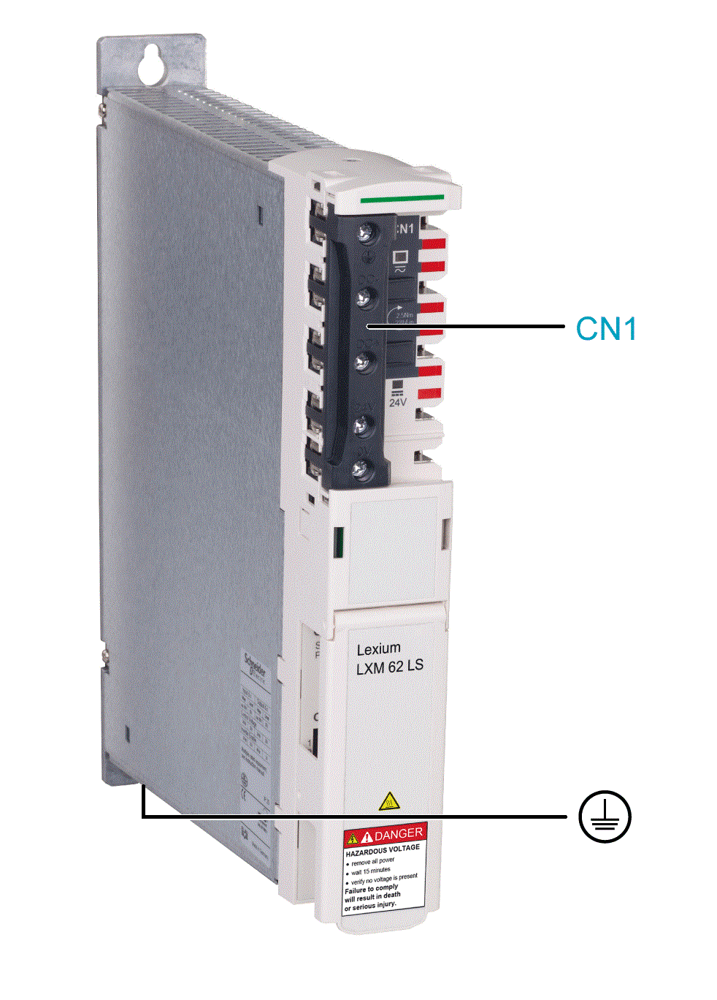

# Electrical Connections for the Lexium 62 DC Link Support Module

## Overview

| Connector | Description | Tightening torque [Nm] / [lbf in] |
| --- | --- | --- |
| **[CN1](#D-SE-0061586__D-SE-0061586.3)** | Bus Bar Module | 2.5 / 22 |
|  | Protective ground (earth) | 3.5 / 30.98 |

## **CN1** - Bus Bar Module

The DC bus voltage and the 24 Vdc control voltage are distributed and the protective conductor is connected via the Bus Bar Module.

| Pin | Designation | Description |
| --- | --- | --- |
| 1 |  | Protective earth (ground) |
| 2 | DC- | DC bus voltage - |
| 3 | DC+ | DC bus voltage + |
| 4 | 24 V | Supply voltage + |
| 5 | 0 V | Supply voltage - |

EIO0000003738.02

© 2021

Schneider Electric.

All rights reserved.