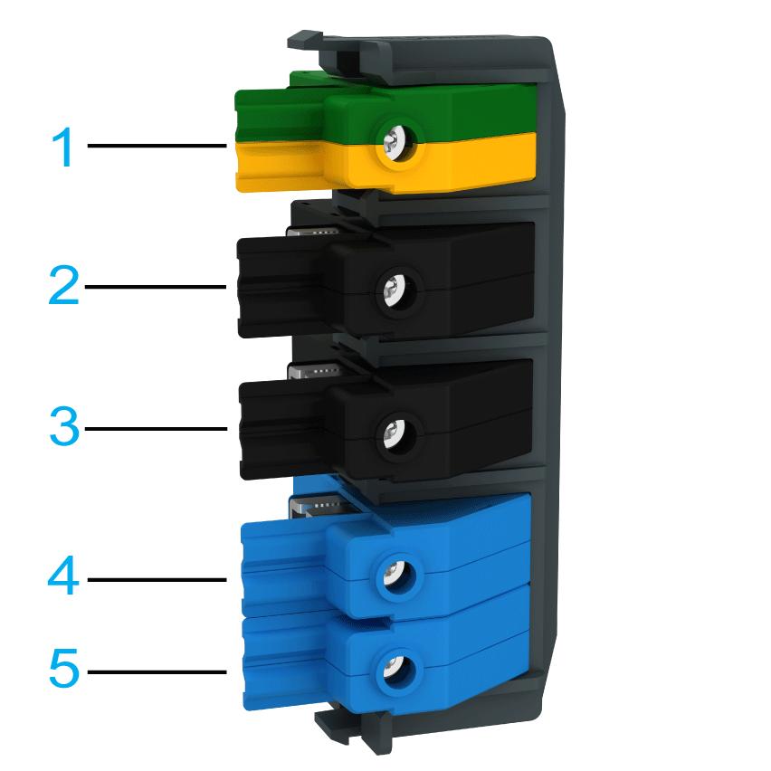

# Electrical Connections for the Lexium 62 DC Link Terminal

## Overview

| Port / Order | Connector | Color | Label |
| --- | --- | --- | --- |
| **1** | PE  Protective earth (ground) | Green/Yellow |  |
| **2** | DC bus connector | Black | DC- |
| **3** | DC+ |
| **4** | 24 V connector | Blue | 24 V |
| **5** | 0 V |

## Overview of the Connection Cross-Sections

|  | Rigid wire | Flexible wire with a cable end (without insulating sleeve) |
| --- | --- | --- |
| mm2 | 10...50 | 10...35 |
| AWG | 8...1 | 8...2 |

NOTE: Use copper conductors only.

## Tightening Torque

| Terminal | Tightening torque [Nm] / [lbf in] |
| --- | --- |
| Clamping screw for fixing the terminal to the Bus Bar Module | 2.5 / 22 |
| Clamping screw for fixing the wire to the terminal | 4.5 / 39.8 |

EIO0000003738.02

© 2021

Schneider Electric.

All rights reserved.