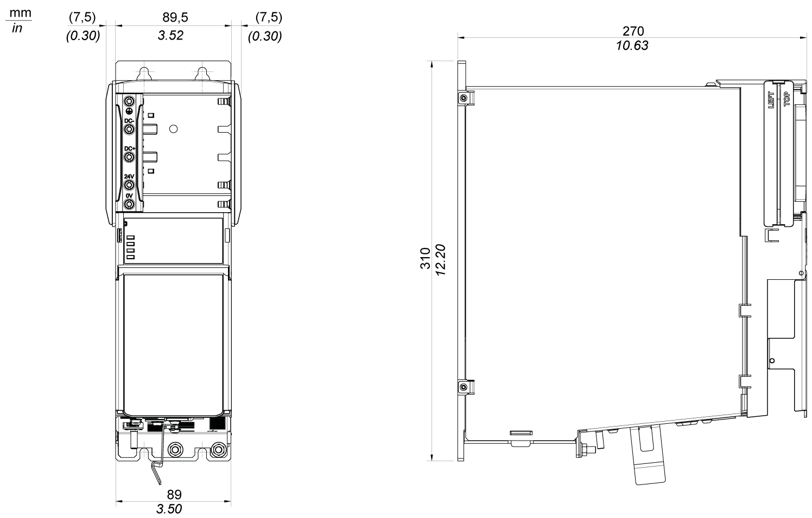

# Mechanical and Electrical Data for the Single Drives

## Technical Data for the Single Drives

| Designation | Parameter | Value | | | | |
| --- | --- | --- | --- | --- | --- | --- |
| Product configuration | Item name | LXM62DU60C  LXM62DU60E  LXM62DU60G | LXM62DD15C  LXM62DD15E  LXM62DD15G | LXM62DD27C  LXM62DD27E  LXM62DD27G | LXM62DD45C  LXM62DD45E  LXM62DD45G | LXM62DC13C  LXM62DC13E  LXM62DC13G |
| Power supply | Control voltage (without holding brake)  Maximum current consumption | 24 Vdc (-20...+25%) | | | | |
| 1.1 A | 1.1 A | 1.1 A | 1.1 A | 1.5 A |
| Control voltage (with holding brake)  Maximum current consumption | 24 Vdc (0...+6%) | | | | |
| 2.5 A | 2.5 A | 2.5 A | 3.5 A | 3.9 A |
| DC bus voltage | 250...700 Vdc | | | | |
| DC bus continuous current | 1.8 A | 4.6 A | 8.2 A | 18.3 A | 45.7 A |
| DC bus peak current | 5.5 A | 13.7 A | 24.7 A | 41.1 A | 119.0 A |
| DC bus capacitance | 110 µF | 110 µF | 110 µF | 220 µF | 250 µF |
| Overvoltage | 900 Vdc | | | | |
| Motor connection | Rated current (4 kHz) | | | | | |
| * at 40 °C (104 °F) | 2.0 Aeff | 5.0 Aeff | 9.0 Aeff | 20.0 Aeff | 50.0 Aeff |
| * at 55 °C (140 °F) | 1.4 Aeff | 3.5 Aeff | 6.3 Aeff | 13.7 Aeff | 35.0 Aeff |
| Peak current 10 s (4 kHz) at 55 °C (140 °F) | 6.0 Aeff | 15.0 Aeff | 27.0 Aeff | 45.0 Aeff | 130.0 Aeff  (HW Rev. 02) |
| Continuous output power (4 kHz, 400 V mains voltage) | | | | | |
| * at 40 °C (104 °F) | 0.95 kW | 2.4 kW | 4.3 kW | 9.6 kW | 24.7 kW |
| Overload protection | Yes | | | | |
| Short-circuit protection | Yes, IEC 60364-4-41/AMD1:-, Clause 411 | | | | |
| Output voltage range | 3 Vac~ 0...480 Vac | | | | |
| Output frequency range | 0...599 Hz | | | | |
| Motor connection | Rated current (8 kHz) | | | | | |
| * at 40 °C (104 °F) | 2.0 Aeff | 5.0 Aeff | 7.0 Aeff | 15.0 Aeff | 50.0 Aeff |
| * at 55 °C (140 °F) | 1.4 Aeff | 3.5 Aeff | 5.0 Aeff | 8.9 Aeff | 30.0 Aeff |
| Peak current 10 s (8 kHz) at 55 °C (140 °F) | 6.0 Aeff | 15.0 Aeff | 27.0 Aeff | 45.0 Aeff | 100.0 Aeff  (HW Rev. 02) |
| Continuous output power (8 kHz, 400 V mains voltage) | | | | | |
| * at 40 °C (104 °F) | 0.95 kW | 2.4 kW | 3.4 kW | 7.2 kW | 24.7 kW |
| Overload protection | Yes | | | | |
| Short-circuit protection | Yes, IEC 60364-4-41/AMD1:-, Clause 411 | | | | |
| Output voltage range | 3 Vac~ 0...480 Vac | | | | |
| Output frequency range | 0...599 Hz | | | | |
| Motor connection | Rated current (16 kHz) | | | | | |
| * at 40 °C (104 °F) | 1.2 Aeff | 3.5 Aeff | 4.0 Aeff | 8.0 Aeff | 30.0 Aeff |
| * at 55 °C (140 °F) | 0.8 Aeff | 2.6 Aeff | 2.9 Aeff | 4.9 Aeff | 20.0 Aeff |
| Peak current 10 s (16 kHz) at 55 °C (140 °F) | 6.0 Aeff | 15.0 Aeff | 27.0 Aeff | 45.0 Aeff | 60.0 Aeff  (HW Rev. 02) |
| Continuous output power (16 kHz, 400 V mains voltage) | | | | | |
| * at 40 °C (104 °F) | 0.6 kW | 1.7 kW | 2.0 kW | 3.8 kW | 16.8 kW |
| Overload protection | Yes | | | | |
| Short-circuit protection | Yes, IEC 60364-4-41/AMD1:-, Clause 411 | | | | |
| Output voltage range | 3 Vac~ 0...480 Vac |  |  |  |  |
| Output frequency range | 0...599 Hz |  |  |  |  |
| Motor connection | Maximum length of the motor cable | 75 m (246.06 ft) | | | | |
| Power loss | Electronics power supply | 18 W | | | | |
| Current-dependent power loss | Power stage (4 kHz) | 6.6 W/A | | | | |
| Power stage (8 kHz) | 8.5 W/A | | | | |
| Power stage (16 kHz) | 14.9 W/A | | | | |
| Interface | Sercos | Integrated | | | | |
| Encoder interface **CN7/CN9** | Power supply | 10 Vdc (-10...+10%), maximum 150 mA, short-circuit protection | | | | |
| Differential analog input (sine and cosine signal) | Input voltage: 0.8...1.1 VPP | | | | |
| Offset: 2.5 Vdc (-10...+10%) | | | | |
| Terminating resistor: 130 Ω | | | | |
| SinCos periods per second   * **CN7**:    + 100 kHz (Variants C, D, G)   + 20 kHz (Variants E, F) * **CN9**:    + 100 kHz (Variants D, G)   + 20 kHz (Variants F) | | | | |
| Cutoff frequency: Maximum 100.000 SinCos periods / second (maximum 100 kHz) | | | | |
| Communication | RS-485 interface | | | | |
| Digital inputs/outputs | DIO supply | Voltage UDIO: 24 Vdc (-20...+25%) | | | | |
| Maximum current consumption: 1.2 A | | | | |
| Digital inputs  A\_DI3, A\_DI4 | Inputs with switching level type 1 according to EN 61131-2 | | | | |
| Low level: -3...5 Vdc | | | | |
| High level: 15...30 Vdc | | | | |
| Filter time constant normal inputs: 1 ms/5 ms (configurable) | | | | |
| Digital inputs or Touchprobe inputs A\_DI1, A\_DI2 | Inputs with switching level type 1 according to EN 61131-2 | | | | |
| Low level: -3...5 Vdc | | | | |
| High level: 15...30 Vdc | | | | |
| Filter time constant normal inputs: 1 ms/5 ms (configurable) | | | | |
| Filter time constant for Touchprobe inputs: 100 µs | | | | |
| Digital inputs or digital outputs A\_DI5, A\_DI6 | Inputs/outputs (bidirectional) with switching level type 1 according to EN 61131-2 | | | | |
| Inputs:  Low level: -3...5 Vdc  High level: 15...30 Vdc  Filter time constant normal inputs: 1 ms/5 ms (configurable) | | | | |
| Outputs:  High level: (UDIO - 3 V) < Uout < UDIO  Maximum output current per output: 500 mA resistive | | | | |
| Inverter Enable | Maximum current consumption | 30 mA | | | | |
| Inputs | Number: 1 | | | | |
| STO active: -3 V ≤ UIE ≤ 5 V | | | | |
| Power stage active: 18 V ≤ UIE ≤ 30 V | | | | |
| Maximum downtime 500 µs at UIE > 20 V and dynamic activation | | | | |
| Maximum switching frequency of input signal: maximum 1 Hz | | | | |
| Maximum potential difference between IE- and PE | 15 V | | | | |
| Ventilation | - | Internal fan | | | | |
| Radio interference level | - | C3 (C2 with additional filter measures) | | | | |
| Protective class | Class | I (IEC 61800-5-1) | | | | |
| Overvoltage category | - | III (IEC 61800-5-1) | | | | |
| Pollution degree | - | 2 (IEC 61800-5-1) | | | | |
| Motor brake | Output voltage | Control voltage minus 0.8 Vdc | | | | |
| Output current | 1.2 A (maximum) | | | 2.2 A (maximum) | |
| Inductance | 1.0 H (maximum) | | | 1.5 H (maximum) | |
| Energy inductive load | 1.2 J (maximum) | | | 4.5 J (maximum) | |
| Overload protection | Yes | | | | |
| Short-circuit protection | Yes | | | | |
| Motor temperature | Sensor Input | PTC, KTY | | | | |
| Sensorless | Encoder temperature with thermal model. No thermal memory retention after reset of device. | | | | |
| Motor temperature sensor | - | Maximum voltage: 5 V  Maximum current: 2.5 mA | | | | |
| Weight | Weight  (without packaging) | 3 kg (6.6 lbs) | | | | 6.8 kg  (14.9 lbs) |
| Weight  (with packaging) | 3.91 kg (8.62 lbs) | | | | 7.8 kg  (17.2 lbs) |
| NOTE:  * Lexium 62 Single Drive includes the variants C and G: LXM62DU60C/G, LXM62DD15C/G, LXM62DD27C/G, LXM62DD45C/G, LXM62DC13C/G * Lexium 62 Single Drive embedded safety includes the variant E: LXM62DU60E, LXM62DD15E, LXM62DD27E, LXM62DD45E, LXM62DC13E | | | | | | |

NOTE: Due to the increased control current of the brake (approximately 2 A), the motor series SH3205xxxxFxx00 with holding brake can only be operated at the servo converters of type Lexium 62 single drive (LXM62DD45C or LXM62DD45E) and LXM62DC13C21000/LXM62DC13E21000.

## Dimensions - Single Drives

Dimensions of the Lexium 62 Servo Drive (excluding LXM62DC13C21000/LXM62DC13E21000/LXM62DC13G21000):

Dimensions of the Lexium 62 Servo Drive (only LXM62DC13C21000/LXM62DC13E21000/LXM62DC13G21000):

EIO0000003738.02

© 2021

Schneider Electric.

All rights reserved.