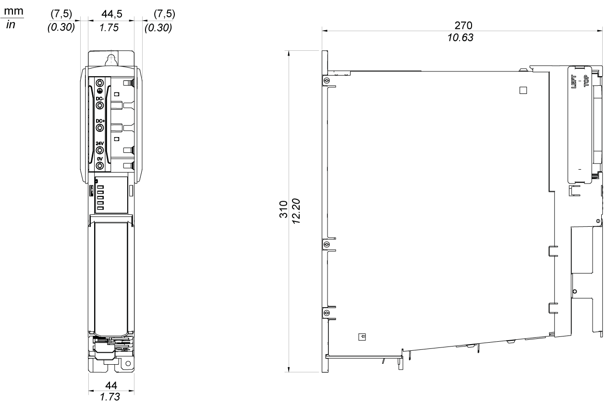

# Mechanical and Electrical Data for the Double Drives

## Technical Data for the Double Drives

| Designation | Parameter | Value | | |
| --- | --- | --- | --- | --- |
| Product configuration | Item name | LXM62DU60D  LXM62DU60F | LXM62DD15D  LXM62DD15F | LXM62DD27D  LXM62DD27F |
| Power supply | Control voltage (without holding brakes)  Maximum current consumption | 24 Vdc (-20...+25%) | | |
| 1.3 A | 1.3 A | 1.3 A |
| Control voltage / control current (with holding brakes)  Maximum current consumption | 24 Vdc (0...+6%) | | |
| 4.1 A | 4.1 A | 4.1 A |
| DC bus voltage | 250...700 Vdc | | |
| DC bus continuous current | 3.6 A | 9.2 A | 16.4 A |
| DC bus peak current | 11.0 A | 27.4 A | 49.4 A |
| DC bus capacitance | 110 µF | | |
| Overvoltage | 900 Vdc | | |
| Motor connection | Rated current (4 kHz) | | | |
| * at 40 °C (104 °F) | 2.0 Aeff | 5.0 Aeff | 9.0 Aeff |
| * at 55 °C (140 °F) | 1.4 Aeff | 3.5 Aeff | 6.3 Aeff |
| Peak current 10 s (4 kHz) at 55 °C (114 °F) | 6.0 Aeff | 15.0 Aeff | 27.0 Aeff |
| Continuous output power per axis (4 kHz, 400 V mains voltage) | | | |
| * at 40 °C (104 °F) | 0.95 kW | 2.4 kW | 4.3 kW |
| Output voltage range | 3 Vac~ 0...480 Vac | | |
| Output frequency range | 0...599 Hz | | |
| Motor connection | Rated current (8 kHz) | | | |
| * at 40 °C (104 °F) | 2.0 Aeff | 5.0 Aeff | 7.0 Aeff |
| * at 55 °C (140 °F) | 1.4 Aeff | 3.5 Aeff | 5.0 Aeff |
| Peak current 10 s (8 kHz) at 55 °C (140 °F) | 6.0 Aeff | 15.0 Aeff | 27.0 Aeff |
| Continuous output power per axis (8 kHz, 400 V mains voltage) | | | |
| * at 40 °C (104 °F) | 0.95 kW | 2.4 kW | 3.4 kW |
| Output voltage range | 3 Vac~ 0...480 Vac | | |
| Output frequency range | 0...599 Hz | | |
| Motor connection | Rated current (16 kHz) | | | |
| * at 40 °C (104 °F) | 1.2 Aeff | 3.5 Aeff | 4.0 Aeff |
| * at 55 °C (140 °F) | 0.8 Aeff | 2.6 Aeff | 2.9 Aeff |
| Peak current 10 s (16 kHz) at 55 °C (140 °F) | 6.0 Aeff | 15.0 Aeff | 27.0 Aeff |
| Continuous output power per axis (16 kHz, 400 V mains voltage) | | | |
| * at 40 °C (104 °F) | 0.6 kW | 1.7 kW | 2.0 kW |
| Output voltage range | 3 Vac~ 0...480 Vac | | |
| Output frequency range | 0...599 Hz | | |
| Motor connection | Maximum length of the motor cable | 75 m (246.06 ft) | | |
| Power loss | Electronics power supply (8 kHz) | 22 W | | |
| Power stage (8 kHz) | 8.5 W/A (per axis) | | |
| Interface | Sercos | Integrated | | |
| Encoder interface **CN7**/**CN9** | Power supply | 10 Vdc (-10...+10%), maximum 150 mA, short-circuit protection | | |
| Differential analog input (sine and cosine signal) | Input voltage: 0.8...1.1 VPP | | |
| Offset: 2.5 Vdc (-10...+10%) | | |
| Terminating resistor: 130 Ω | | |
| SinCos periods per second   * **CN7**:    + 100 kHz (Variants C, D, G)   + 20 kHz (Variants E, F) * **CN9**:    + 100 kHz (Variants D, G)   + 20 kHz (Variants F) | | |
| Cutoff frequency: Maximum 100.000 SinCos periods / second (maximum 100 kHz) | | |
| Digital inputs/ outputs | DIO supply | Voltage UDIO: 24 Vdc (-20...+25%) | | |
| Maximum current consumption: 2.2 A | | |
| Digital inputs  A\_DI3, A\_DI4  B\_DI1, B\_DI4 | Inputs with switching level type 1 according to EN 61131-2 | | |
| Low level: -3...5 Vdc | | |
| High level: 15...30 Vdc | | |
| Filter time constant normal inputs: 1 ms/5 ms (configurable) | | |
| Digital inputs or Touchprobe inputs  A\_DI1, A\_DI2  B\_DI1, B\_DI2 | Inputs with switching level type 1 according to EN 61131-2 | | |
| Low level: -3...5 Vdc | | |
| High level: 15...30 Vdc | | |
| Filter time constant normal inputs: 1 ms/5 ms (configurable) | | |
| Filter time constant for Touchprobe inputs: 100 µs | | |
| Digital inputs or digital outputs A\_DI5, A\_DI6  B\_DI5, B\_DI6 | Inputs/outputs (bidirectional) with switching level type 1 according to EN 61131-2 | | |
| Inputs:  Low level: -3...5 Vdc  High level: 15...30 Vdc  Filter time constant normal inputs: 1 ms/5 ms (configurable) | | |
| Outputs:  High level: (UDIO - 3 V) < Uout < UDIO  Maximum output current per output: 500 mA resistive | | |
| Inverter Enable | Maximum current consumption | 30 mA | | |
| Inputs | Number: 2 | | |
| STO active: -3 V ≤ UIE ≤ 5 V | | |
| Power stage active: 18 V ≤ UIE ≤ 30 V | | |
| Maximum downtime 500 µs at UIE > 20 V and dynamic activation | | |
| Maximum switching frequency of input signal: maximum 1 Hz | | |
| Maximum potential difference between IE- and PE | 15 V | | |
| Ventilation | - | Internal fan | | |
| Radio interference level | - | C3 (C2 with additional filter measures) | | |
| Protective class | Class | I (IEC 61800-5-1) | | |
| Overvoltage category | - | III (IEC 61800-5-1) | | |
| Pollution degree | - | 2 (IEC 61800-5-1) | | |
| Motor brake | Output voltage | Control voltage minus 0.8 Vdc | | |
| Output current | 1.2 A (maximum) | | |
| Inductance | 1.0 H (maximum) | | |
| Energy inductive load | 1.2 J (maximum) | | |
| Overload protection | Yes | | |
| Short-circuit protection | Yes | | |
| Motor temperature sensor | - | Maximum voltage: 5 V  Maximum current: 2.5 mA | | |
| Weight | Weight  (without packaging) | 3 kg (6.6 lbs) | | |
| Weight  (with packaging) | 3.91 kg (8.62 lbs) | | |
| NOTE:  * Lexium 62 Double Drive includes the variant D: LXM62DU60D, LXM62DD15D, LXM62DD27D * Lexium 62 Double Drive embedded safety includes the variant F: LXM62DU60F, LXM62DD15F, LXM62DD27F | | | | |

## Dimensions - Double Drives

EIO0000003738.02

© 2021

Schneider Electric.

All rights reserved.