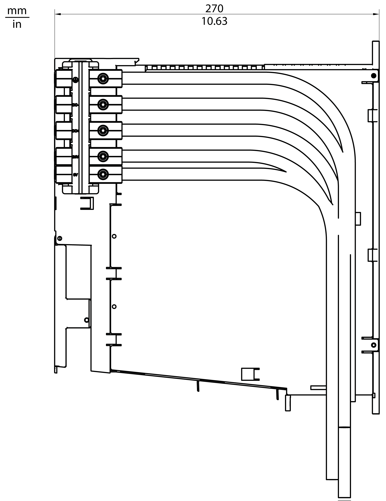
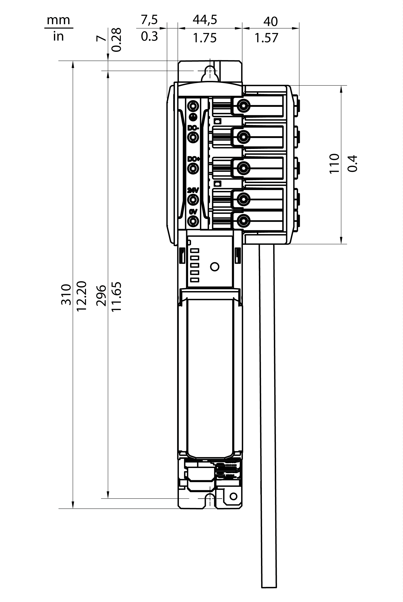
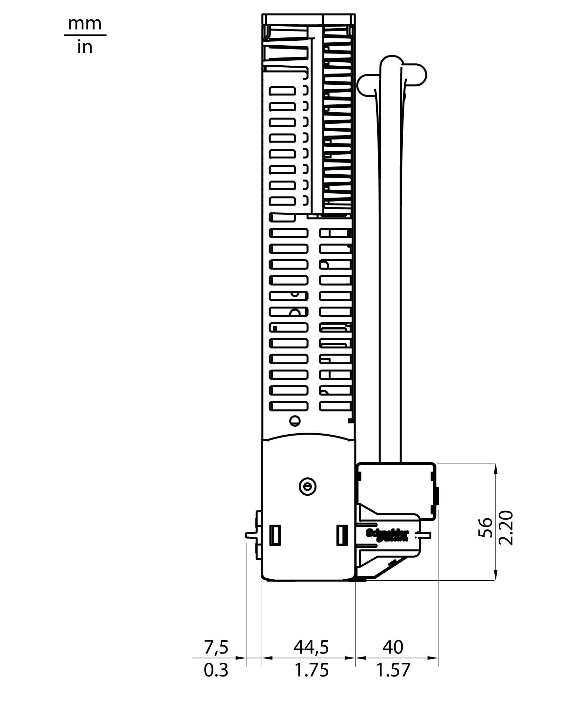

# Mechanical and Electrical Data for the Lexium 62 DC Link Terminal

## Technical Data for the Lexium 62 DC Link Terminal

| Designation | Parameter | Value |
| --- | --- | --- |
| Electrical specification | Rated Voltage | 1000 Vdc on the Lexium 62 DC Link Terminal connectors for the upper three Bus Bar Module ports.  NOTE: The ports of the Bus Bar Module are numbered from top to bottom. |
| 24 Vdc on the Lexium 62 DC Link Terminal connectors for the bottom two Bus Bar Module ports. |
| Rated continuous current | 120 A with temperature rise of less than 60 K. |
| High voltage test level | 2120 Vdc or 1500 Vac between ports 2 and 1 and between ports 3 and 1 of Bus Bar Modules.  NOTE: The ports of the Bus Bar Module are numbered from top to bottom. |
| System voltage | 300 V |
| Pollution degree | – | 2 (IEC 60664-1) |
| Over voltage category | – | III |
| Lifetime of end product | – | ≥60,000 hours |

## Dimensions - Lexium 62 DC Link Terminal

Dimensions of the Lexium 62 DC Link Terminal:

EIO0000003738.02

© 2021

Schneider Electric.

All rights reserved.