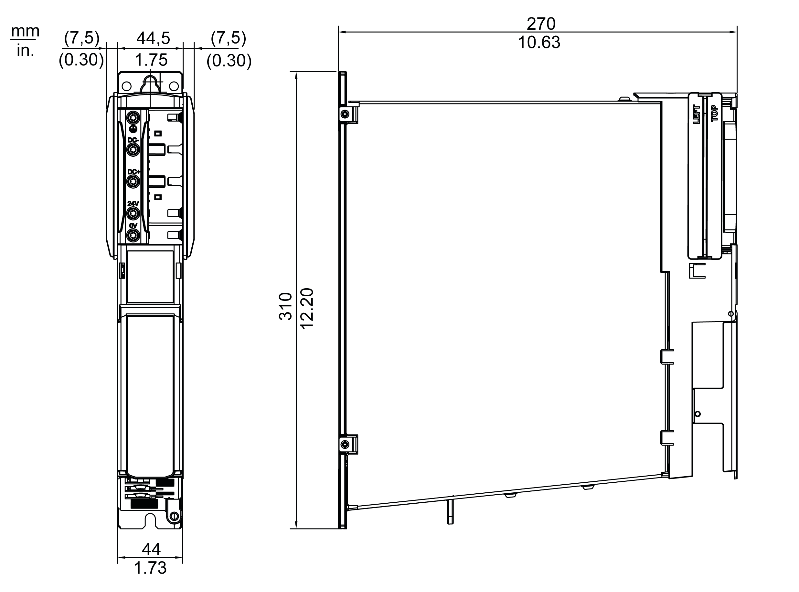

# Mechanical and Electrical Data for the Lexium 62 DC Link Support Module

## Technical Data for the Lexium 62 DC Link Support Module

| Designation | Parameter | Value |
| --- | --- | --- |
| Power supply | Control voltage | 30 Vdc (maximum) |
| DC bus voltage (nominal) | 700 Vdc (maximum) |
| DC bus capacity | 1.76 mF |
| Discharge time | 5 min (maximum) |
| Overvoltage | 900 Vdc |
| Cooling | - | Natural convection |
| Ingress protection rating | - | IP20 |
| Isolation class | Pollution degree | 2 (IEC 60664-1) |
| Protective class | Class | 1 (IEC/EN 61800-5-1) |
| Overvoltage category | Class | III (IEC/EN 61800-5-1) |
| Radio interference level | Class | C3 (IEC/EN 61800-3) |
| Lifetime of end product | – | ≥60,000 hours |
| Weight | Weight (with packaging) | 3.1 kg (3.8 kg) / 6.83 lbs (8.38 lbs) |

## Dimensions - Lexium 62 DC Link Support Module

EIO0000003738.02

© 2021

Schneider Electric.

All rights reserved.