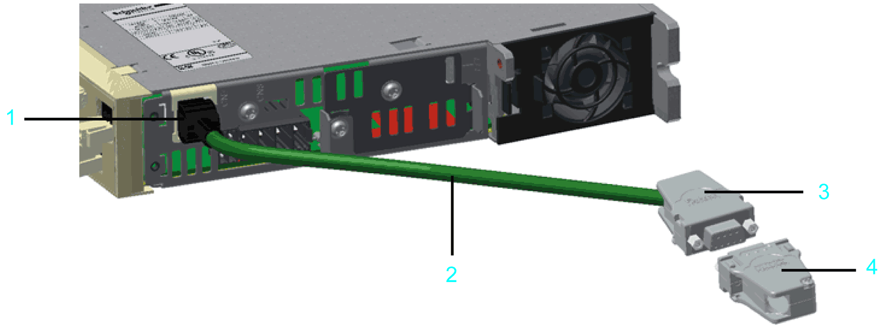

# Overview

## General Information

5V Encoder Adapter

**1** RJ45 connector

**2** Encoder cable

**3** D-Sub 9-pin female connector

**4** D-Sub 9-pin male connector at the encoder cable (user wired)

## Features

The 5V Encoder Adapter consists of an encoder cable (2) with an RJ45 connector (1) on one side that is connected to a Lexium 62 servo drive, and a D-Sub 9-pin female connector (3) on the other side.

A DC/DC converter is assembled in the D-Sub 9-pin female connector (3). It converts the encoder power supply that is coming from the drive from 10 V to 5 V, making it possible to connect 5 V encoders which are not directly supported by the Lexium 62 servo drive. The 5 V and the 10 V encoder supply voltage is available on the D-Sub 9-pin female connector (3). The other signals, such as encoder- and RS485 signals are transferred directly from the drive to the encoder.

| NOTICE | |
| --- | --- |
|  | CURRENT TOO HIGH AT THE ENCODER CONNECTOR OF THE LEXIUM 62 SERVO DRIVE BY USING BOTH 5 V AND 10 V VOLTAGE SUPPLY  * Use exclusively one voltage supply for the encoder, either 5 V or 10 V. * In the case of using 5 V encoders, ensure that the maximum power consumption of the encoder does not exceed 250 mA.  Failure to follow these instructions can result in equipment damage. |

For further information on the 5V Encoder Adapter, see catalog *Multi axis servo system and servo motors for PacDrive 3*.

EIO0000003738.02

© 2021

Schneider Electric.

All rights reserved.