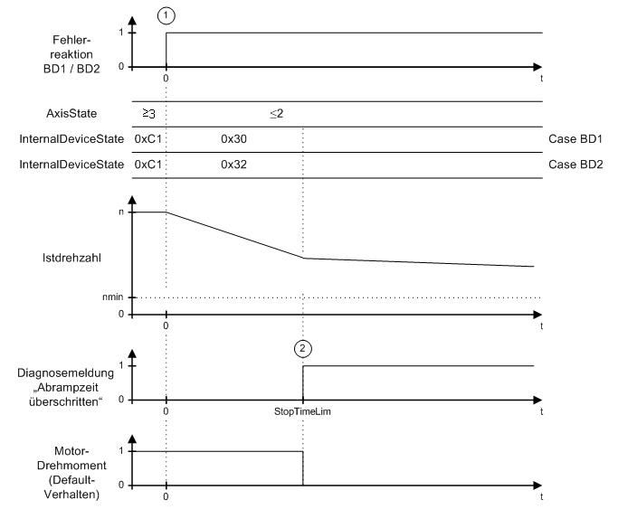

# Maximum Ramp-Down Time Exceeded

## General

In the case of an error with reaction BD1 (1), the axis ramps down at maximum current (MaxDrivePeakCurrent). In the case of an error with reaction BD2 (1), the axis ramps down according to the parameters ControllerStopDec and ControllerStopJerk. The axis does not come to a standstill before expiration of the maximum ramp-down time (parameter StopTimeLim) (2) ( speed < nmin). Therefore, error message `8140 Motor ramp-down time exceeded` is triggered.

Time diagram for reaction BD1 / BD2 (maximum ramp down time exceeded)

EIO0000003547.02

© 2021

Schneider Electric.

All rights reserved.