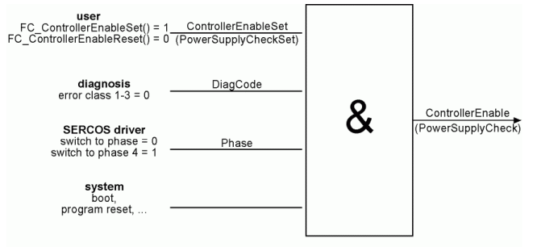
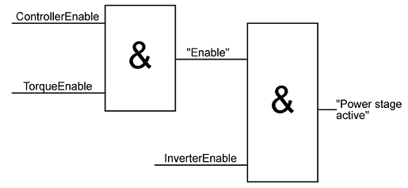

# ControllerEnable

## General

|  |  |
| --- | --- |
| Type | AF |
| Devices supporting the parameter | Lexium LXM52 Drive, Lexium LXM52 Linear Drive,  Lexium LXM62 Drive, Lexium LXM62 Linear Drive,  Lexium ILM62 Drive Module,  Sercos Drive |
| Traceable | Yes |

## Functional Description

The parameter indicates whether a software enabling for the servo amplifier has been given by the controller. The parameter provides information on the Release status. It is determined by the user, diagnostic, Sercos driver and system components.

Th following figure shows the influencing factors on the ControllerEnable parameter of the servo amplifier.

| Value | Data type | Meaning |
| --- | --- | --- |
| off / 0 | BOOL | Not enabled |
| on / 1 | BOOL | Enabled |

The following figure shows the influence of ControllerEnable, TorqueEnable, and InverterEnable on the power stage release of the servo amplifier.

EIO0000003547.02

© 2021

Schneider Electric.

All rights reserved.