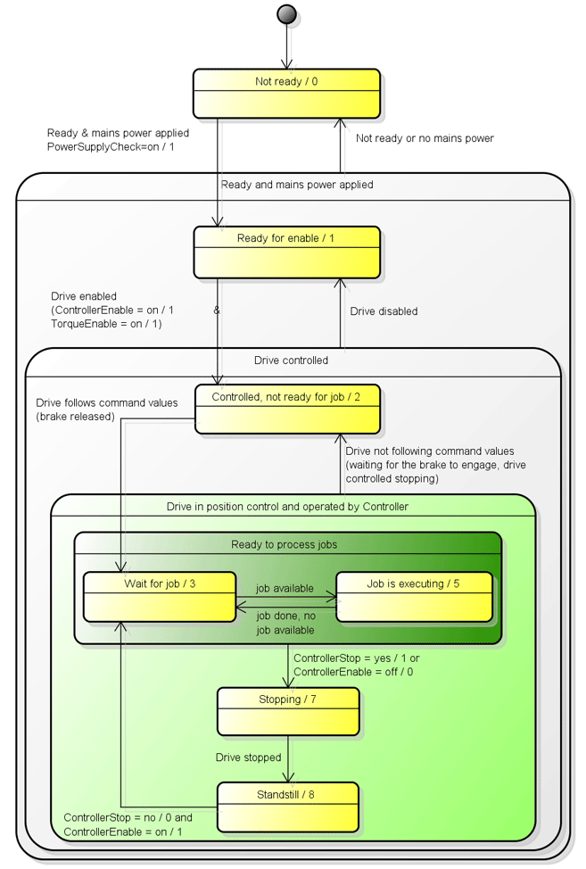
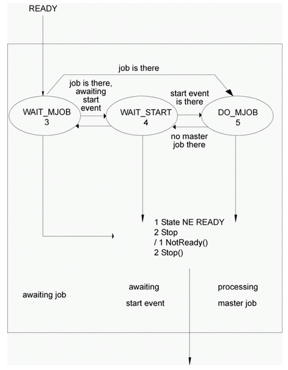

# AxisState

## General

|  |  |
| --- | --- |
| Type | AD |
| Devices supporting the parameter | Lexium LXM52 Drive, Lexium LXM52 Linear Drive,  Lexium LXM62 Drive, Lexium LXM62 Linear Drive,  Lexium ILM62 Drive Module,  Sercos Drive |
| Traceable | Yes |

## Functional Description

The parameter indicates the status of the servo amplifier.

| Value | Data type | Meaning |
| --- | --- | --- |
| Not ready / 0 | DINT | Drive is not ready to be switched on.  Possibly the parameter MotorIdentification is set to motorless / 1.  Drives with external power supply (for example, LXM62DxS or Lexium 62 ILM): waiting for object parameter PowerSupplyCheck = TRUE of the corresponding power supply, InverterEnable = on / 1, axis is standstill, and the correct value for the parameter MotorTemperatureMonitoring is set. |
| Ready for release / 1 | DINT | Power unit ready, drive is torque-free, DC bus ready, waiting for release (TorqueEnable + ControllerEnable). |
| Under control, not ready for job / 2 | DINT | The drive is in position control, but does not follow the specified reference values. When switching on the power stage, the torque is established and the brake is released; otherwise, the drive is stopped by a drive reaction and the brake is closed at standstill. |
| Waiting for master job / 3 | DINT | Waiting for master job. The drive is in position control and follows the specified reference values. |
| Processing master job / 5 | DINT | Job is being processed. The drive is in position control and follows the specified reference values. |
| Stopping / 7 | DINT | Canceling jobs; drive stopping. The drive is in position control and follows the specified reference values. |
| Standstill / 8 | DINT | Job processing blocked; drive stopped. The drive is in position control and follows the specified reference values. |

Diagram 1 for parameter AxisState

Diagram 2 for parameter AxisState

EIO0000003547.02

© 2021

Schneider Electric.

All rights reserved.