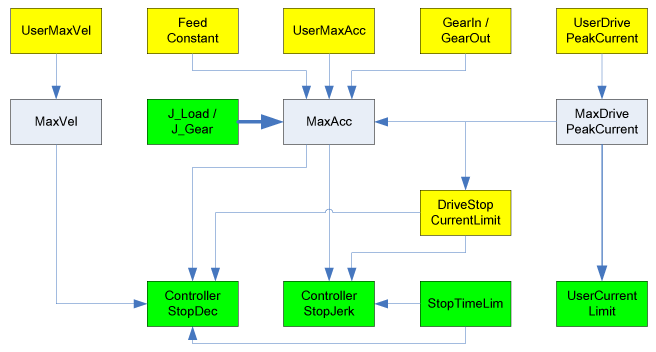

# UserMaxVel

## General

|  |  |
| --- | --- |
| Type | AK |
| Devices supporting the parameter | Lexium LXM52 Drive, Lexium LXM52 Linear Drive,  Lexium LXM62 Drive, Lexium LXM62 Linear Drive,  Lexium ILM62 Drive Module,  Sercos Drive |
| Traceable | Yes |

## Functional Description

The parameter is used to set the maximum velocity on the drive shaft (gear box outside) and is specified in [units/seconds].

With physical axes, the UserMaxVel can be set up to the equivalent value that corresponds to the maximum motor rotational speed MaxSpeed  [RPM]. With the UserMaxVel parameter, the maximum velocity MaxVel, determined by the system, can be limited. This parameter defines the machine-specific value of MaxVel.

The default value of MaxVel is overwritten by virtual axes.

If UserMaxVel is set to 0, then the parameter MaxVel is determined by the system.

NOTE: If the rated speed is exceeded, then the motor picks up less current by increasing rotational speed. The amplitude of the current depends on the momentary voltage in the DC bus. The current is reduced until a further increasing of the speed is not possible anymore. Depending on the induced voltage of the motor used, it is possible that MaxSpeedLinear cannot be reached (the typical DC bus voltage on a 3-phase 400 V network is 560 V, even though MaxSpeedLinear requires up to 780 V). Verify that enough voltage/current is available for the speed requirements of your application (see Drive sizing with Motion Builder).

UserMaxVel influences the threshold for triggering the diagnostic message `8122 Shutdown due to velocity limit`.

NOTE: Modifications to the parameter are only applied during the Sercos phase up (communication phase 0 => communication phase 4). The maximum user speed is not supervised for induction motors without encoder (in open-loop V / f control mode, *[ControlMode](../../../../../api/crossBook?lang=en-US&virtualBookName=PD.Parameter.LXM62Drive&topicID=D_SE_0071561)* = open-loop control / 1).

The following graphic shows the dependency with other object parameters for rotary drives:

The following graphic shows the dependency with other object parameters for linear drives:

**Example:**

Entering J\_Load has a direct impact on the parameter MaxAcc. A revision of MaxAcc only has an impact on ControllerStopDec if,

* a Sercos phase up takes place or
* the parameter ControllerStopDec is modified.

EIO0000003547.02

© 2021

Schneider Electric.

All rights reserved.