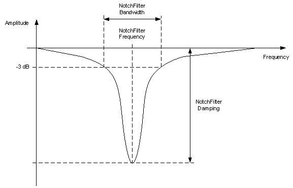

# NotchFilterDamping

## General

|  |  |
| --- | --- |
| Type | ES |
| Offline editable | Yes |
| Available as of | V1.50.1.x |
| Devices supporting the parameter | Lexium LXM52 Drive, Lexium LXM52 Linear Drive,  Lexium LXM62 Drive, Lexium LXM62 Linear Drive,  Lexium ILM62 Drive Module |
| Traceable | Yes |

## Functional Description

The parameter is used to enter the damping of the NotchFilter in the velocity control loop in dB (decibels). The parameter sets the damping for the frequency NotchFilterFrequency. For this frequency, the damping of the filter is at maximum.

The damping can be set to values between 6 dB (corresponds to an amplitude reduction to 0.5) and 60 dB (corresponds to an amplitude reduction to 0.001).

Setting the parameter to zero disables the filter.

The notch filter is used to specifically filter a mechanical resonance frequency in order to achieve higher amplifications especially in the velocity controller but also in the position controller. In doing so, detected deviations can be corrected in a better way and tracking deviation can be reduced.

The notch filter has its maximum damping at the filter frequency which is adjusted with the NotchFilterFrequency parameter.

The damping must be adjusted to the level of the resonance. Also, the level of the maximum phase offset (positive and negative) is influenced by the damping. The higher the damping the higher the phase offset. A high phase offset can cause instability of the velocity control loop. Hence, the selected damping level should not be any greater than necessary. In addition, the NotchFilterFrequency and NotchFilterBandwidth parameters must be adjusted. The optimal conditions must be determined.

NOTE: This parameter can be determined as of firmware version V01.50.x.0 by using the AutoTune automatic controller optimization.

This parameter has no effect for asynchronous motors in open-loop V / f mode (*[ControlMode](../../../../../api/crossBook?lang=en-US&virtualBookName=PD.Parameter.LXM62Drive&topicID=D_SE_0071561)* = open-loop control / 1).

EIO0000003547.02

© 2021

Schneider Electric.

All rights reserved.