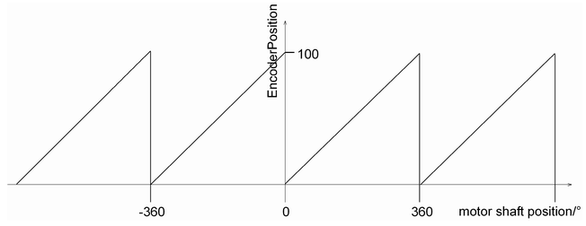

# EncoderPosition

## General

|  |  |
| --- | --- |
| Type | AF |
| Devices supporting the parameter | Lexium LXM52 Drive, Lexium LXM52 Linear Drive,  Lexium LXM62 Drive, Lexium LXM62 Linear Drive,  Lexium ILM62 Drive Module,  Sercos Drive |
| Traceable | No |

## Functional Description

EncoderPosition represents the actual position of the motor encoder within the EncoderRange in units. It is indicated on the drive shaft (gear box output side). It is the actual position that is transferred via the Sercos bus (see [Ref-Actual Values](D-SE-0071489.html#D-SE-0071489)). For single turn encoders, the EncoderPosition ranges from 0 to 1 revolutions (motor side), for multi-turn encoders, the EncoderPosition ranges from 0 to 4096 revolutions (motor side).

Coordinate displacement with SetPos (*[FC\_SetposDual()](../../../../../api/crossBook?lang=en-US&virtualBookName=PD.Lib.SystemInterface&topicID=D_SE_0085315)*, *[FC\_SetposGroup()](../../../../../api/crossBook?lang=en-US&virtualBookName=PD.Lib.SystemInterface&topicID=D_SE_0085317)*, *[FC\_SetposSingle()](../../../../../api/crossBook?lang=en-US&virtualBookName=PD.Lib.SystemInterface&topicID=D_SE_0085319)*) does not affect this parameter. The parameter Direction must not be taken into account when interpreting EncoderPosition.

The EncoderPosition value is calculated once per Sercos cycle (*[CycleTime](../../../../../api/crossBook?lang=en-US&virtualBookName=PD.Parameter.LMCEco&topicID=D_SE_0073362)*).

Relative to the actual position at the drive shaft, the position is delayed by the time ShaftDelay. Thus, a position within the encoder range is represented that is delayed to the drive shaft by the ShaftDelay time.

## Example

FeedConstant = 100 units/revolution

GearIn = GearOut (no gear box)

EncoderRange = 1 revolution (single turn)

Diagram for the parameter EncoderPosition of a drive

NOTE: The parameter value is transferred from the slave to the master via the parameter channel of the Sercos by every access. Typically, this takes about 10 ms. However, up to 1 s can be realized if large amounts of data are transferred on the parameter channel. If the Sercos bus is in phase 0 or 1, then a default value is indicated here. If the Sercos bus is in phase 3 or 4, then the parameter value is transferred and indicated. In the Sercos phase 2, the parameter can be read through the application.

EIO0000003547.02

© 2021

Schneider Electric.

All rights reserved.