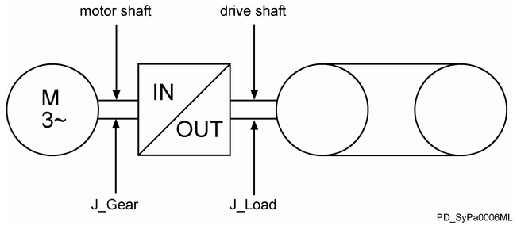

# J\_Load

## General

|  |  |
| --- | --- |
| Type | ES |
| Offline editable | Yes |
| Devices supporting the parameter | Lexium LXM52 Drive,  Lexium LXM62 Drive,  Lexium ILM62 Drive Module |
| Traceable | Yes |

## Functional Description

The parameter represents the input of the load moment of inertia on the drive shaft (gear box output side).

This parameter affects the feed forward and the internal amplifying factors of the speed controller and influences the calculation of the maximum acceleration MaxAcc.

The maximum adjustable value of the J\_Load parameter is 1,000,000,000.

If J\_Load is adjusted incorrectly in the offline state, the following diagnostic messages are entered in the message logger:

* DiagCode: `8205 ExtDiagMsg: J_Load DiagMsg: Parameter has an invalid value`
* DiagCode: `8205 ExtDiagMsg: J_Gear DiagMsg: Parameter has an invalid value`
* DiagCode: `8205 ExtDiagMsg: Vel_P_Gain DiagMsg: Parameter has an invalid value`

In the online state (via Logic Builder or via program code), no diagnostic message is issued. In this case, the incorrect value is not taken into account.

To calculate the possible J\_Load value, the following conditions have to be fulfilled:

1. TotalInertia <= 3163 \* TorqueConstant / Vel\_P\_Gain
2. TotalInertia <= 3163 \* TorqueConstant / Vel\_I\_Gain
3. TotalInertia <= 60.18 \* TorqueConstant

TotalInertia is calculated as follows:

TotalInertia = [MotorInertia + J\_Gear + J\_Load \* (GearIn / GearOut)2] \* 10-4

NOTE: If an error is detected during parameter transfer (offline - diagnostic message `8205 Parameter has non-permissible value` or online - controller configuration does not accept the value), verify whether you have reset the controller after a GearIn or GearOut modification.

NOTE: The parameters GearIn and GearOut are applied after another Sercos phase up (phase 0 -> phase 4).

NOTE: The parameter value is transferred from the master to the slave via the parameter channel of the Sercos at every access. Typically, this takes about 10 ms. However, times up to 1 s may be realized if large amounts of data are transferred on the parameter channel.

NOTE: This parameter can be determined as of firmware version V01.35.x.0 by using the AutoTune automatic controller optimization.

The following graphic shows the dependency with other object parameters for rotary drives:

**Example:**

Entering J\_Load has a direct impact on the parameter MaxAcc. A revision of MaxAcc only has an impact on ControllerStopDec if,

* a Sercos phase up takes place or
* the parameter ControllerStopDec is modified.

EIO0000003547.02

© 2021

Schneider Electric.

All rights reserved.