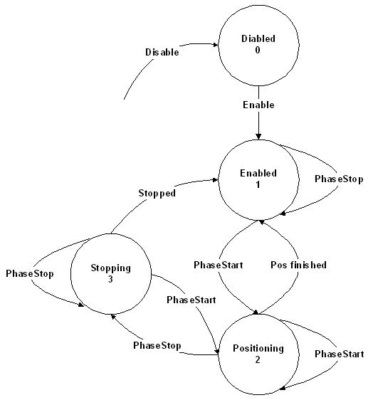

# YOffsetState

## General

|  |  |
| --- | --- |
| Type | AD |
| Devices supporting the parameter | Lexium LXM52 Drive, Lexium LXM52 Linear Drive,  Lexium LXM62 Drive, Lexium LXM62 Linear Drive,  Lexium ILM62 Drive Module,  Sercos Drive |
| Traceable | Yes |

## Functional Description

The parameter represents the status of the position generator.

| Value | Data type | Meaning |
| --- | --- | --- |
| disabled / 0 | DINT | The position generator is disabled. |
| enabled / 1 | DINT | The position generator is enabled. |
| positioning / 2 | DINT | YOffset generator is in process. |
| stopping / 3 | DINT | YOffset generator is stopping. |

YOffsetState

EIO0000003547.02

© 2021

Schneider Electric.

All rights reserved.