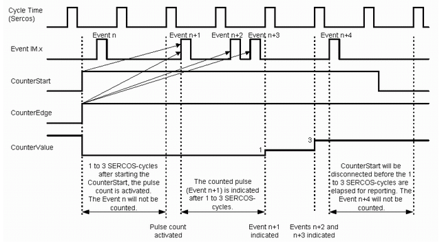
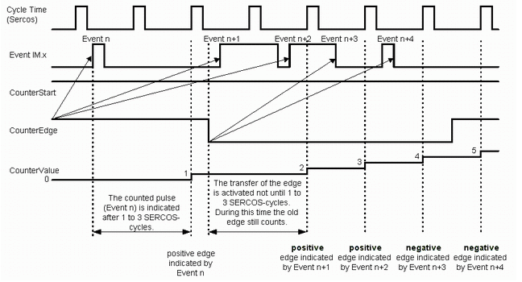

# IO0\_Mode ... IO7\_Mode

## General

|  |  |
| --- | --- |
| Type | EF |
| Offline editable | Yes |
| Devices supporting the parameter | DIO8 module |
| Traceable | Yes |

## Functional Description

Defines the input/output mode.

| Value | Meaning |
| --- | --- |
| inactive / 0 | The input/output is switched off. |
| Input / 1 | Only the static state of the input (Value parameter) can be queried. |
| Output / 2 | Output function. |
| Touchprobe / 3 | The touchprobe function is activated. See also the CaptureState, CaptureOK, CaptureValue, and SensorDelay parameters. |
| Fast counter / 4 | The impulse counter function is activated. See also CounterState, CounterValue, CounterStart, and CounterEdge |

NOTE: Modifications to the parameter are only applied during the Sercos phase up (communication phase 0 => communication phase 4). The touchprobe and fast counter modes require additional bandwidth on the Sercos bus. The additional bandwidth may reduce the maximum possible number of axes for a certain BaudRate and [CycleTime](../../../../../api/crossBook?lang=en-US&virtualBookName=PD.Parameter.LMCEco&topicID=D_SE_0073362).

NOTE: The sum of measured inputs and impulse counters for DIO8 module must not be higher than two. Otherwise, the diagnostic message `8787 Configuration error` is triggered.

NOTE: The first measured input / impulse counter is assigned to measured input\_0, the second to measured input\_1.

## Touchprobe

The TouchProbe functions are measuring functions. They accurately detect positions relative to a measure input.

## Impulse Counter (Fast Counter)

The impulse counter is a measuring function that allows fast impulses to be recorded and counted at the measured inputs. Once an impulse counter has been enabled, it runs in the system independently of the program. The program can use parameters to determine the status of the counting function.

For more information on the accuracy of the measuring inputs, see the description of the CaptureValue parameter of the digital measuring inputs.

## Minimum Length of a Measuring Impulse

The shortest time of a high impulse is 100 µs; the shortest time of a low impulse is 230 µs. This yields a maximum frequency of approximately 3 kHz. For a pulse/pause ratio of 1:1, a maximum frequency of approximately 2.2 kHz can be reached.

## Time of Activation

Once the CounterStart parameter in the program has activated the impulse counter, one to three Sercos cycles pass before the counting function is active. If an event occurs, it is displayed in the CounterValue parameter with a delay of one to three Sercos cycles.

## Time Diagrams

For a better understanding of time dependencies during impulse counter evaluation, some examples are shown below:

Impulse counter at the measured input of the Lexium 62 ILM

Impulse counter at the measure input of the ILM - edge change

EIO0000003547.02

© 2021

Schneider Electric.

All rights reserved.