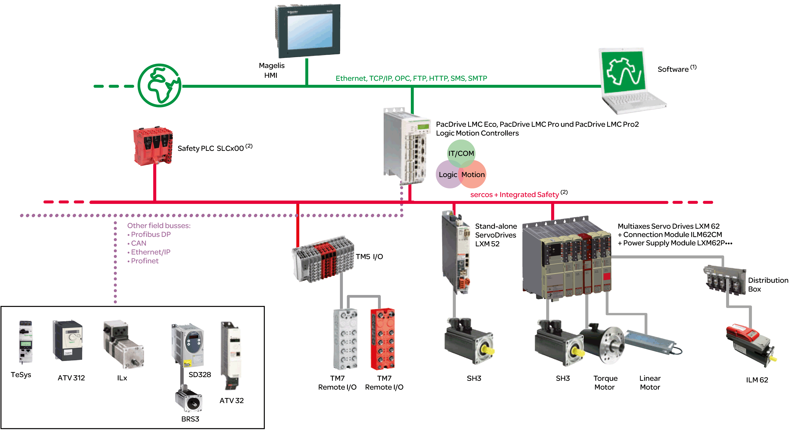
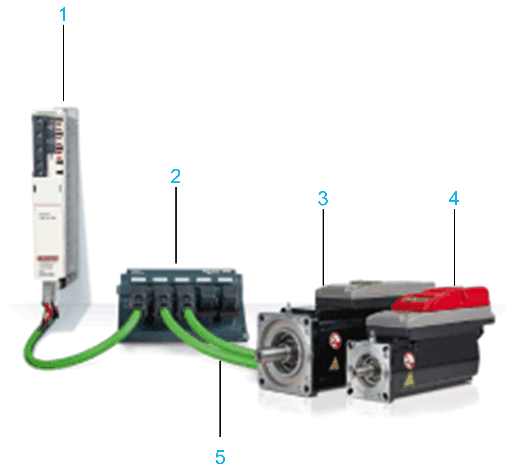

# System Overview

## System Overview

The control system consists of several components, depending on its application.

PacDrive 3 system overview:

**(1)** EcoStruxure Machine Expert Software

**(2)** Safety Logic Controller according to IEC 61508:2010 and EN ISO 13849:2015

Lexium 62 ILM system overview:

**1** Lexium 62 Connection Module

**2** Lexium 62 Distribution Box

**3** Lexium 62 ILM Integrated Servo Drive

**4** Lexium 62 ILM with Safety Module

**5** Hybrid Cable

EIO0000001351.08

© 2022

Schneider Electric.

All rights reserved.