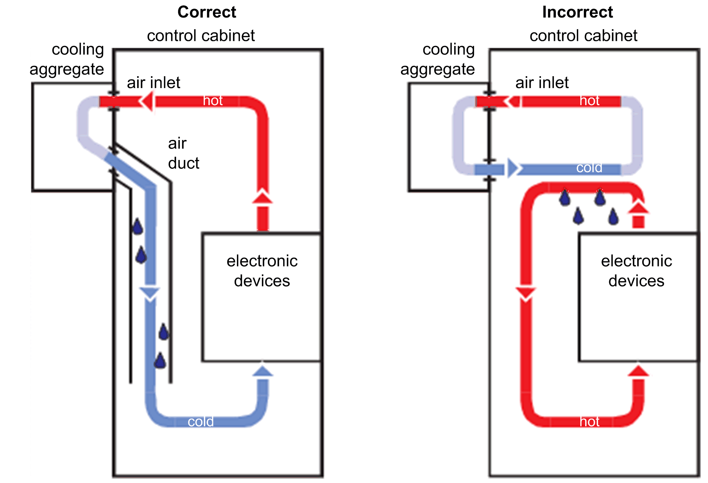

# Using Cooling Units

## Installing a Cooling Unit

How to proceed when installing a cooling unit:

| Step | Action |
| --- | --- |
| 1 | Position the cooling units so that no condensate drips out of the cooling unit onto electronic components or is sprayed by the cooling air flow. |
| 2 | Provide specially designed control cabinets for cooling units on the top of the control cabinet. |
| 3 | Design the control cabinet so that the cooling unit fan cannot spray any accumulated condensate onto the electronic components when it restarts after a pause. |
| 4 | When using cooling units, use only well-sealed control cabinets so that warm, humid outside air, which causes condensation, does not enter the cabinet. |
| 5 | When operating control cabinets with open doors during commissioning or maintenance, ensure that the electronic components are at no time cooler than the air in the control cabinet after the doors are shut, in order to avoid any condensation. |
| 6 | Continue to operate the cooling unit even when the system is switched off, so that the temperature of the air in the control cabinet and the air in the electronic components remains the same. |
| 7 | Set cooling unit to a fixed temperature of 40 °C (104 °F) or lower. |
| 8 | For cooling units with temperature monitoring, set the temperature limit to 40 °C (104 °F) so that the internal temperature of the control cabinet does not fall below the external air temperature. |

| WARNING | |
| --- | --- |
|  | UNINTENDED EQUIPMENT OPERATION  Follow the installation instructions such that the condensation from the cooling unit can not enter electrical equipment.  Failure to follow these instructions can result in death, serious injury, or equipment damage. |

Installing a cooling unit

EIO0000001351.08

© 2022

Schneider Electric.

All rights reserved.