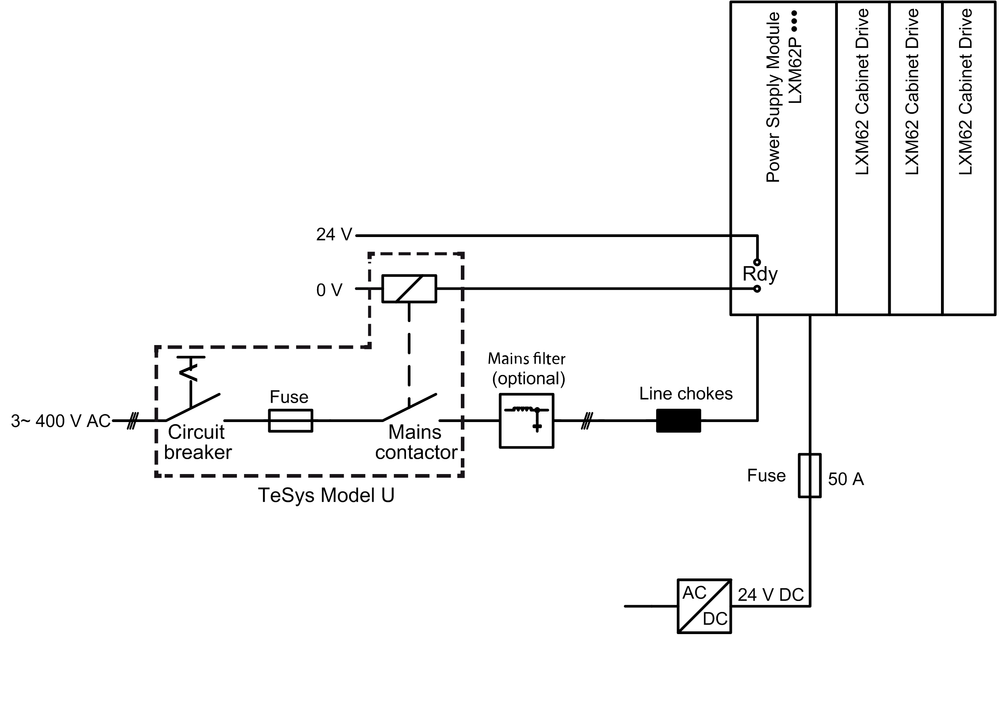

# Connection of the Lexium 62 Power Supply

## Overview

Connection of a Lexium 62 Power Supply

NOTE: The 24 Vdc supply input current must be limited to 50 A, which can be realized by a 50 A fuse as shown above. In particular, a 50 A fuse is mandatory if a passive 24 Vdc power supply is used.

For further information, refer to [*Fusing the Mains Connection*](D-SE-0052480.html#D-SE-0052480).

EIO0000001351.08

© 2022

Schneider Electric.

All rights reserved.