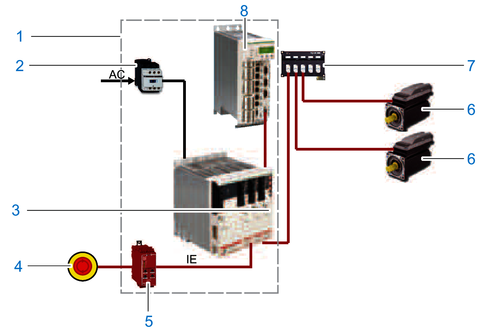
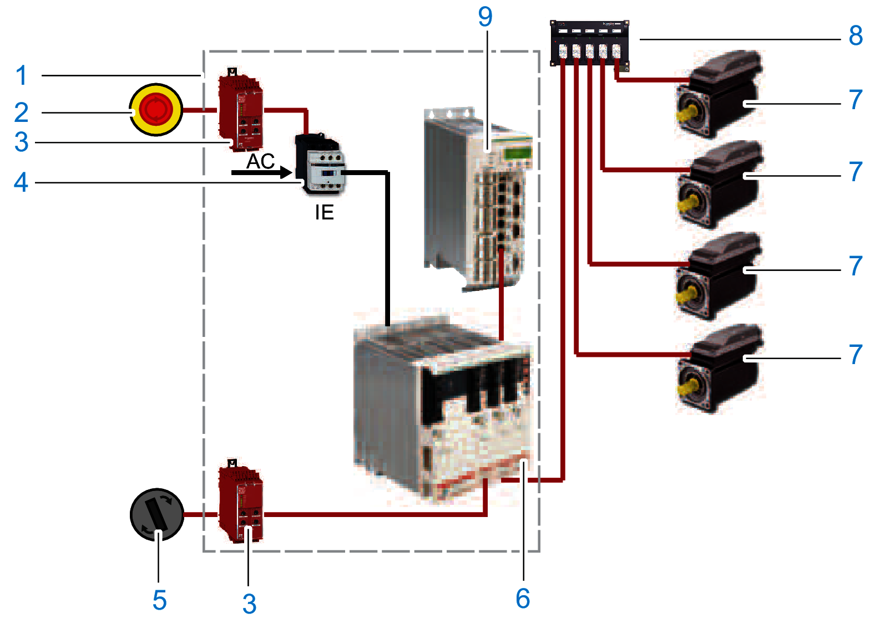
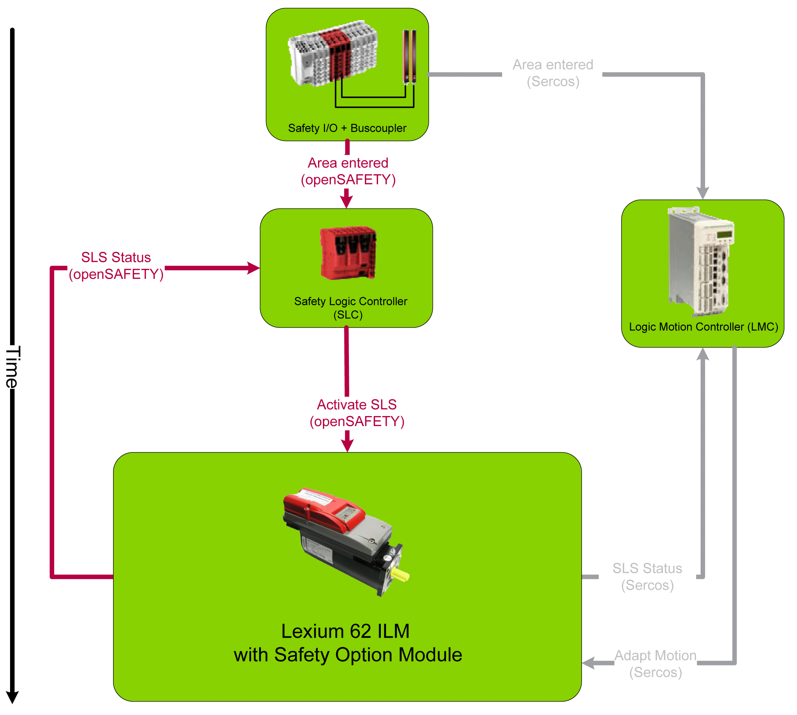

# Designated Safety Function

## Functional Description

With the Inverter Enable function (IE), you can bring drives to a defined safe stop.

This Inverter Enable function relates to the components

* Lexium 62 Connection Module
* Lexium 62 Distribution Box
* Lexium 62 ILM Integrated Servo Drive

In the sense of the relevant standards, the requirements of the stop category 0 (Safe Torque Off, STO) and stop category 1 (Safe Stop 1, SS1) can be met. Both categories lead to a torque-free motor while SS1 takes this state after a predefined time. As a result of the hazard and risk analysis, it may be necessary to choose an additional brake as a safety-related option (for example, for hanging loads).

With the optionally available Lexium 62 ILM Safety Module it is also possible to realize the extended safety functions such as Safety Limited Speed (SLS) in connection with the SLC100/200 FS and the associated software EcoStruxure Machine Expert - Safety.

| WARNING | |
| --- | --- |
|  | UNINTENDED EQUIPMENT OPERATION  * Make certain that no hazards can arise for persons or material during the coast down period of the axis/machine. * Do not enter the zone of operation during the coast down period. * Ensure that no other persons can access the zone of operation during the coast down period. * Use appropriate safety interlocks where personnel and/or equipment hazards exist.  Failure to follow these instructions can result in death, serious injury, or equipment damage. |

## Designated Safety Function Safe Torque Off (STO)

The Inverter Enable function relates to Lexium 62 Connection Module, Lexium 62 Distribution Box and Lexium 62 ILM, hereinafter referred to as Lexium 62 Drive System.

The function is selected via a signal (pair) at the input of the Lexium 62 Connection Module (2), which is forwarded to all drives (7) of the Lexium 62 Connection Module network. The supply voltage (AC) does not need to be interrupted.

The graphic shows the Lexium 62 Drive System with an emergency stop:

**1** Control cabinet

**2** Contactor

**3** Lexium 62 Connection Module

**4** Emergency stop switch

**5** Safety-related switching device (for example Harmony XPSUAT1)

**6** Lexium 62 ILM Integrated Servo Drive

**7** Lexium 62 Distribution Box

**8** Logic Motion Controller

## Operating Principle

The Inverter Enable function switches off the motor torque. It is sufficient to set a logical zero at the function input. There is no need to interrupt the power supply. Standstill, however, is not monitored.

## Defined Safe State

Inverter Enable is synonymous with "Safe Torque Off (STO)" according to IEC 61800-5-2:2016. This torque-free state is automatically entered when errors are detected and is therefore the defined safe state of the drive.

## Mode of Operation

The safety-related circuit with Inverter Enable was developed to minimize wear on the mains contactor. When the stop or the emergency stop button is activated, the mains contactor is not switched off. The defined safe stop is achieved by removing the “InverterEnable” for the optocouple in the power stage. Thus, the PWM signals cannot control the power stage so that a startup of the drives is prevented (pulse pattern lock).

You can use the Inverter Enable function to implement the control function “Stopping in case of emergency” (IEC 60204-1) for stop categories 0 and 1. Use an appropriate external safety-related circuit to prevent the unintended restart of the drive after a stop, as required in the machine directive.

## Stop Category 0

In stop category 0 (Safe Torque Off, STO), the drive coasts to a stop (provided there are no external forces operating to the contrary). The STO safety-related function is intended to help prevent an unintended start-up, not stop a motor, and therefore corresponds to an unassisted stop in accordance with IEC 60204-1.

In circumstances where external influences are present, the coast down time depends on physical properties of the components used (such as weight, torque, friction, and so on), and additional measures such as mechanical brakes may be necessary to help prevent any hazard from materializing. That is to say, if this means a hazard to your personnel or equipment, you must take appropriate measures (refer to [*Hazard and Risk Analysis*](D-SE-0051312.html#D-SE-0051312__D-SE-0051312.3)).

| WARNING | |
| --- | --- |
|  | UNINTENDED EQUIPMENT OPERATION  * Make certain that no hazards can arise for persons or material during the coast down period of the axis/machine. * Do not enter the zone of operation during the coast down period. * Ensure that no other persons can access the zone of operation during the coast down period. * Use appropriate safety interlocks where personnel and/or equipment hazards exist.  Failure to follow these instructions can result in death, serious injury, or equipment damage. |

## Stop Category 1

For stops of category 1 (Safe Stop 1, SS1) you can request a controlled stop via the Logic Motion Controller (LMC). The controlled stop by the LMC is not safety-relevant, nor monitored, and does not perform as defined in the case of a power outage or if an error is detected. The final switch off in the defined safe state is accomplished by switching off the "Inverter Enable" input. This has to be implemented by using an external safety-related switching device with safety-related delay (see [*Application Proposal*](D-SE-0062634.html#D-SE-0062634)).

Independent of the safety function, the detectable errors not affecting the safety function are recognized by the controller, thus avoiding the drive from starting by switching off the mains contactor. Contactor K2 prevents the mains contactor from being switched on.

## Execute Muting

To execute muting, determine the muting reaction time for switching off, that is, without the Inverter Enable function, within the application.

Should a response time be required because of the risk assessment of the machine, the total response time of the machine has to be taken into account. That is to say, the components related to the safety functions from the sensor to the drive shaft or the driven mechanics have to be considered. The determined reaction time must correspond to the results of the hazard and risk analysis.

| WARNING | |
| --- | --- |
|  | UNINTENDED EQUIPMENT OPERATION  * Verify that the maximum response time corresponds to your risk analysis. * Be sure that your risk analysis includes an evaluation for the maximum response time. * Validate the overall function with regard to the maximum response time and thoroughly test the application.  Failure to follow these instructions can result in death, serious injury, or equipment damage. |

Proceed as follows to disable the Inverter Enable function:

| Step | Action |
| --- | --- |
| 1 | You can deactivate the Inverter Enable function by using the [optional module DIS1](D-SE-0062527.html#D-SE-0062527).  **Result**:The defined safe state can only be achieved if the power is removed from the power supply. |
| 2 | In order to use the optional module DIS1, you must define the configuration with the parameter InverterEnableConfig of the Lexium 62 ILM in the motion controller configuration. |

If the software configuration does not match the physical configuration of the Lexium 62 ILM, then the diagnostic message 8978 InverterEnableConfig invalid with Ext. diagnostic = x(HW)!=y(Cfg) is triggered. The drive is disabled as long as the configuration is incorrect. The detected error can only be acknowledged if the set InverterEnableConfig corresponds to the physical configuration. The deactivation of the Inverter Enable function can be used to divide the drives on a Lexium 62 Connection Module in two groups if it is technically not possible to use two Lexium 62 Connection Module for the two groups in the existing machine.

The axes without Inverter Enable function become torque-free via the mains contactor and come to a stop.

If only some of the drives attached to a Lexium 62 Connection Module are to be put in the defined safe state, this can be achieved by the configuration of the drives. This can be of interest, for example, for maintenance procedures. If an optional module DIS1 is set, then the Inverter Enable signal is ignored.

To implement the emergency stop, the supply voltage on the Lexium 62 Power Supply must be interrupted:

**1** Control cabinet

**2** Emergency stop switch

**3** Safety-related switching device (for example Harmony XPSUAT1)

**4** Contactor

**5** Switch: Operating mode (normal/maintenance)

**6** Lexium 62 Connection Module

**7** Lexium 62 ILM Integrated Servo Drive

**8** Lexium 62 Distribution Box

**9** Logic Motion Controller

## Extended Safety-Related Functions - Operating Principle

The safety concept is based upon the general consideration that the required safety-related travel movement is performed by the controller and the drive. The safety system monitors the correct execution of the motion, and if it is not respected the safety system initiates the required fall-back level (for example the defined safe state).

An example for Safe Limited Speed (SLS) is as follows:

A light curtain is connected to a safety-related digital input. As soon as a person enters the protected zone passing the light curtain, a corresponding information is transmitted to the Safety Logic Controller (SLC) and the LMC via the Sercos bus. After that the LMC initiates an adequate travel movement, for example by using decelerating and then moving slowly. After an adjustable delay time this slow movement is monitored by Lexium 62 ILM Safety Module. Upon exceeding an adjustable threshold value (for example, high velocity), the required fall-back level is entered, for example, the defined safe state.

Application of safety-related function SLS:

## Extended Safety-Related Functions - Inverter Enable via Hardware Input

The Lexium 62 ILM Safety Module has been primarily developed to realize the extended safety functions, however, it still can be accessed using the usual hardware input for the Inverter Enable of the Lexium 62 Drive System. If only this is to be used, the device still needs to be configured and parameterized by using the software. If it is hardwired, the Safe Torque Off (STO) function can be triggered via this input or the Sercos bus. The Lexium 62 ILM Safety Module can be configured to ignore the hardware input. In this case, the Safe Torque Off (STO) function can only be activated upon a request over the Sercos bus. Otherwise, if the hardware input is not ignored then both requests (hardware input and Sercos bus) are verified and the Safe Torque Off (STO) function is triggered if one or both requests are active. The default configuration is not to ignore the hardware input.

## Extended Safety-Related Functions - Defined Safe State

The defined safe state of the device is characterized by the following features:

* The drive is torque-free, which is equivalent to Safe Torque Off (STO) according to IEC 61800-5-2.
* There is no safety-related communication from the drive via the Sercos bus.

This state is automatically entered when errors are detected.

## Validity of the Safety Case

The safety case for the Inverter Enable function of the Lexium 62 ILM is identified and defined by the standards listed in [*Safety Standards*](../../../../../api/crossBook?lang=en-US&virtualBookName=D-SE-0062635.html#D-SE-0062635). The safety case for the designated safety function of the Lexium 62 ILM system applies to the following hardware codes, which can be found examining the appropriate software object in [EcoStruxure Machine Expert](../../SoMProg&topicID=D_SG_0026478):

| Unicode | Hardware code |
| --- | --- |
| ILM 070/xx | xxxxxxxxx1xx, xxxxxxxxx2xx |
| ILM 100/xx | xxxxxxxxx1xx, xxxxxxxxx2xx |
| ILM140/xx | xxxxxxxxx1xx, xxxxxxxxx2xx |
| DIS1 | 1 |
| ILM62CM | xxxxxx1xx, xxxxxx2xx |
| ILM62DB | xxxxxx1xx |

| Device | Hardware code |
| --- | --- |
| VW3E702200000 | 011A1110 |

For questions on this, contact your Schneider Electric representative.

## Interface and Control

The Inverter Enable function is operated via the switching thresholds of the InverterEnable-input (IE\_p1/IE\_p2 at Pin1/Pin2, IE\_n1/IE\_n2 at Pin3/Pin4) of the Lexium 62 Connection Module.

* Maximum downtime: 500 µs at UIEX > 20 V with dynamic control
* Maximum test pulse ratio: 1 Hz
* STO active: -3 V ≤ UIE ≤ 5 V
* Power stage active: 15 V ≤ UIE ≤ 30 V

For information on the technical data and electrical connections, refer to the chapter [*Technical Data*](D-SE-0049402.html#D-SE-0049402).

EIO0000001351.08

© 2022

Schneider Electric.

All rights reserved.