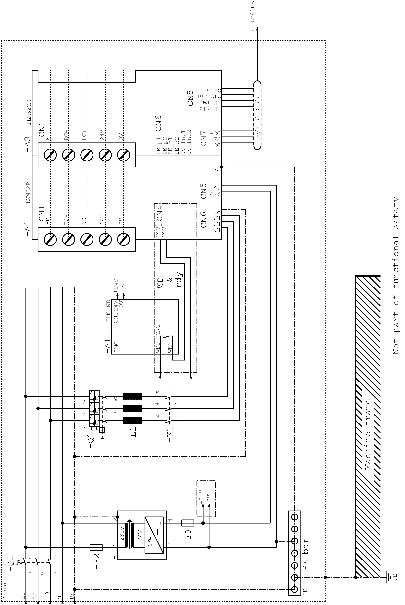
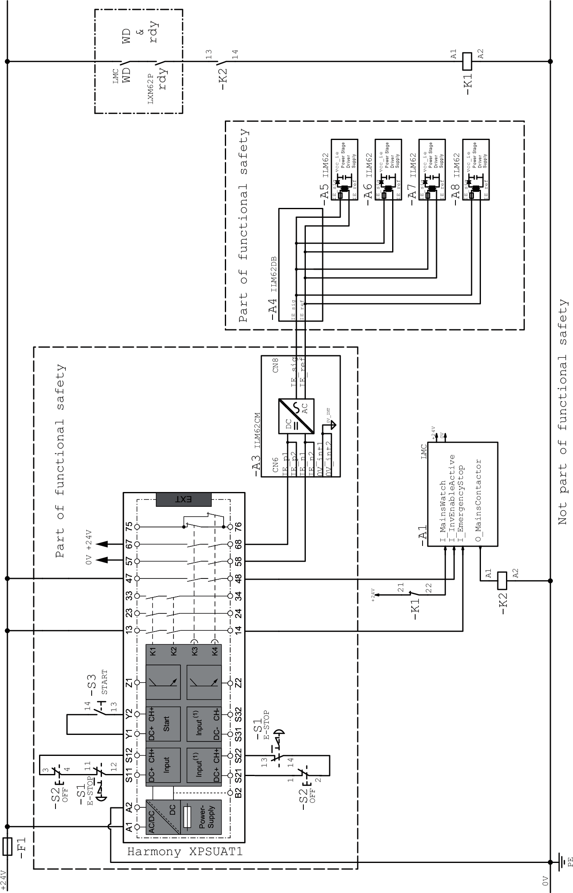

# Application Proposals for Hardware-Based Safety Functions

## How to Implement the Safe Stop Category 1 (SS1)

Refer to the schematic EL-1122-05-xx: Inverter Enable circuit Lexium 62 Connection Module / Lexium 62 ILM using the Logic Motion Controller LMC•00C with safety switch device for an emergency stop circuit.

NOTE:

* All application proposals provide for a protected Inverter Enable-wiring (control cabinet IP54) from the safety-related switch device to the Lexium 62 Connection Module, as wiring issues need to be ruled out.
* Protection against automatic restart must be provided by the external safety-related switch device.

NOTE: The mains contactor in the circuit suggestion EL-1122-05-xx is not necessary for functional safety purposes. It is, however, used in the application proposal for the device protection of the Lexium 62 Power Supply or the components connected to it.

EL-1122-05-xx Sheet 1:

EL-1122-05-xx Sheet 2:

EIO0000001351.08

© 2022

Schneider Electric.

All rights reserved.