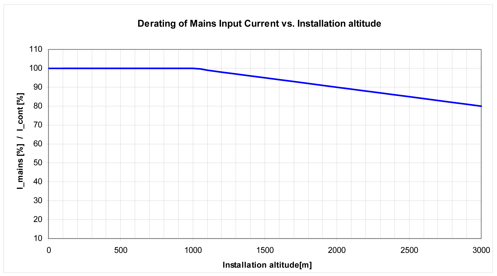
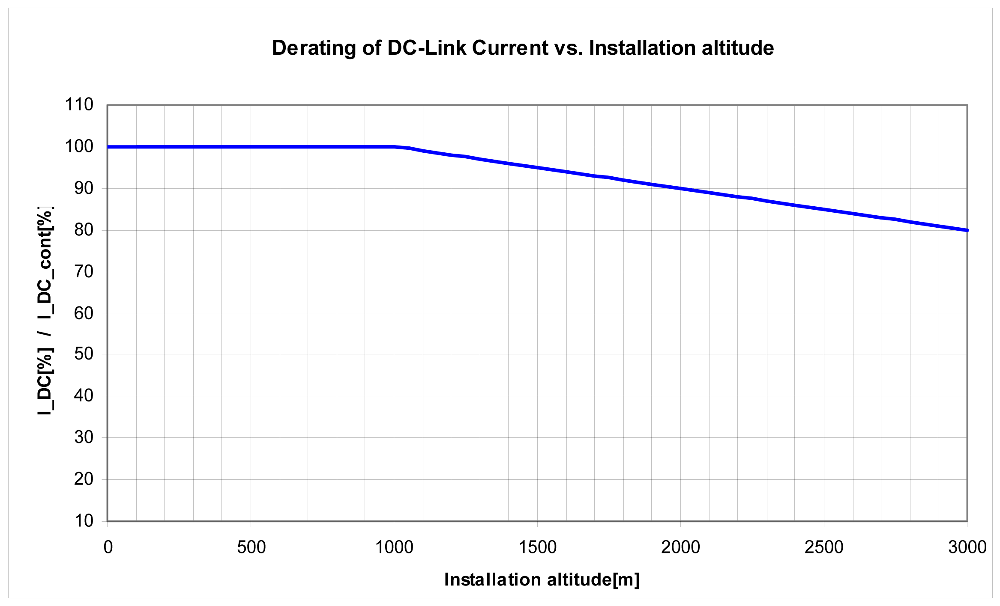
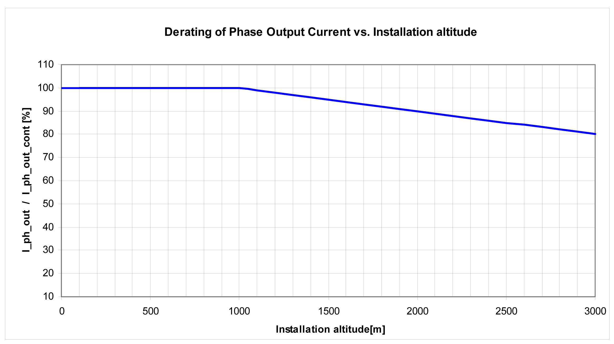

# Low Air Pressure

## Description

If the installation altitude exceeds the specified rated installation altitude, the performance of the entire system is reduced.

## Low Air Pressure - Lexium 62 Power Supply

Power reduction at increased installation altitude (Lexium 62 Power Supply):

## Low Air Pressure - Lexium 62 Connection Module

Power reduction at increased installation altitude (Lexium 62 Connection Module):

## Low Air Pressure - Lexium 62 ILM

Power reduction at increased installation altitude (Lexium 62 ILM at 8 kHz clock frequency of power stage):

NOTE: Multiply the values with the nominal current at 40 °C / 104 °F in order to calculate the maximum current value, depending on the required installation altitude.

EIO0000001351.08

© 2022

Schneider Electric.

All rights reserved.