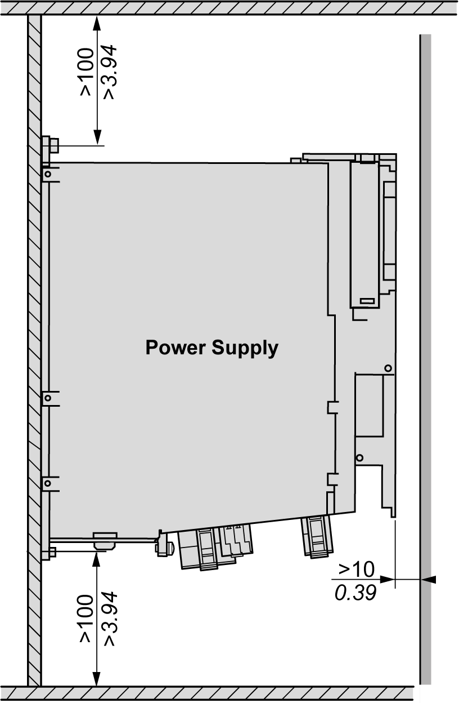
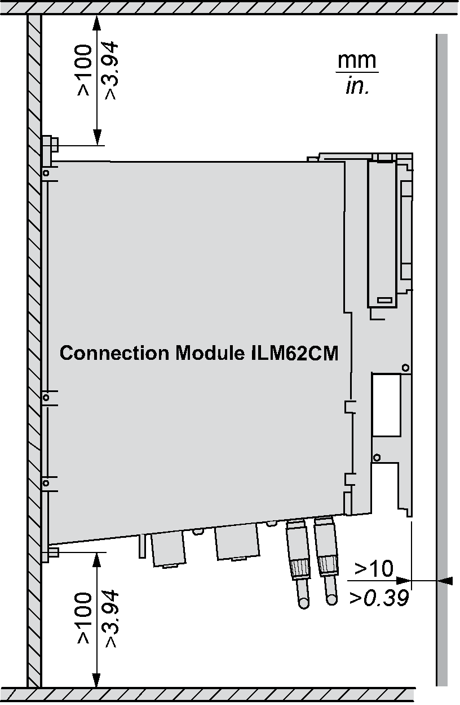

# Preparing the Control Cabinet

## Overview

| DANGER | |
| --- | --- |
|  | INCORRECT OR UNAVAILABLE GROUNDING  Remove paint across a large surface at the installation points before installing the devices (bare metal connection).  Failure to follow these instructions will result in death or serious injury. |

| Step | Action |
| --- | --- |
| 1 | If necessary to maintain and respect the maximum ambient operating temperature, install additional fan in the control cabinet. |
| 2 | Do not block the fan air inlet of the product. |
| 3 | Drill mounting holes in the control cabinet in the 45 mm (1.77 in) mounting-grid pattern (±0.2 mm / ±0.01 in). |
| 4 | Observe tolerances as well as distances to the cable channels and adjacent Lexium 62 servo drives or other heat producing equipment. |

## Required Distances

Keep a distance of at least 100 mm (3.94 in) above and below the devices.

Required distances in the control cabinet for the Logic Motion Controller, Lexium 62 Power Supply, Lexium 62 Connection Module:

NOTE: For the shield plates (external shield connections), additional holes are required.

## Required Distances in the Control Cabinet for the Power Supply

Keep a distance of at least 100 mm (3.94 in) above and below the devices.

Required distances in the control cabinet for the Lexium 62 Power Supply:

Do not lay any cables or cable channels over the servo amplifiers or braking resistor modules.

## Required Distances in the Control Cabinet for the Lexium 62 Connection Module

Keep a distance of at least 100 mm (3.94 in) above and below the devices.

Required distances in the control cabinet for the Lexium 62 Connection Module:

Do not lay any cables or cable channels over the servo amplifiers or braking resistor modules.

EIO0000001351.08

© 2022

Schneider Electric.

All rights reserved.