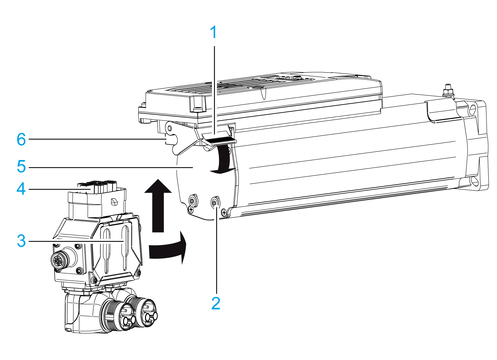

# Mounting

## How to Mount the Lexium 62 Power Supply and the Lexium 62 Connection Module

| Step | Action |
| --- | --- |
| 1 | Remove the terminal covers on the module sides (Lexium 62 Power Supply and Lexium 62 Connection Module) on which the modules are connected with each other. |
| 2 | For this purpose, press the screwdriver in the opening (1) (blade width: 5.5...8 mm (0.22...0.31 in)) on the top side of the module to loosen the terminal cover. |
| 3 | Then remove the terminal covers (a, b) toward the outside. |
| 4 | Screw the pan-head screws M6 (socket head cap screws) into the prepared mounting holes. |
| 5 | Keep a distance of 10 mm (0.39 in) between the screw head and the mounting plate. |
| 6 | Hook in device and verify the vertical mounting arrangement. |
| 7 | Place the Lexium 62 Power Supply and Lexium 62 Connection Module in the following order from left to right according to the current carrying capacity:   1. Lexium 62 Power Supply 2. Lexium 62 Connection Module   NOTE: By doing this, the load on the DC bus- and 24 V-supply at the wiring bus is reduced. |
| 8 | Tighten the mounting screws (torque: 4.6 Nm (41 lbf in)). |

## How to Assemble the Modules

| Step | Action |
| --- | --- |
| 1 | Verify whether the slide on the Bus Bar Module can be moved easily. If not, loosen the screws securing the slide to the Bus Bar Module. |
| 2 | Connect devices via the slide of the Bus Bar Module (1). |
| 3 | Tighten the screws of the Bus Bar Module (torque: 2.5 Nm / 22 lbf in). |
| 4 | Mount the terminal covers left TOP (a) and right TOP (b) on the outside of the Bus Bar Module combination. For important safety information, follow the instructions in the first safety message after this table.  Terminal covers on the outside of the Bus Bar Module combination |

This product has a touch current greater than 3.5 mA. If the protective earth ground connection is interrupted, a hazardous touch current may flow if the housing is touched.

| DANGER | |
| --- | --- |
|  | ELECTRIC SHOCK CAUSED BY HIGH LEAKAGE (TOUCH) VOLTAGE  * Attach the terminal covers on the extremities of the [*Bus Bar Module combination*](D-SE-0065676.html#D-SE-0065676). * Apply power to the device only if the terminal covers have been attached to the extremities of the Bus Bar Module combination.  Failure to follow these instructions will result in death or serious injury. |

## How to Ground the Lexium 62 Power Supply

| Step | Action |
| --- | --- |
| 1 | Connect the additional protective earth ground conductor with the ring cable lug and the M5 screw to the heat sink of the power supply (tightening torque: 3.5 Nm (31 lbf in)). |
| 2 | Follow the assembly based on the heat sink:   * Washer * Ring cable lug * Washer * Lock washer * Screw |
| 3 | Connect the plug-in connector CN5 24 V supply to the power supply.  NOTE: See important hazard message after the table. |
| 4 | Connect the plug-in connector CN6 AC supply to the power supply. |
| 5 | Connect the Sercos cable CN2 (CN3) to the power supply. |

| DANGER | |
| --- | --- |
|  | INSUFFICIENT GROUNDING  * Use a protective ground copper conductor with at least 10 mm2 (AWG 6) or two protective ground copper conductors with the same or larger cross section of the conductors supplying the power terminals. * Verify compliance with all local and national electrical code requirements as well as all other applicable regulations with respect to grounding of all equipment.  Failure to follow these instructions will result in death or serious injury. |

## How to Mount the Daisy Chain Connector Box on the Lexium 62 ILM

The graphic shows the installation of the Daisy Chain Connector Box on the Lexium 62 ILM.

| Step | Action |
| --- | --- |
| 1 | Place the Daisy Chain Connector Box flush onto the rear side of the Lexium 62 ILM so that the two guide lugs (5) are inserted in the two guide slots (6).  **Result**: The Daisy Chain Connector Box lies flush on the rear side of the Lexium 62 ILM (3). |
| 2 | While the Daisy Chain Connector Box is lying flush on the rear side of the Lexium 62 ILM (3), push it upwards as far as it goes.  **Result**: The hybrid plug connector (4) is inserted as far as it goes into the hybrid socket connector (2) of the Lexium 62 ILM. |
| 3 | Close the locking latch (1). |

| NOTICE | |
| --- | --- |
|  | BROKEN TABS ON THE LOCKING LATCH  Only close the locking latch (1) when the hybrid plug connector (4) is fully seated into the hybrid socket connector (2) and the Daisy Chain Connector Box lies flush on the rear side of the Lexium 62 ILM (3).  Failure to follow these instructions can result in equipment damage. |

EIO0000001351.08

© 2022

Schneider Electric.

All rights reserved.