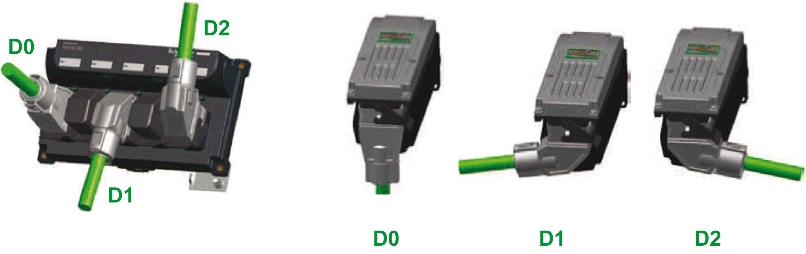
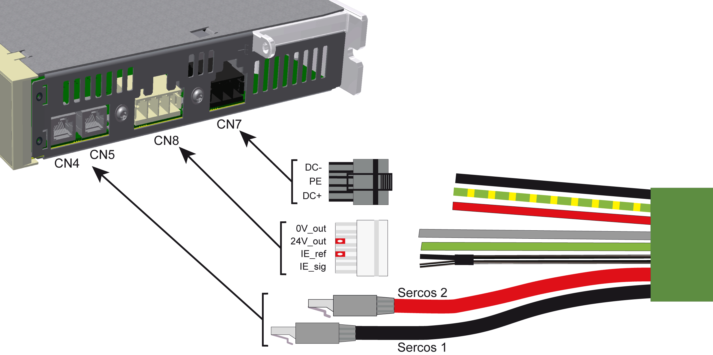
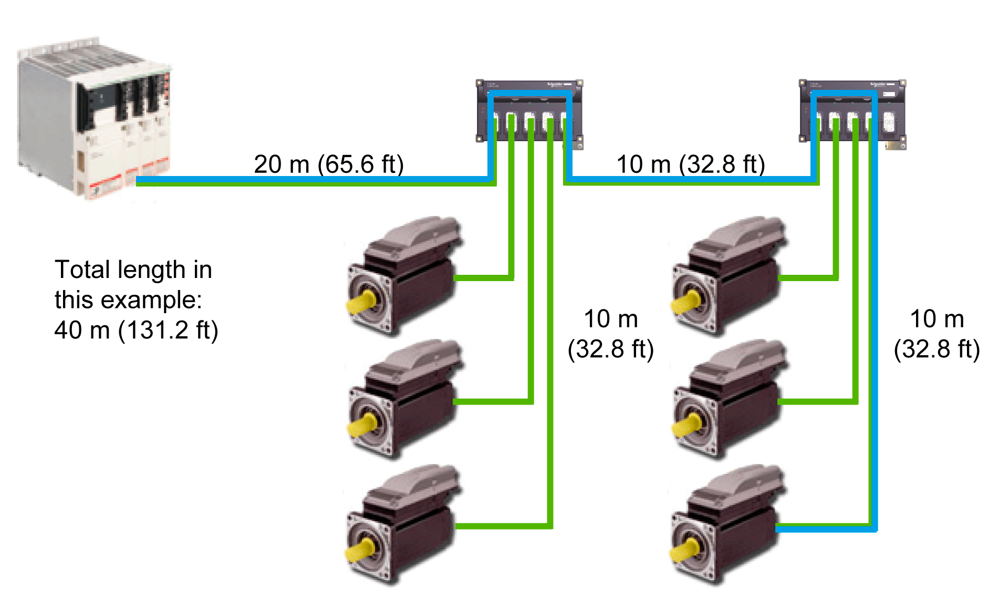
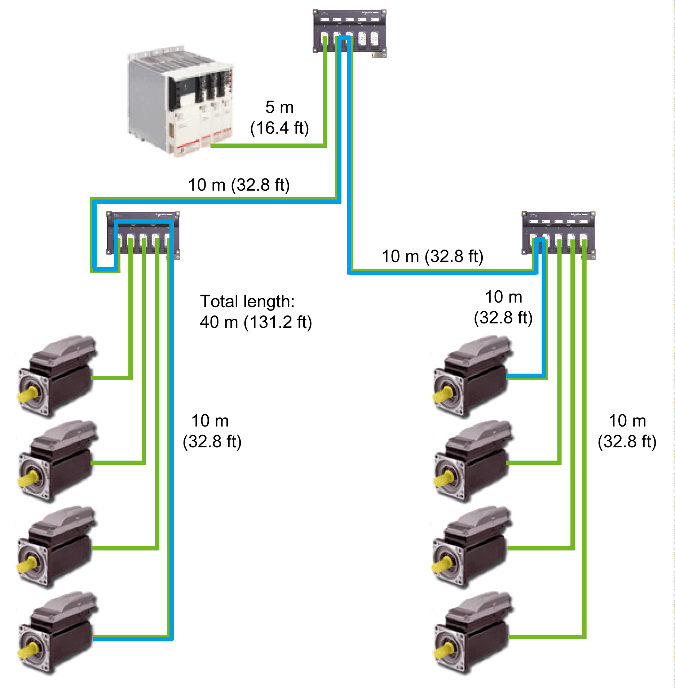

# Wiring the Lexium 62 Connection Module in Linear or Tree Topologies

## Presentation

The wiring of Lexium 62 Connection Module, Lexium 62 Distribution Box, and Lexium 62 ILM in linear or tree topologies is supported by hybrid cables.

The hybrid cable variants suitable for linear or tree topologies are listed in the type code Lexium 62 ILM accessories.

The hybrid connector variants presented in the following graphic are suitable for wiring in linear or tree topologies.

**D0** Straight connection

**D1** Connection at the bottom (Lexium 62 Distribution Box) or on the left (Lexium 62 ILM).

**D2** Connection on the top (Lexium 62 Distribution Box) or on the right (Lexium 62 ILM).

## How to Wire the Modules

For an overview of the different connections, refer to the [*Electrical Power Connections*](D-SE-0091923.html#D-SE-0091923).

| Step | Action |
| --- | --- |
| 1 | Connect connections **CN4**, **CN5**, **CN7**, and **CN8** (Sercos, DC bus voltage, 24 V, Inverter Enable) at the Lexium 62 Connection Module with the Lexium 62 Distribution Box by using the pre-assembled hybrid cable. |
| 2 | Remove protective cover from hybrid cables. |
| 3 | Connect up to four Lexium 62 ILMs at the Lexium 62 Distribution Box using hybrid cables. Engage the respective mounting bracket at both connection sides. |
| 4 | Provide unused hybrid connection sockets with strapping plugs.  NOTE:  * The strapping plugs are not included in the scope of delivery of Lexium 62 ILM and must be ordered separately (Commercial reference: VW3E6023). * Strapping plugs close the Sercos loop, while helping to ensure the integrity of the IP65 degree of protection. |

| WARNING | |
| --- | --- |
|  | LOSS OF IP65 RATING  Use strapping plugs VW3E6023 in unused hybrid connection sockets.  Failure to follow these instructions can result in death, serious injury, or equipment damage. |

## Topological Addressing of the Lexium 62 ILMs

The table is an example of the topological addressing of the Lexium 62 ILMs, depending on the Sercos, the connection, and assuming the Lexium 62 Connection Module is connected to connector CN1 with a hybrid cable.

The topological address for **CN2**, **CN3**, **CN4**, and **CN5** (Lexium 62 Distribution Box) depends on the assignment of Sercos 1/Sercos 2 to **CN4/CN5** (Lexium 62 Connection Module):

| Sercos lines with the hybrid cable | Connection Lexium 62 Connection Module | Topological address of the Lexium 62 ILMs connected to the Lexium 62 Distribution Box | | | |
| --- | --- | --- | --- | --- | --- |
| CN2 | CN3 | CN4 | CN5 |
| Sercos 1 (black)  Sercos 2 (red) | **CN4**  **CN5** | 4 | 3 | 2 | 1 |
| Sercos 1 (black)  Sercos 2 (red) | **CN5**  **CN4** | 1 | 2 | 3 | 4 |
| The topological address for **CN2**, **CN3**, **CN4**, and **CN5** (Lexium 62 Distribution Box) depends on the assignment of Sercos 1/Sercos 2 to **CN4/CN5** (Lexium 62 Connection Module). | | | | | |

Depending on the selected identification (address) mode in the EcoStruxure Machine Expert Logic Builder, an interchanged connection of the Sercos 1 / Sercos 2 connectors can lead to unintended machine operation.

| WARNING | |
| --- | --- |
|  | UNINTENDED MACHINE OPERATION  Ensure that the Sercos cables are connected to the Sercos connections CN4/CN5 of the Lexium 62 Connection Module according to the requirements of the application, its configuration and applicable standards.  Failure to follow these instructions can result in death, serious injury, or equipment damage. |

The following boundary conditions must be observed for the system layout:

* Maximum cable length of 20 m (65.2 ft) from Lexium 62 Connection Module to Lexium 62 Distribution Box.
* Maximum cable length of 10 m (32.8 ft) from Lexium 62 Distribution Box to another Lexium 62 Distribution Box.
* Maximum cable length of 10 m (32.8 ft) from Lexium 62 Distribution Box to Lexium 62 ILM.
* Sum of all cable lengths maximum 200 m (656 ft).
* Maximum distance of 50 m (164 ft) between 2 active Sercos slaves. In the example below, the critical measure is the return from the last Sercos slave (Lexium 62 ILM) to the Lexium 62 Power Supply via the connection module.
* Lexium 62 Connection Module and Lexium 62 Distribution Box are not active Sercos slaves. Both the Lexium 62 Connection Module and the Lexium 62 Distribution Box are passive, pass-through devices.

## Examples for the Pathways in Linear Topology and Tree Topology

NOTE: Contact Schneider Electric in order to create a detailed system layout for the respective available topology.

The following two examples illustrate the longest path between 2 active Sercos slaves for which a maximum length of 50 m (164 ft) is permissible. This critical distance is marked in blue.

In the following example of a linear topology, the longest path is between the Lexium 62 Power Supply and the last Lexium 62 ILM:

In this example of a tree topology, the longest path is between two Lexium 62 ILMs and not between the Lexium 62 Power Supply and the last Lexium 62 ILM. In this topology, the critical path is the forward, incoming signal as opposed to the former example where the critical path was the return path.

The graphic shows a connection overview of Lexium 62 ILM

**1** Ground connection

**2** Hybrid connector

NOTE: According to IEC/EN 60204-1, the correct grounding of the motor has to be verified on the installed machine on location in all cases.

EIO0000001351.08

© 2022

Schneider Electric.

All rights reserved.