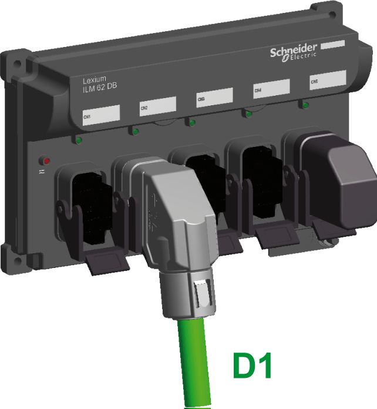
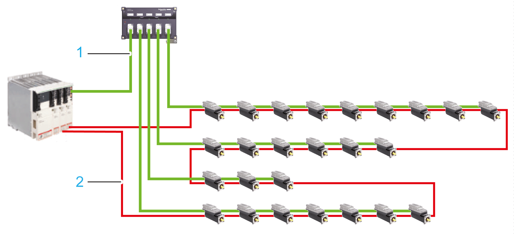
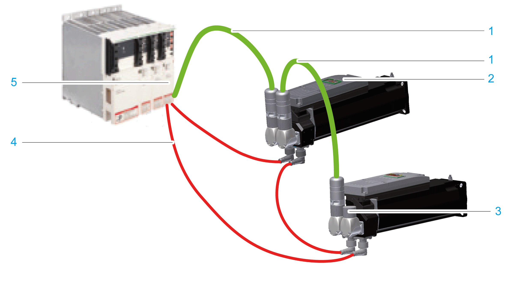

# Wiring from the Lexium 62 Connection Module in a Daisy Chain Topology

## Overview

Wiring of Lexium 62 Connection Module, Lexium 62 Distribution Box, Lexium 62 ILM in daisy chain topology is supported by a Daisy Chain Connector Box mounted on the Lexium 62 ILM along with power and Sercos cables.

The power and Sercos cable variants suitable for daisy chain topologies are listed in the [type code](D-SE-0062499.html#D-SE-0062499__D-SE-0062499.4) figure Lexium 62 ILM accessories.

The graphic shows a power connector suitable for a daisy chain wiring

**D1** Connection at the bottom (Lexium 62 Distribution Box)

With daisy chain structure, the power (DC bus voltage/24 V/Inverter Enable signals) and Sercos signals are distributed via separate cables.

The graphic shows an example of a net topology in a daisy chain structure with four daisy chain lines:

**1** Power cable (green)

**2** Sercos cable (red)

Each Lexium 62 ILM must be extended for daisy chain wiring by a Daisy Chain Connector Box. For this purpose, the Daisy Chain Connector Box is [mounted](D-SE-0065676.html#D-SE-0065676__D-SE-0065676.4) onto the Lexium 62 ILM and the wiring of the Lexium 62 ILMs is carried out via M12 / M23 connectors of the Daisy Chain Connector Box.

The graphic shows an example for a daisy chain wiring with one daisy chain line (connected directly to the Lexium 62 Connection Module):

**1** Power cable (green)

**2** Lexium 62 ILM

**3** At the last Lexium 62 ILM of the daisy chain line, the open power socket connector M23 (**CN2/CN3**) of the Daisy Chain Connector Box has to be tightly closed with a protection cap ILM62DCZ000.

**4** Sercos cable (red)

**5** Lexium 62 Connection Module

| WARNING | |
| --- | --- |
|  | LOSS OF IP65 RATING  * Assemble the M23 cable connector correctly to the daisy-chain connector box to properly seal the connection and meet the IP65 protection class requirements. * Tightly seal off open power socket connectors CN2/CN3 with an ILM62DCZ000 protection cap on the last drive of the daisy chain. * Use only cables and accessory parts from Schneider Electric.  Failure to follow these instructions can result in death, serious injury, or equipment damage. |

## How to Wire the Modules

For an overview of the different connections, refer to the [*Electrical Power Connections*](D-SE-0091923.html#D-SE-0091923)

Depending on the selected identification (address) mode in the EcoStruxure Machine Expert Logic Builder, an interchanged connection of the Sercos cables can lead to unintended machine operation.

| WARNING | |
| --- | --- |
|  | UNINTENDED MACHINE OPERATION  * Ensure that the Sercos cables are connected to the Sercos connections **CN4/CN5** of the Lexium 62 Connection Module according to the requirements of the application, its configuration, and applicable standards. * Ensure that the Sercos cables are connected to the Sercos socket connectors of the Daisy Chain Connector Box according to the requirements of the application, its configuration, and applicable standards.  Failure to follow these instructions can result in death, serious injury, or equipment damage. |

| Step | Action | |
| --- | --- | --- |
| 1 | By using one (or several) Lexium 62 Distribution Box:  Connect the connections **CN7**, **CN8** (power cable: DC bus voltage, 24 V, Inverter Enable) at the Lexium 62 Connection Module with the (first) Lexium 62 Distribution Box by using the pre-assembled power cable. | Without Lexium 62 Distribution Box:  Connect the connections **CN7**, **CN8** (power cable: DC bus voltage, 24 V, Inverter Enable) at the Lexium 62 Connection Module with the (first) Lexium 62 ILM by using the pre-assembled power cable. |
| 2 | Secure the M23 connector to the Daisy Chain Connector Box by twisting the connector collar. | |
| 3 | Connect up to 9 Lexium 62 ILMs per daisy chain line by using power cables. | |
| 4 | Connect up to four daisy chain lines with a maximum of 9 Lexium 62 ILMs to a Lexium 62 Distribution Box by using power cables. | |
| 5 | Engage the locking mechanism to the Lexium 62 Distribution Box connection side. | |
| 6 | Connect the connections **CN4**, **CN5** of the Lexium 62 Connection Module with the Sercos socket connectors of the Daisy Chain Connector Box to the Lexium 62 ILM by using a pre-assembled Sercos cable. | |
| 7 | Connect the Lexium 62 ILMs to the Sercos socket connectors of the Daisy Chain Connector Box by using a pre-assembled Sercos cable. | |
| 8 | Tightly close the open power socket M23 (**CN2/CN3**) of the Lexium 62 ILM with a protection cap ILM62DCZ000 on every daisy chain line on the last Daisy Chain Connector Box. | |

| WARNING | |
| --- | --- |
|  | LOSS OF IP65 RATING  * Assemble the M23 cable connector correctly to the daisy-chain connector box to properly seal the connection and meet the IP65 protection class requirements. * Tightly seal off open power socket connectors CN2/CN3 with an ILM62DCZ000 protection cap on the last drive of the daisy chain. * Use only cables and accessory parts from Schneider Electric.  Failure to follow these instructions can result in death, serious injury, or equipment damage. |

The following boundary conditions must be observed for the system layout:

* Maximum cable length of 20 m (65.2 ft) from Lexium 62 Connection Module to Lexium 62 Distribution Box.
* Maximum cable length of 10 m (32.8 ft) from Lexium 62 Distribution Box to another Lexium 62 Distribution Box.
* Maximum cable length of 10 m (32.8 ft) from Lexium 62 Distribution Box or Lexium 62 Connection Module to the first Lexium 62 ILM of the daisy chain line.
* A maximum of 9 Lexium 62 ILMs can be connected per daisy chain line and a maximum cable length of 10 m (32.8 ft) between the first and the last Lexium 62 ILM of the daisy chain line.
* Sum of all cable lengths maximum 200 m (656 ft).
* Maximum distance of 50 m (164 ft) between 2 active Sercos slaves.
* Lexium 62 Connection Module and Lexium 62 Distribution Box are not active Sercos slaves. Both the Lexium 62 Connection Module and the Lexium 62 Distribution Box are passive, pass-through devices.

NOTE: Contact Schneider Electric in order to create a detailed system layout for the respective available topology.

| NOTICE | |
| --- | --- |
|  | INCORRECT VOLTAGE / CURRENT  Only use topologies approved by Schneider Electric.  Failure to follow these instructions can result in equipment damage. |

NOTE: According to IEC/EN 60204-1, the correct grounding of the motor has to be verified on the installed machine on location in all cases.

EIO0000001351.08

© 2022

Schneider Electric.

All rights reserved.