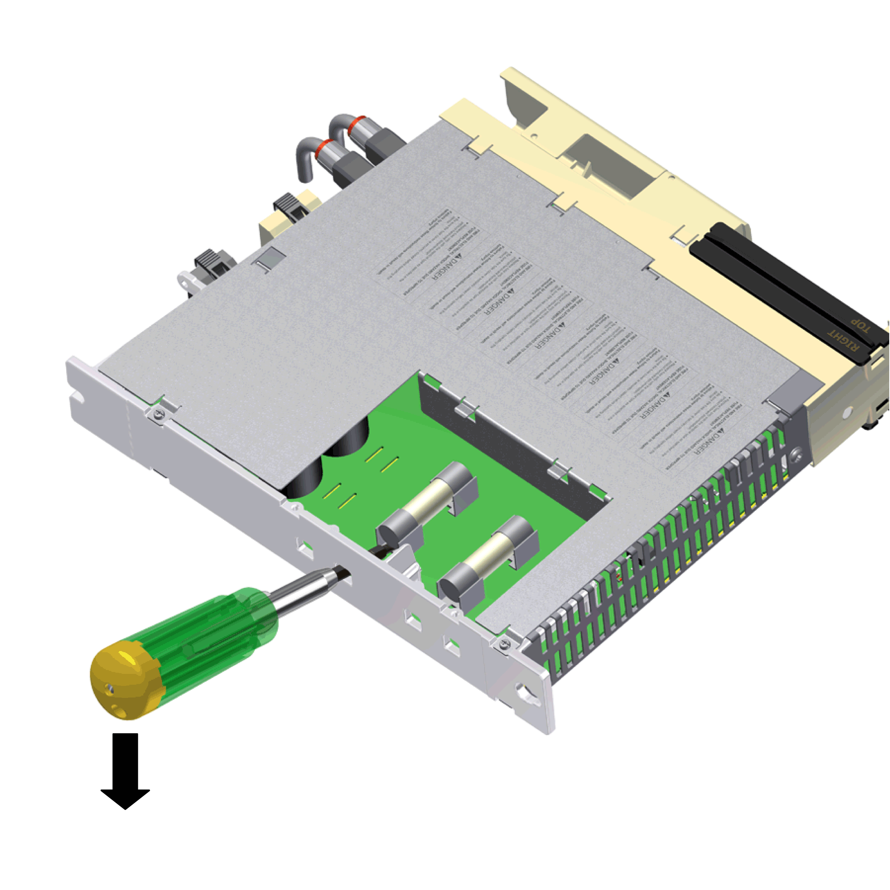

# Fuse Replacement Lexium 62 Connection Module

## Overview

If there is a loss of power from the Lexium 62 Connection Module while there is power at the power supply, you may need to replace the internal fuses.

The Lexium 62 Drive System indicates such a condition by the following:

* DC bus LED at the Lexium 62 Power Supply is on.
* DC bus LED at the Lexium 62 Connection Module is off.

NOTE: Before attempting to replace the fuses, determine the source of over-current or short circuit and remedy the issue.

The Lexium 62 Connection Module needs to be disconnected and removed to replace the internal fuses.

| DANGER | |
| --- | --- |
|  | ELECTRIC SHOCK CAUSED BY HIGH TOUCH VOLTAGE  * Before working on the product, make sure that it is de-energized. * After disconnection, do not touch connector CN6 mains connection on the Lexium 62 Power Supply module as it still carries hazardous voltages for approximately one second. * Only operate the Lexium 62 Power Supply and the Lexium 62 Connection Module in a control cabinet that cannot be opened without the help of tools.  Failure to follow these instructions will result in death or serious injury. |

| Step | Action |
| --- | --- |
| 1 | Dismount Lexium 62 Connection Module, refer to [*Replacing components and cables*](D-SE-0049351.html#D-SE-0049351). |
| 2 | Open the maintenance flap. |
| 3 | On the back side of the housing, remove both fuses from the holding device using a screwdriver and replace them by new fuses of the same type (Commercial reference VW3E6024). |

| DANGER | |
| --- | --- |
|  | FIRE AND ELECTRICAL SHOCK DUE TO IMPROPER FUSE REPLACEMENT  * Replace fuse only by a fuse of identical type as specified in the product documentation. * Be sure that the fuse cover is securely closed before operating the device.  Failure to follow these instructions will result in death or serious injury. |

## Instructions for ESD Protection

| NOTICE | |
| --- | --- |
|  | ELECTROSTATIC DISCHARGE  * Do not touch any of the electrical connections or components. * Touch circuit boards only on the edges. * Take the necessary protective measures against electrostatic discharges.  Failure to follow these instructions can result in equipment damage. |

Observe the following instructions to help avoid damages due to electrostatic discharge:

| Step | Action |
| --- | --- |
| 1 | Close maintenance flap and [mount](D-SE-0065676.html#D-SE-0065676) the Lexium 62 Connection Module. |
| 2 | Restart the [system](D-SE-0065676.html#D-SE-0065676__D-SE-0065676.5). |

NOTE:

* If after remedying the source of over-current or short circuit and fuse replacement, the Lexium 62 Connection Module still is not ready for operation or returns to a no power condition again after recommissioning, contact your Schneider Electric representative.
* With exception of internal fuses in the Lexium 62 Connection Module, there are no other user-serviceable parts within the Lexium 62 components. Either replace the component or contact your Schneider Electric representative.

| WARNING | |
| --- | --- |
|  | UNINTENDED EQUIPMENT OPERATION  * Only use software and hardware components approved by Schneider Electric for use with this equipment. * Do not attempt to service this equipment outside of authorized Schneider Electric service centers. * Update your application program every time you change the physical hardware configuration.  Failure to follow these instructions can result in death, serious injury, or equipment damage. |

EIO0000001351.08

© 2022

Schneider Electric.

All rights reserved.