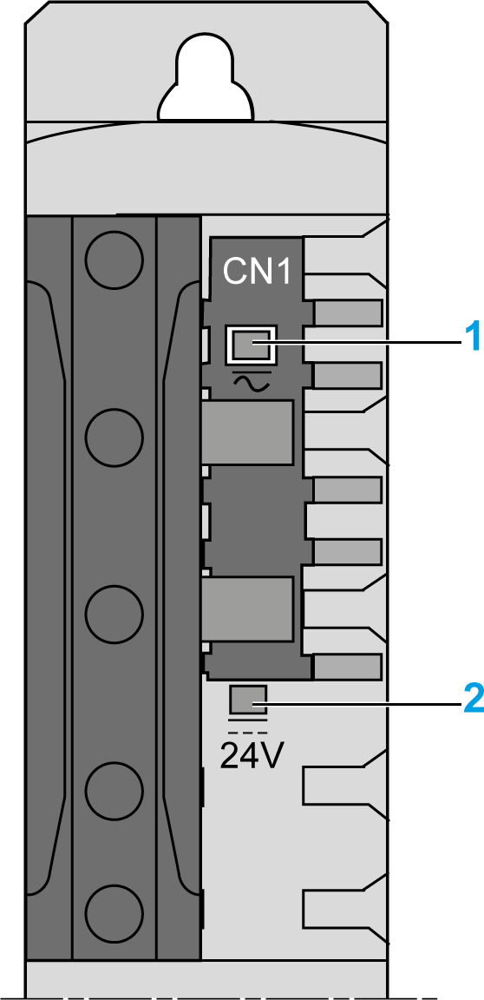

# Indicators of the Lexium 62 Connection Module

## Overview

The display of the Lexium 62 Connection Module consists of two LEDs that indicate the state of the DC voltage supply or the 24 V voltage supply via the Bus Bar Module.

The graphic shows the diagnostic LEDs of the Lexium 62 Connection Module:

**1** DC Bus LED Indicator

**2** 24 V LED Indicator

## DC Bus LED Indicator

| LED indicator color / status | Description | Information |
| --- | --- | --- |
| Off | DC bus supply inactive | – |
| Steady red | DC bus supply active | DC bus voltage ≥ 42 Vdc |

The DC Bus LED indicator is not an indicator for the absence of DC bus voltage.

| DANGER | |
| --- | --- |
|  | ELECTRIC SHOCK, EXPLOSION OR ARC FLASH  Verify with a correctly calibrated measuring instrument that the DC bus is de-energized (less than 42.4 Vdc) before replacing, maintaining or cleaning machine components.  Failure to follow these instructions will result in death or serious injury. |

## **24V** LED Indicator

| LED indicator color / status | Description |
| --- | --- |
| Off | 24 Vdc logic supply inactive |
| Steady green | 24 Vdc logic supply active |

EIO0000001351.08

© 2022

Schneider Electric.

All rights reserved.