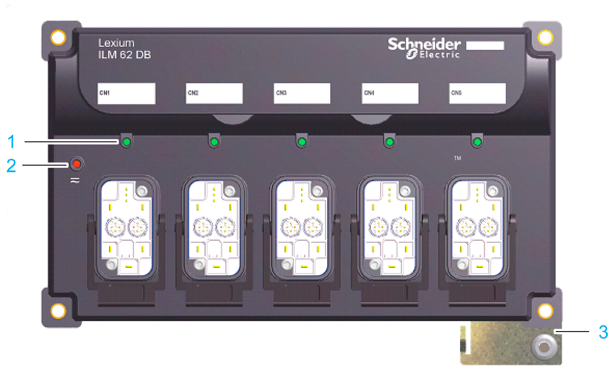
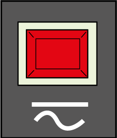

# Indicators of the Lexium 62 Distribution Box

## Overview

The graphic shows the display and operating elements of the LEDs of the Lexium 62 Distribution Box:

**1** Hybrid connection LED Indicator

**2** DC bus LED Indicator

**3** Protective ground (earth)

## Hybrid Connection LED Indicator

| LED indicator color / status | Description | Information |
| --- | --- | --- |
| Off | Hybrid connection not connected. | – |
| Steady green | Hybrid plug connector connected. | Applies for hybrid cable or power cable (daisy chain wiring). |

## DC Bus LED Indicator

| LED indicator color / status | Description | Information |
| --- | --- | --- |
| Off | DC bus supply inactive | – |
| Steady red | DC bus supply active | DC bus voltage ≥ 42 Vdc |

The DC Bus LED indicator is not an indicator for the absence of DC bus voltage.

| DANGER | |
| --- | --- |
|  | ELECTRIC SHOCK, EXPLOSION OR ARC FLASH  Verify with a correctly calibrated measuring instrument that the DC bus is de-energized (less than 42.4 Vdc) before replacing, maintaining or cleaning machine components.  Failure to follow these instructions will result in death or serious injury. |

EIO0000001351.08

© 2022

Schneider Electric.

All rights reserved.