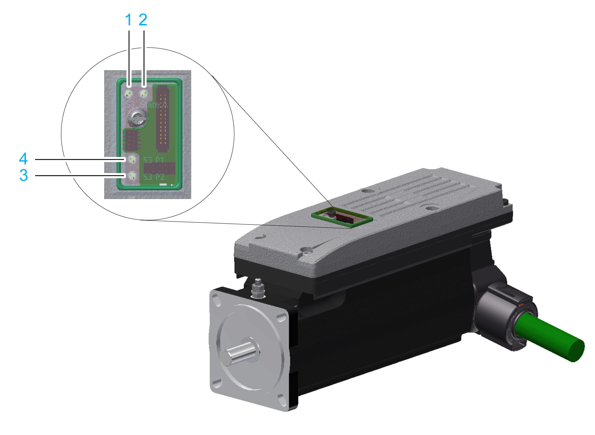

# Indicators of the Lexium 62 ILM Integrated Servo Drive

## Overview

The display at the Lexium 62 ILM consists of four color LEDs that are used to display the status information.

Diagnostic LEDs of the Lexium 62 ILM:

**1** S3 LED Indicator

**2** State LED Indicator

**3** Port 2 LED Indicator

**4** Port 1 LED Indicator

## S3 (Sercos III) LED Indicator

| LED indicator color / status | Description | Instructions / information for the user |
| --- | --- | --- |
| Off | The device is not energized or is otherwise inoperable, or there is no communication due to an interrupted or separated connection. | Start Sercos boot up or verify the Sercos cable and connections. |
| Steady green | Active Sercos connection without an error detected in the CP4. | – |
| Flashing green (2 Hz, 250 ms) | The device is in loopback mode.  Loopback describes the situation in which the Sercos telegrams have to be sent back on the same port on which they were received.  Possible causes:   * Line topology or * Sercos loop break | Workaround:   * Close ring.   Reset condition:   * Acknowledge the detected error in the EcoStruxure Machine Expert Logic Builder menu Online > Reset diagnostic messages of controller. * Switch from CP0 to CP1 alternatively.   NOTE: If during phase CP1 a line topology or ring break was detected (device in loopback mode), the LED indicator condition does not change. |
| Steady red | Sercos diagnostic class 1 (DC1) an error has been detected on port 1 and/or port 2. No Sercos communication possible on the ports. | Reset condition:   * Acknowledge the detected error in the EcoStruxure Machine Expert Logic Builder menu Online > Reset diagnostic messages of controller. |
| Flashing red / green (2 Hz, 250 ms) | Communication error has been detected.  Possible causes:   * Improper functioning of the telegram * CRC error detected | Reset condition:   * The configuration shows which error has been detected. * Acknowledge the detected error in the EcoStruxure Machine Expert Logic Builder menu Online > Reset diagnostic messages of controller. |
| Steady orange | The device is in a communications phase CP0 up to and including CP3 or HP0 up to and including HP2. Sercos telegrams are received. | – |
| Flashing orange (4 Hz, 125 ms) | Device identification | – |

## State LED Indicator

| LED indicator color / status | Description | Instructions / information for the user |
| --- | --- | --- |
| Off | Device is not energized or is otherwise inoperable. | * Verify the power supply. * Replace device. |
| Flashing green (2 Hz, 250 ms) | Initialization of the device (firmware restart process, compatibility verification of the hardware, updating the firmware) | * Wait until initialization is complete. |
| Flashing slowly green (2 Hz, 40 ms) | Identification of the device | * If necessary, identify the device via EcoStruxure Machine Expert as defined by the controller configuration. |
| Steady green | Device has been initialized and waits for the configuration. | * Configure device as active. * Configure device as inactive. * Configure device for the execution of motions. |
| Steady red | A non-recoverable error has been detected requiring user intervention:   * Watchdog * Firmware * Checksum * Internal error detected | * Cycle power (power reset) * If this condition persists, replace the device. |
| Flashing slowly red (2 Hz, 250 ms) | A general error has been detected. | * The devices tree in EcoStruxure Machine Expert displays the error detected . * Reset error detected in the EcoStruxure Machine Expert Logic Builder menu Online > Reset diagnostic messages of controller. * Otherwise restart device. |

## Port 1 and 2 LED Indicators

| LED indicator color / status | Description |
| --- | --- |
| Off | No cable connected |
| Steady orange | Cable connected, no Sercos communication |
| Steady green | Cable connected, active Sercos communication |

EIO0000001351.08

© 2022

Schneider Electric.

All rights reserved.