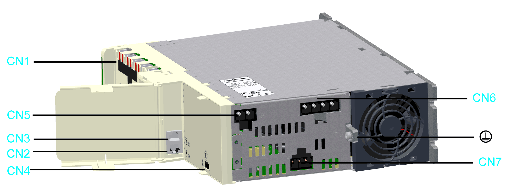
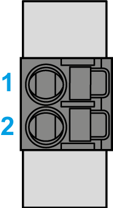
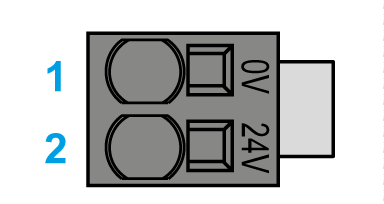
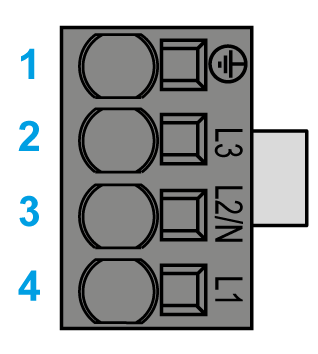
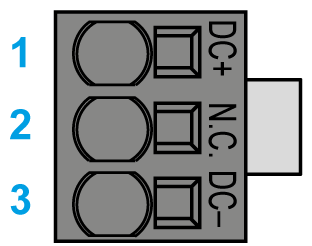

# Electrical Connections for the Lexium 62 Power Supply

## Overview

| Connector | Description | Connection cross-section [mm2] / [AWG] | Tightening torque [Nm] / [lbf in] |
| --- | --- | --- | --- |
| **[CN1](#D-SE-0051911__D-SE-0051911.6)** | Bus Bar Module | – | 2.5 / 22.14 |
| **[CN2/CN3](#D-SE-0051911__D-SE-0051911.7)** | Sercos communication | – | – |
| **[CN4](#D-SE-0051911__D-SE-0051911.8)** | Ready relay output | 0.2...1.5 / 24...16(1) | – |
| **[CN5](#D-SE-0051911__D-SE-0051911.9)** | 24 Vdc | 0.5…16 / 20...6(1) | – |
| **[CN6](#D-SE-0051911__D-SE-0051911.10)** | Mains connection | 0.75…16 / 18...6(1) | – |
| **[CN7](#D-SE-0051911__D-SE-0051911.11)** | DC bus output | 0.2…6 / 24...10(1) | – |
|  | Protective ground (earth) | 10 / 6 | 3.5 / 30.98 |
| **(1)** Gauge required for UL conformance. For further information on this, refer to [*Conditions for UL Compliant Use*](D-SE-0052479.html#D-SE-0052479). | | | |

## Removable Spring-Clamping Terminal Block Wiring

The details in the following table apply for the wiring on the removable spring-clamping terminal block of the **CN4** connection.

Overview of the connection cross-sections for the removable spring-camping terminal block **CN4** Ready Relay output

|  | Rigid wire | Flexible wire | Flexible wire with a wire end sleeve without a plastic sleeve | Flexible wire with a wire end sleeve and plastic sleeve |
| --- | --- | --- | --- | --- |
| mm2 | 0.2...1.5 | 0.2...1.5 | 0.25...1.5 | 0.25...0.75 |
| AWG | 24...16 | 24...16 | 23...16 | 23...16 |

The details in the following table apply for the wiring on the removable spring-clamping terminal block of the **CN5, CN6 and CN7** connection.

Overview of the connection cross-sections for the removable spring-clamping terminal block **CN5, CN6 and CN7** mains connection.

|  | Rigid wire | Flexible wire | Flexible wire with a wire end sleeve(1) without a plastic sleeve | Flexible wire with a wire end sleeve(1) and plastic sleeve |
| --- | --- | --- | --- | --- |
| mm2 | 0.75...16 | 0.75...16 | 0.75...16 | 0.75...10 |
| AWG | 18...6 | 18...6 | 18...6 | 18...8 |
| **(1)** Use crimping tools CRIMPFOX 10 S (for wire cross sections 0.75..10 mm², AWG 18..8) and CRIMPFOX 16 S (for wire cross-sections 10...16 mm², AWG 8..6) from Phoenix Contact. | | | | |

## **CN1** - Bus Bar Module

The DC bus voltage and the 24 Vdc control voltage are distributed and the protective conductor is connected via the Bus Bar Module.

| Pin | Designation | Description |
| --- | --- | --- |
| 1 |  | Protective ground (earth) |
| 2 | DC- | DC bus voltage - |
| 3 | DC+ | DC bus voltage + |
| 4 | 24 V | Supply voltage + |
| 5 | 0 V | Supply voltage - |

## **CN2/CN3** - Sercos

The Sercos connection is used for the communication between the controller and the Lexium 62 Power Supply.

| Pin | Designation | Description |
| --- | --- | --- |
| 1.1 | Eth0\_Tx+ | Positive transmission signal |
| 1.2 | Eth0\_Tx- | Negative transmission signal |
| 1.3 | Eth0\_Rx+ | Positive receiver signal |
| 1.4 | N.C. | Reserved |
| 1.5 | N.C. | Reserved |
| 1.6 | Eth0\_Rx- | Negative receiver signal |
| 1.7 | N.C. | Reserved |
| 1.8 | N.C. | Reserved |
| 2.1 | Eth1\_Tx+ | Positive transmission signal |
| 2.2 | Eth1\_Tx- | Negative transmission signal |
| 2.3 | Eth1\_Rx+ | Positive receiver signal |
| 2.4 | N.C. | Reserved |
| 2.5 | N.C. | Reserved |
| 2.6 | Eth1\_Rx- | Negative receiver signal |
| 2.7 | N.C. | Reserved |
| 2.8 | N.C. | Reserved |

## **CN4** - Ready Relay Output

Following initialization of the Lexium 62 Power Supply, the Ready output is activated.

| Pin | Designation | Description | Note |
| --- | --- | --- | --- |
| 1 | RDY1 | Indicates that the power supply is operational. | Potential-free contact |
| 2 | RDY2 |

## **CN5** - 24 V

The 24 V input supplies the internal logic assemblies as well as the holding brakes of the axis group, connected to the axis modules.

| Pin | Designation | Description |
| --- | --- | --- |
| 1 | 0 V | Internal supply voltage |
| 2 | 24 V |

The insulation-stripped length of the wires of the 24 V input connector is 18 mm (0.71 in.).

## **CN6** - Mains Connection

The Power Supply is supplied with voltage via the power connection.

| Pin | Designation | Description |
| --- | --- | --- |
| 1 |  | Protective ground (earth) |
| 2 | L3 | External conductor L3 |
| 3 | L2/N | External conductor L2/N |
| 4 | L1 | External conductor L1 |

The insulation-stripped length of the wires of the AC infeed connectors is 18 mm (0.71 in.).

## **CN7** - DC Bus Output

The DC bus output can be used for an external braking resistor module.

| Pin | Designation | Description |
| --- | --- | --- |
| 1 | DC+ | DC bus voltage + |
| 2 | N.C. | Reserved |
| 3 | DC- | DC bus voltage - |

The insulation-stripped length of the wires of the DC bus connector is 15 mm (0.59 in.).

EIO0000001351.08

© 2022

Schneider Electric.

All rights reserved.