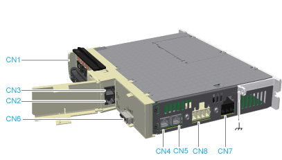
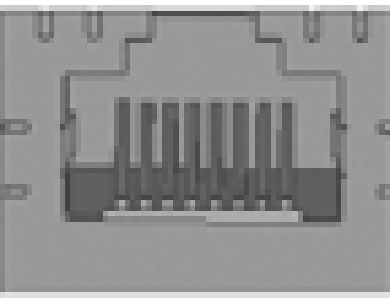
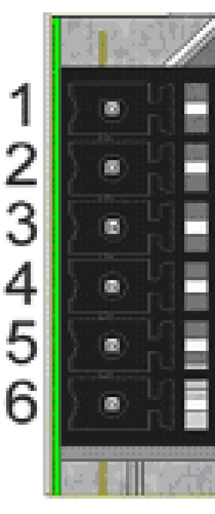
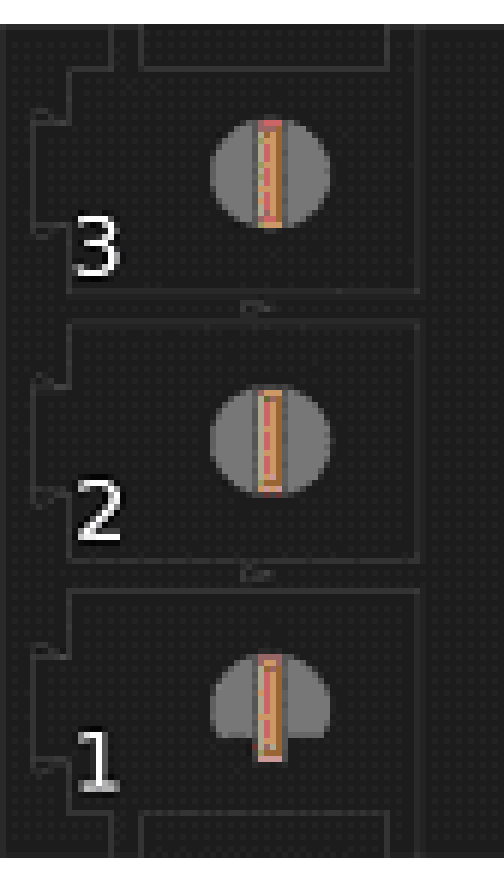
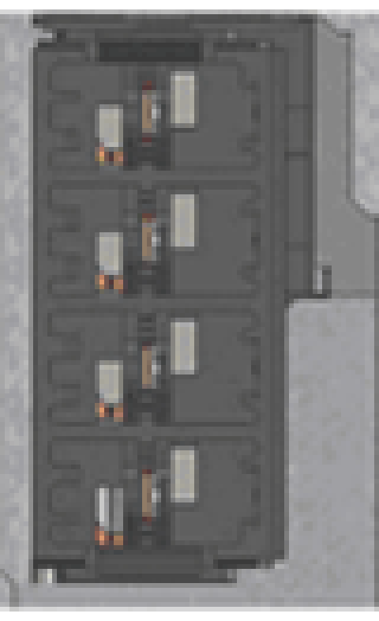

# Electrical Connections for the Lexium 62 Connection Module

## Overview

| Connector | Description | Connection cross-section [mm2] / [AWG] | Tightening torque [Nm] / [lbf in] |
| --- | --- | --- | --- |
| **[CN1](#D-SE-0064675__D-SE-0064675.2)** | Bus Bar Module | – | 2.5 / 22.14 |
| **[CN2/CN3](#D-SE-0064675__D-SE-0064675.3)** | Sercos communication | – | – |
| **[CN4](#D-SE-0064675__D-SE-0064675.17)** | Sercos communication | – | – |
| **[CN5](#D-SE-0064675__D-SE-0064675.17)** | Sercos communication | – | – |
| **[CN6](#D-SE-0064675__D-SE-0064675.23)** | Inverter Enable 24 V | 0.5…16 / 20...6 | – |
| **[CN7](#D-SE-0064675__D-SE-0064675.19)** | DC bus output | 0.2…6 / 24...10 | – |
| **[CN8](#D-SE-0064675__D-SE-0064675.25)** | Inverter Enable signal output / 24 V output | 0.2…6 / 24...10 | – |
|  | Protective ground (earth) | 10 (cable lug) / 6 | 3.5 / 30.98 |

## **CN1** - Bus Bar Module

The DC bus voltage and the 24 Vdc control voltage are distributed and the protective conductor is connected via the Bus Bar Module.

| Pin | Designation | Description |
| --- | --- | --- |
| 1 |  | Protective ground (earth) |
| 2 | DC- | DC bus voltage - |
| 3 | DC+ | DC bus voltage + |
| 4 | 24 V | Supply voltage + |
| 5 | 0 V | Supply voltage - |

## **CN2/CN3** - Sercos

The Sercos connection is used for the communication between the controller, the Lexium 62 Power Supply and the Lexium 62 Connection Module.

| Pin | Designation | Description |
| --- | --- | --- |
| 1.1 | Eth0\_Tx+ | Positive transmission signal |
| 1.2 | Eth0\_Tx- | Negative transmission signal |
| 1.3 | Eth0\_Rx+ | Positive receiver signal |
| 1.4 | N.C. | – |
| 1.5 | N.C. | – |
| 1.6 | Eth0\_Rx- | Negative receiver signal |
| 1.7 | N.C. | – |
| 1.8 | N.C. | – |
| 2.1 | Eth1\_Tx+ | Positive transmission signal |
| 2.2 | Eth1\_Tx- | Negative transmission signal |
| 2.3 | Eth1\_Rx+ | Positive receiver signal |
| 2.4 | N.C. | – |
| 2.5 | N.C. | – |
| 2.6 | Eth1\_Rx- | Negative receiver signal |
| 2.7 | N.C. | – |
| 2.8 | N.C. | – |

## **CN4/CN5** - Sercos

The Sercos connection is used for communication between Lexium 62 Connection Module and Lexium 62 ILM.

| Pin | Designation | Description |
| --- | --- | --- |
| 1 | Eth0\_Tx+ | Positive transmission signal |
| 2 | Eth0\_Tx- | Negative transmission signal |
| 3 | Eth0\_Rx+ | Positive receiver signal |
| 4 | N.C. | – |
| 5 | N.C. | – |
| 6 | Eth0\_Rx+ | Negative receiver signal |
| 7 | N.C. | – |
| 8 | N.C. | – |

## **CN6** - Inverter Enable Power Supply 24 V

The Inverter Enable voltage connection supplies the Inverter Enable output.

| Pin | Designation | Description |
| --- | --- | --- |
| 1 | IE\_p1 | Supply voltage 24 V for Inverter Enable |
| 2 | IE\_p2 | Supply voltage 24 V for Inverter Enable |
| 3 | IE\_n1 | Supply voltage 0 V for Inverter Enable |
| 4 | IE\_n2 | Supply voltage 0 V for Inverter Enable |
| 5 | 0V\_int1 | Control voltage 0 V |
| 6 | 0V\_int2 | Control voltage 0 V |

NOTE: The maximum current carrying capacity must be respected:

Maximum consumption per Lexium 62 Connection Module: 2 A with 45 Lexium 62 ILM Integrated servo drives.

## **CN7** - DC Bus Output

The DC bus output is connected to the Lexium 62 Distribution Box via the hybrid cable or power cable (daisy chain wiring), or is directly connected to an Lexium 62 ILM and supplies the Lexium 62 ILM with the required power.

| Pin | Designation | Description | Color of cable core |
| --- | --- | --- | --- |
| 1 | DC+ | DC bus voltage + | red |
| 2 | PE | Protective ground (earth) | green/yellow |
| 3 | DC- | DC bus voltage - | black |

The insulation-stripped length of the wires of the DC bus connector is 15 mm (0.59 in.).

## CN8 - Inverter Enable Output

The Inverter Enable signal switches off the motor torque to obtain the defined safe state.

| Pin | Designation | Description | Color of cable core |
| --- | --- | --- | --- |
| 1 | IE\_sig | IE signal 1 | white (core) |
| 2 | IE\_ref | IE signal 2 | white (shield) |
| 3 | 24V\_out | Control voltage 24 V | green |
| 4 | 0V\_out | Control voltage 0 V | gray |

The insulation-stripped length of the wires of the 24 V input connector is 15 mm (0.59 in.).

EIO0000001351.08

© 2022

Schneider Electric.

All rights reserved.