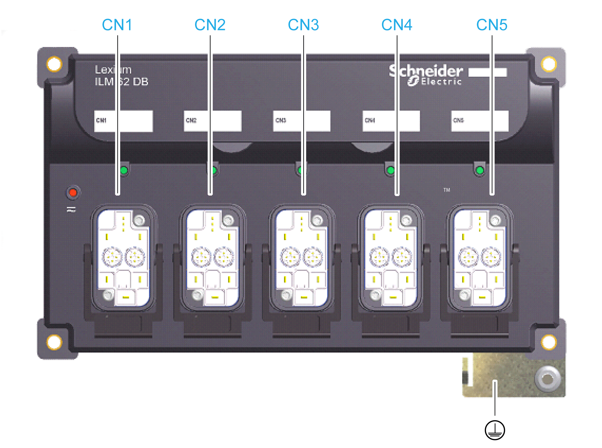
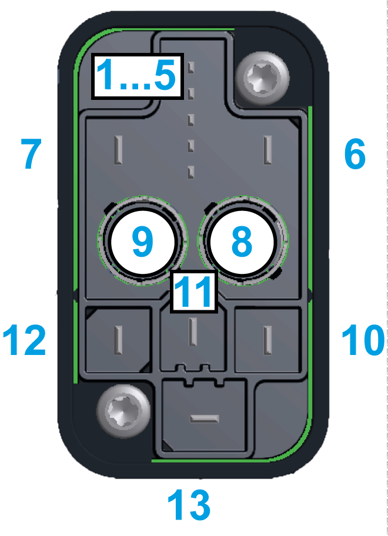

# Electrical Connections for the Lexium 62 Distribution Box

## Overview

| Connector | Description |
| --- | --- |
| **[CN1](#D-SE-0064679__D-SE-0064679.3)** | Input (Lexium 62 Connection Module or Lexium 62 Distribution Box) |
| **[CN2](#D-SE-0064679__D-SE-0064679.3)** | Output (Lexium 62 Distribution Box or Lexium 62 ILM) |
| **[CN3](#D-SE-0064679__D-SE-0064679.3)** | Output (Lexium 62 Distribution Box or Lexium 62 ILM) |
| **[CN4](#D-SE-0064679__D-SE-0064679.3)** | Output (Lexium 62 Distribution Box or Lexium 62 ILM) |
| **[CN5](#D-SE-0064679__D-SE-0064679.3)** | Output (Lexium 62 Distribution Box or Lexium 62 ILM) |
|  | Protective ground (earth)  Connection cross-section 2.5 / 13 [mm2]/[AWG]  Tightening torque 3.5 / 30.98 [Nm] / [lbf in] |

## CN1...CN5 - Hybrid Socket Connector

| Pin | Designation | Description |
| --- | --- | --- |
| 1 | IE\_sig | IE signal 1 |
| 2 | IE\_ref | IE signal 2 |
| 3 | Hybrid cable or power cable detection | Hybrid cable or power cable detection (daisy chain wiring) |
| 4 | Hybrid cable or power cable detection | Hybrid cable or power cable detection (daisy chain wiring) |
| 5 | n.c. | - |
| 6 | 0 V | Control voltage 0 V |
| 7 | 24 V | Control voltage 24 V |
| 8.1 | Rx+ | Sercos port 1 - Input (not assigned for daisy chain wiring) |
| 8.2 | Tx- | Sercos port 1 - Output (not assigned in the case of daisy chain wiring) |
| 8.3 | Rx- | Sercos port 1 - Input (not assigned for daisy chain wiring) |
| 8.4 | Tx+ | Sercos port 1 - Output (not assigned in the case of daisy chain wiring) |
| 9.1 | Rx+ | Sercos port 2 - Input (not assigned for daisy chain wiring) |
| 9.2 | Tx- | Sercos port 2 - Output (not assigned in the case of daisy chain wiring) |
| 9.3 | Rx- | Sercos port 2 - Input (not assigned for daisy chain wiring) |
| 9.4 | Tx+ | Sercos port 2 - Output (not assigned in the case of daisy chain wiring) |
| 10 | DC- | DC bus voltage - |
| 11 | Shield | Shielded connector |
| 12 | DC+ | DC bus voltage + |
| 13 | PE | Protective ground (earth) |

NOTE: Provide unused hybrid connection sockets with strapping plugs.

* The strapping plugs are not included in the scope of delivery of Lexium 62 ILM and must be ordered separately (Commercial Reference: VW3E6023).
* Strapping plugs close the Sercos loop while ensuring the integrity of the IP65 degree of protection.

Depending on the selected identification (address) mode in the EcoStruxure Machine Expert Logic Builder, an interchanged connection of the Sercos connectors can lead to unintended machine operation.

| WARNING | |
| --- | --- |
|  | UNINTENDED MACHINE OPERATION  Ensure that the Sercos cables are connected to the Sercos connections CN4/CN5 of the Lexium 62 Connection Module according to the requirements of the application, its configuration and applicable standards.  Failure to follow these instructions can result in death, serious injury, or equipment damage. |

EIO0000001351.08

© 2022

Schneider Electric.

All rights reserved.