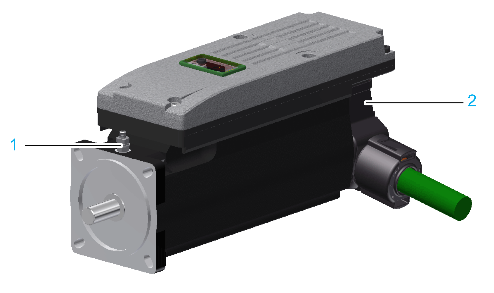
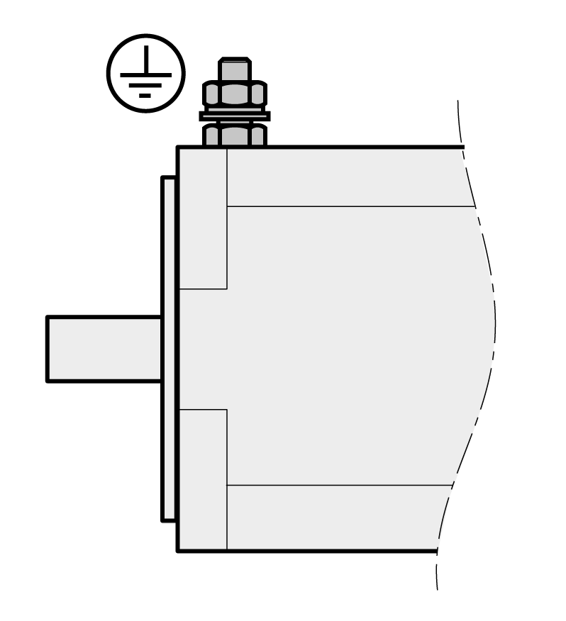

# Electrical Connections for the Lexium 62 ILM Integrated Servo Drive

## Overview

| Connection | Description | Connection cross section [mm2]/ [AWG] | Tightening torque [Nm] / [lbf in] |
| --- | --- | --- | --- |
| 1 | Ground connection | 2.5 / 131)  4.0 / 112) | 1.8 / 15.9 |
| 2 | Hybrid connector | – / – | – / – |
| 1) With mechanical protection  2) Without mechanical protection | | | |

## Protective Ground Conductor Connection

Ground the motor via a grounding screw if grounding via the flange and the protective ground conductor of the motor cable is not sufficient. Use parts with suitable corrosion protection. Note the required tightening torque and the property class of the grounding screw.

## Hybrid Connector

| Pin | Designation | Description |
| --- | --- | --- |
| 1 | IE\_sig | IE signal 1 |
| 2 | IE\_ref | IE signal 2 |
| 3 | Brake | Braking signal |
| 4 | n.c. | - |
| 5 | n.c. | - |
| 6 | 0 V | Control voltage 0 V |
| 7 | 24 V | Control voltage 24 V |
| 8.1 | Rx+ | Sercos port 1 - Input (not assigned for daisy chain wiring) |
| 8.2 | Tx- | Sercos port 1 - Output (not assigned in the case of daisy chain wiring) |
| 8.3 | Rx- | Sercos port 1 - Input (not assigned for daisy chain wiring) |
| 8.4 | Tx+ | Sercos port 1 - Output (not assigned in the case of daisy chain wiring) |
| 9.1 | Rx+ | Sercos port 2 - Input (not assigned for daisy chain wiring) |
| 9.2 | Tx- | Sercos port 2 - Output (not assigned in the case of daisy chain wiring) |
| 9.3 | Rx- | Sercos port 2 - Input (not assigned for daisy chain wiring) |
| 9.4 | Tx+ | Sercos port 2 - Output (not assigned in the case of daisy chain wiring) |
| 10 | DC- | DC bus voltage - |
| 11 | Shield | Shielded connector |
| 12 | DC+ | DC bus voltage + |
| 13 | PE | Protective ground (earth) |

EIO0000001351.08

© 2022

Schneider Electric.

All rights reserved.