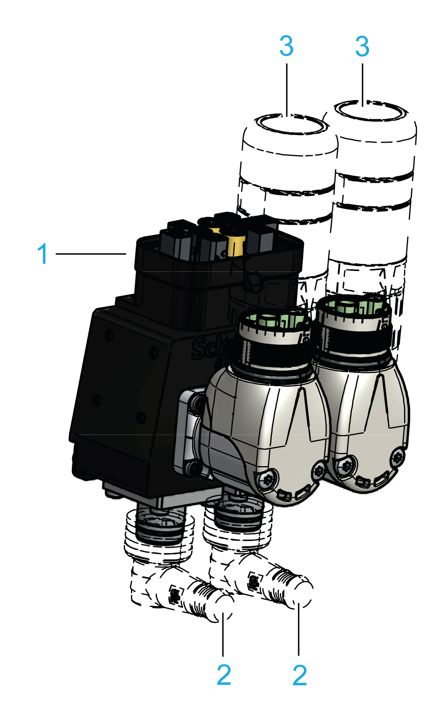
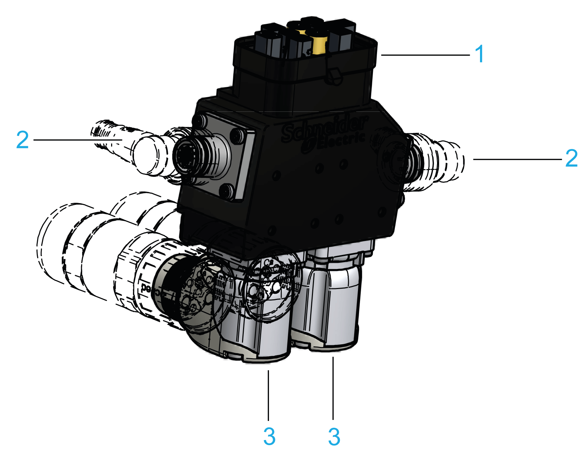
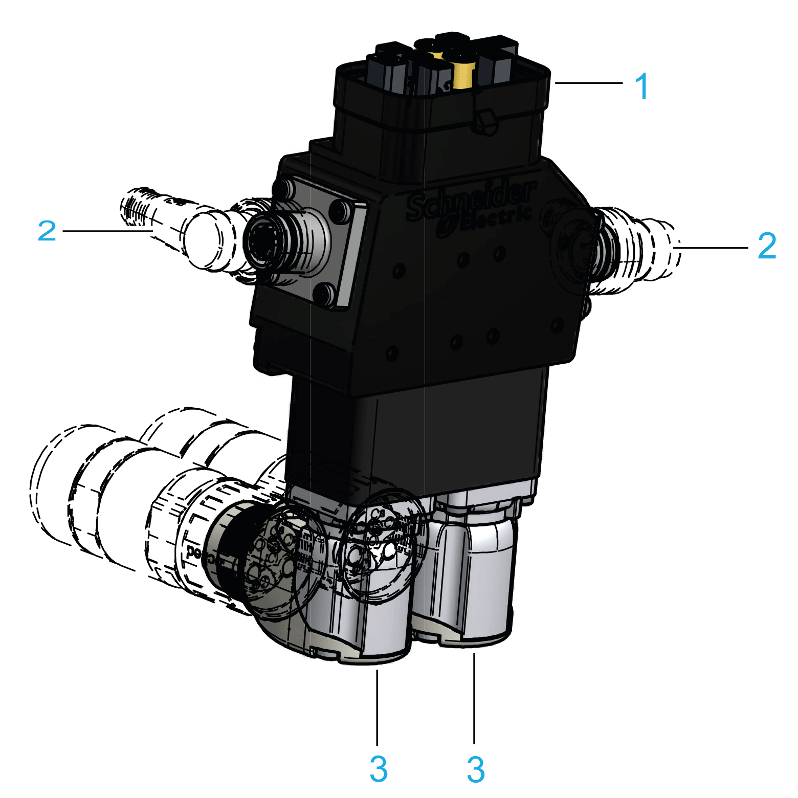
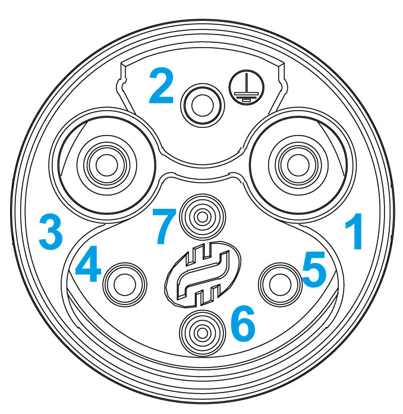
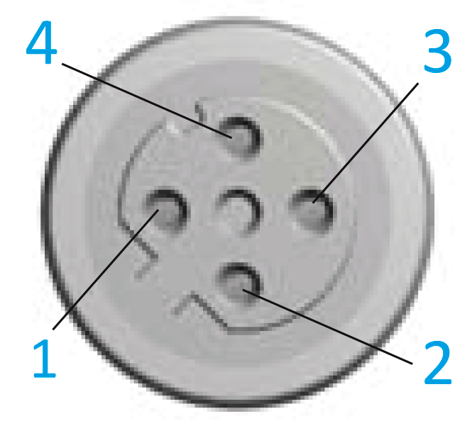

# Electrical Connections for the ILM Daisy Chain Connector Box

## Overview

Usage of Daisy Chain Connector Box enables wiring of Lexium 62 ILMs in daisy chain structure. This requires that each Lexium 62 ILM must be extended by a Daisy Chain Connector Box. Per daisy chain line, up to 9 Lexium 62 ILMs can be connected to one another via their respective Daisy Chain Connector Box. Power (DC bus voltage/24 V/ Inverter Enable signals) and signals are distributed from one to the next via separate cables (power cable and signal cable).

Plug and socket connectors of the Daisy Chain Connector Box type A:

| Connection | Connector | Description |
| --- | --- | --- |
| 1 | **[CN1](#D-SE-0064704__D-SE-0064704.3)** | Hybrid plug connector |
| 2 | **[CN4/CN5](#D-SE-0064704__D-SE-0064704.5)** | Sercos socket connectors M12 |
| 3 | **[CN2/CN3](#D-SE-0064704__D-SE-0064704.4)** | Power socket connectors M23 |

Plug and socket connectors of the Daisy Chain Connector Box type B:

| Connection | Connector | Description |
| --- | --- | --- |
| 1 | **[CN1](#D-SE-0064704__D-SE-0064704.3)** | Hybrid plug connector |
| 2 | **[CN4/CN5](#D-SE-0064704__D-SE-0064704.5)** | Sercos socket connectors M12 |
| 3 | **[CN2/CN3](#D-SE-0064704__D-SE-0064704.4)** | Power socket connectors M23 |

Plug and socket connectors of the Daisy Chain Connector Box type C:

| Connection | Connector | Description |
| --- | --- | --- |
| 1 | **[CN1](#D-SE-0064704__D-SE-0064704.3)** | Hybrid plug connector |
| 2 | **[CN4/CN5](#D-SE-0064704__D-SE-0064704.5)** | Sercos socket connectors M12 |
| 3 | **[CN2/CN3](#D-SE-0064704__D-SE-0064704.4)** | Power socket connectors M23 |

## Hybrid Plug Connector (CN1)

| Pin | Designation | Description |
| --- | --- | --- |
| 1 | IE\_sig | IE signal 1 |
| 2 | IE\_ref | IE signal 2 |
| 3 | Brake | Braking signal |
| 4 | N.C. | – |
| 5 | N.C. | – |
| 6 | 0 V | Control voltage 0 V |
| 7 | 24 V | Control voltage 24 V |
| 8.1 | Rx+ | Sercos port 1- input |
| 8.2 | Tx- | Sercos port 1 - output |
| 8.3 | Rx- | Sercos port 1 - input |
| 8.4 | Tx+ | Sercos port 1 - output |
| 9.1 | Rx+ | Sercos port 2 - input |
| 9.2 | Tx- | Sercos port 2 - output |
| 9.3 | Rx- | Sercos port 2 - input |
| 9.4 | Tx+ | Sercos port 2 - output |
| 10 | DC- | DC bus voltage - |
| 11 | n.c. | – |
| 12 | DC+ | DC bus voltage + |
| 13 | PE | Protective earth ground (earth) |

## Power Socket Connector M23 (CN2/CN3) of Daisy Chain Connector Box:

| Pin | Designation | Description |
| --- | --- | --- |
| 1 | DC + | DC bus voltage + |
| 2 | PE | Protective ground conductor |
| 3 | DC- | DC bus voltage - |
| 4 | 24 V | Control voltage 24 V |
| 5 | 0 V | Control voltage 0 V |
| 6 | IE\_sig | IE signal 1 |
| 7 | IE\_ref | IE signal 2 |

## Sercos Socket Connector M12 (CN4/CN5) of Daisy Chain Connector Box:

| Pin | Designation | Description |
| --- | --- | --- |
| 1 | Eth\_Tx+ | Positive transceiver signal |
| 2 | Eth\_Rx+ | Positive receiver signal |
| 3 | Eth\_Tx- | Negative transceiver signal |
| 4 | Eth\_Rx- | Negative receiver signal |

EIO0000001351.08

© 2022

Schneider Electric.

All rights reserved.