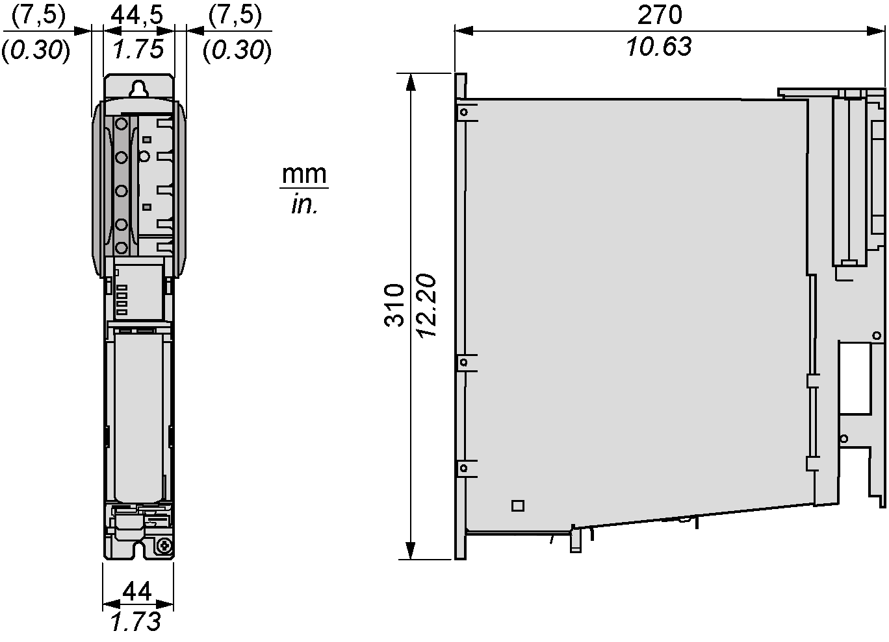

# Mechanical and Electrical Data for the Lexium 62 Connection Module

## Technical Data for the Lexium 62 Connection Module

| Designation | Parameter | Value |
| --- | --- | --- |
| Electronics power supply (**CN1**) | Control voltage | DC +24 V -20% / +25% |
| Input current | 20 A |
| Power supply (**CN1**) | DC bus voltage | DC 250...700 V |
| Input current | 20 A rated current |
| DC bus capacity | 220 μF |
| Discharge time | 5 minutes (maximum) |
| Overvoltage | 860 Vdc |
| Output DC bus (**CN7**) | DC bus voltage | DC 250...700 V |
| Output current | 20 A rated current |
| Peak current 1 s (ISC) | 40 A |
| Inverter Enable power supply (**CN6**) | Control voltage | DC +24 V -20% / +25% |
| Control current | 1.5 A |
| Inverter Enable output signal (**CN8**) | IE voltage | AC 40 V rms |
| IE current | AC 2 A rms |
| IE signal frequency | 100 kHz |
| Interfaces | Sercos | Integrated |
| Cooling | – | Natural convection |
| Degree of protection | – | IP20 |
| Pollution degree | – | 2 (IEC/EN 61800-5-1) |
| Protective class | Class | 1 (IEC/EN 61800-5-1) |
| Overvoltage category | Class | III (IEC/EN 61800-5-1) |
| Radio interference level | Class | C3 (IEC/EN 61800-3) |
| Weight | Weight (with packaging) | 3 kg (4 kg) / 6.6 lbs (8.8 lbs) |

## Ambient Conditions for the Lexium 62 Connection Module

| Procedure | Parameter | Value | Basis |
| --- | --- | --- | --- |
| Operation | **Class 3K3** | | IEC/EN 60721-3-3 |
| Ambient temperature | +5 °C...+55 °C / +41 °F...+131 °F |
| Relative humidity | 5%... 85% |
| * Condensation | No |
| * Icing | No |
| * Other water | No |
| **Class 3M4** | |
| Vibration | 10 m/s2 |
| Shock | 100 m/s2 |
| Transport | **Class 2K3** | | IEC/EN 60721-3-2 |
| Ambient temperature | -25 °C...+70 °C / -13 °F...+158 °F |
| Relative humidity | 5%... 95% |
| * Condensation | No |
| * Icing | No |
| * Other water | No |
| **Class 2M2** | |
| Vibration | 15 m/s2 |
| Shock | 300 m/s2 |
| Long-term storage in transport packaging | **Class 1K4** | | IEC/EN 60721-3-1 |
| Ambient temperature | -25 °C...+55 °C/-13 °F...+131 °F |
| Relative humidity | 5%...95% |
| * Condensation | No |
| * Icing | No |
| * Other water | No |

## Dimensions - Lexium 62 Connection Module

For mounting holes diameter and required distances in the control cabinet, refer to [*Preparing the Control Cabinet*](D-SE-0064619.html#D-SE-0064619).

EIO0000001351.08

© 2022

Schneider Electric.

All rights reserved.