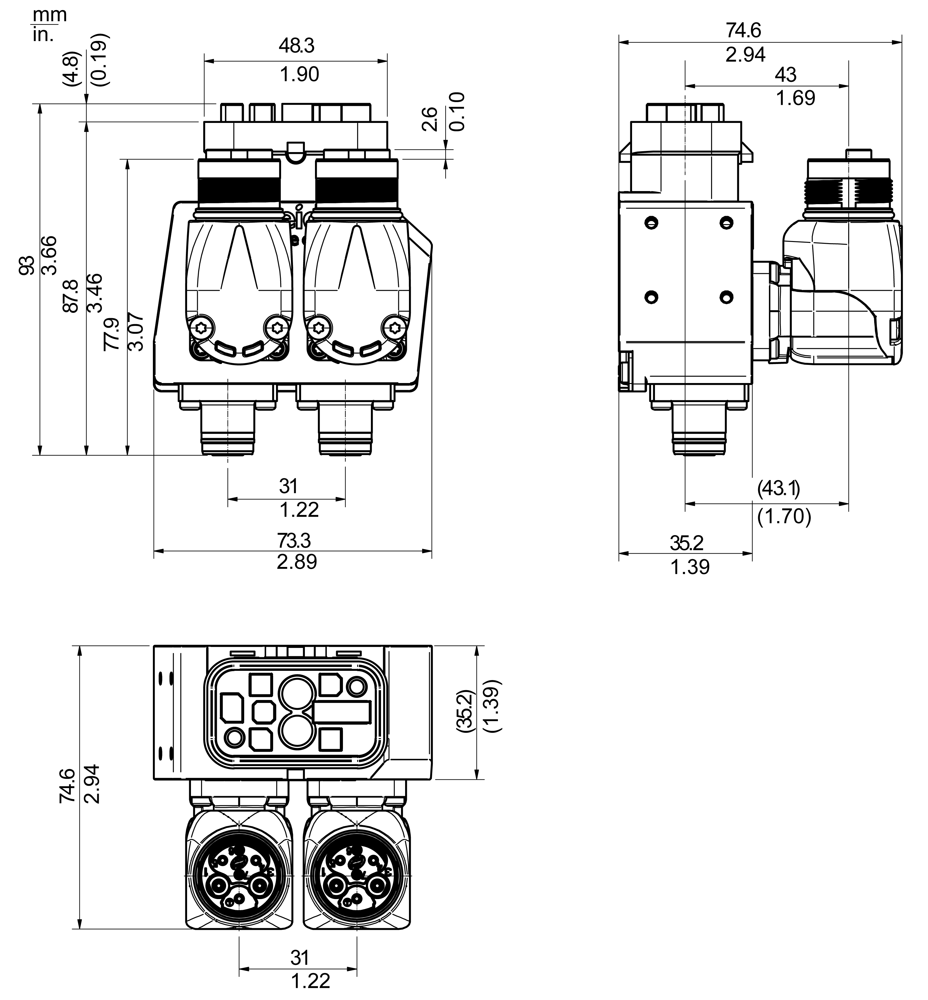
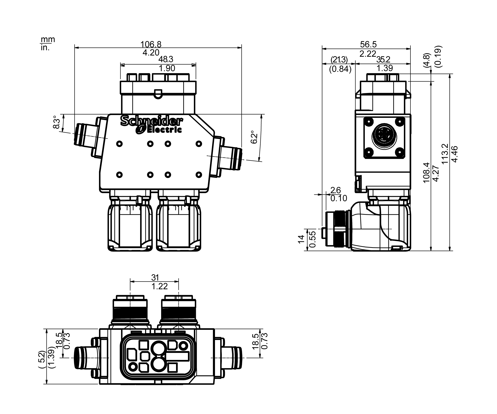
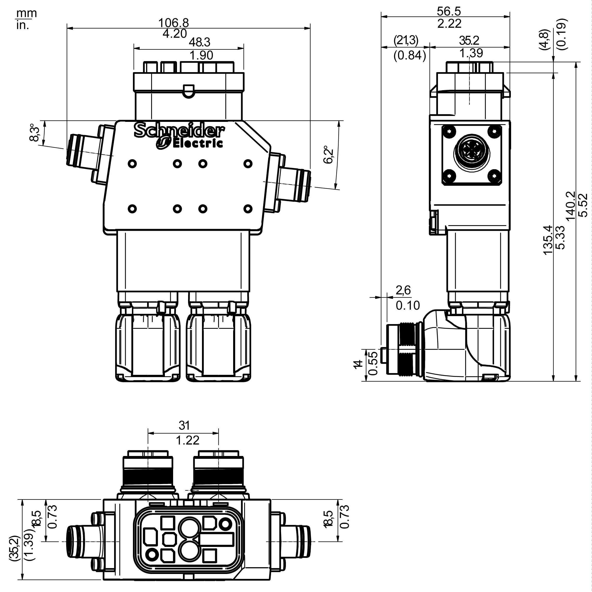

# Mechanical and Electrical Data for the ILM Daisy Chain Connector Box

## Technical Data for the ILM Daisy Chain Connector Box:

| Designation | Parameter | Value |
| --- | --- | --- |
| DC power supply  **(CN1, CN2/CN3)** | DC bus voltage | DC 250 V...700 V |
| Rated current | 20 A |
| Electronics power supply  **(CN1, CN2/CN3)** | Control voltage / -current | DC 24 V (-20%...+25%) / maximum 20 A |
| Inverter Enable  **(CN1, CN2/CN3)** | IE voltage | AC 40 V rms |
| IE current | AC 2 A rms |
| IE signal frequency | 100 kHz |
| Ethernet Sercos  **(CN4/CN5)** | Data rate | 100 Mbit/s |
| Cooling | – | Natural convection |
| Degree of protection | – | IP65 |
| Pollution degree | – | 2(IEC/EN 61800-5-1) |
| Protective class | Class | 1 (IEC/EN 61800-5-1) |
| Overvoltage category | Class | III (IEC/EN 61800-5-1:2016), T2 (DIN VDE 0110) |
| Radio interference level | Class | C3 (IEC/EN 61800-3) |
| Material | – | Polybutylene terephthalate (PBT) with 30% fiberglass [Pocan B 4235] |
| Connect / Disconnect | Cycles | Maximum 20 |

| NOTICE | |
| --- | --- |
|  | CONNECTOR WEAR  Do not connect / disconnect the hybrid cables more than 20 times.  Failure to follow these instructions can result in equipment damage. |

## Ambient Conditions for the Daisy Chain Connector Box

| Procedure | Parameter | Value | Basis |
| --- | --- | --- | --- |
| Operation | **Class 3K4** | | IEC/EN 60721-3-3 |
| Ambient temperature | -20 °C...+60 °C / -4 °F...+140 °F |
| Relative humidity | 5%...95% |
| * Condensation | No |
| * Icing | No |
| * Other water | No |
| **Class 3M7** | |
| Vibration | 30 m/s2 |
| Shock | 250 m/s2 |
| Transport | **Class 2K2** | | IEC/EN 60721-3-2 |
| Ambient temperature | -25 °C...+70 °C/ -13 °F...+158 °F |
| Relative humidity | maximum 75% |
| * Condensation | No |
| * Icing | No |
| * Other water | No |
| **Class 2M2** | |
| Vibration | 15 m/s2 |
| Shock | 300 m/s2 |
| Long-term storage in transport packaging | **Class 1K2** | | IEC/EN 60721-3-1 |
| Ambient temperature | -25 °C...+55 °C / -13 °F...+131 °F |
| Relative humidity | 5%... 85% |
| * Condensation | No |
| * Icing | No |
| * Other water | No |

## Dimensions - ILM Daisy Chain Connector Box

Dimensions - Daisy Chain Connector Box type A:

Dimensions - Daisy Chain Connector Box type B:

Dimensions - Daisy Chain Connector Box type C:

EIO0000001351.08

© 2022

Schneider Electric.

All rights reserved.