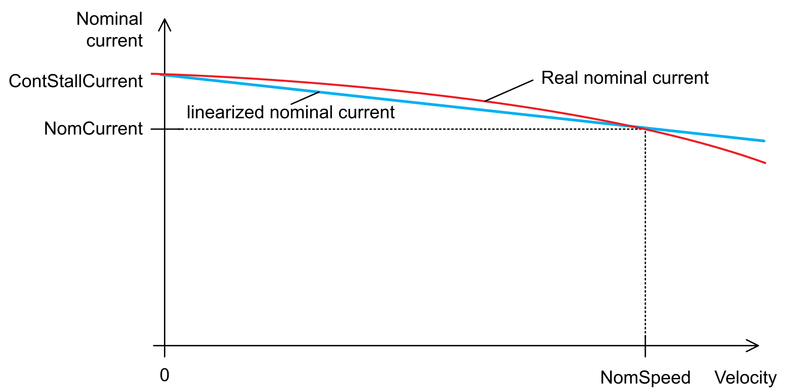

# Mechanical and Electrical Data for the Lexium 62 ILM Integrated Servo Drive

## Technical Data for the Lexium 62 ILM

| Designation | Parameter | | Value | |
| --- | --- | --- | --- | --- |
| Power Supply | DC bus voltage | | 250...700 Vdc | |
| DC bus capacity | | 700 nF | |
| DC bus current | Motor type |  | |
| ILM0701P | 0.6 A DC | |
| ILM0702P | 0.9 A DC | |
| ILM0703P | 1.2 A DC | |
| ILM1001P | 1.2 A DC | |
| ILM1002P | 1.7 A DC | |
| ILM1003P | 2.0 A DC | |
| ILM1401P | 2.7 A DC | |
| ILM1402P | 2.4 A DC | |
| ILM1401M | 3.7 A DC | |
| **Without brake** | | | |
| Control voltage | |  | |
| Hardware code: xxxxxx1xxxxx | | DC +18.5...+31 V | |
| Hardware code: xxxxxx2xxxxx | | DC +18.5...+31 V | |
| Current consumption | | 240 mA (maximum) | |
| **With brake** | | | |
| Control voltage  Hardware code: xxxxxx1xxxxx  Hardware code: xxxxxx2xxxxx | | DC +21.6... +25.4 V  DC +20.5... +30 V | |
| Power Supply | **Current consumption** | **Motor type** | **Continuous operation** | **While releasing the brake** |
| ILM0701P | 360 mA | 500 mA |
| ILM0702P | 360 mA | 530 mA |
| ILM0703P | 360 mA | 530 mA |
| ILM1001P | 450 mA | 740 mA |
| ILM1002P | 450 mA | 740 mA |
| ILM1003P | 500 mA | 820 mA |
| ILM1401P | 560 mA | 700 mA |
| ILM1402P | 600 mA | 890 mA |
| ILM1401M | 560 mA | 700 mA |
| Cooling | – | | Natural convection | |
| Degree of protection | Controller | | IP65 | |
| Motor | | For information on the degree of protection of the motor refer to the corresponding Mechanical and Electrical Data of the Lexium 62 ILM Integrated Servo Motor. | |
| Pollution degree | – | | 2 (IEC/EN 61800-5-1) | |
| Protective class | Class | | 1 (IEC/EN 61800-5-1) | |
| Overvoltage category | Class | | III (IEC/EN 61800-5-1), T2 (DIN VDE 0110) | |
| Overload protection | – | | Yes. See [Overload Protection](#D-SE-0062278__OverloadProtection-28E73B1D) | |
| Radio interference level | Class | | C3 (IEC/EN 61800-3) | |
| Insulation material class | – | | F | |
| Motor coating | – | | Powder coating based on epoxy resin | |
| Lubricant (according to FDA standard for servo motors) | – | | Klübersynth UH1 64-62 food safe gearbox grease | |

## Overload Protection

The motor overload supervision observes an exceeding nominal current of the motor to prevent the motor from thermal overload.

The height of the nominal current depends on the velocity of the motor. At standstill the nominal current is defined by the parameter ContStallCurrent and at nominal velocity (NomSpeed) by the parameter NomCurrent. The three parameters are stored in the motor type plate.

Over the residual velocity range, the calculated height of the nominal current deviates linear (shown as linearized nominal current).

The real nominal current is a curve (red) that lies above the linearized nominal current (blue) for almost the whole velocity range. It helps preventing overheating of the motor.

The overload is calculated in a range from 0% to 200%. At 80% the message 8125 Motor load high and at 100% the message 8100 Motor overload is triggered that leads to a stop of the motor.

When the drive is energized, the integral starts with 79% to cover the case that the motor is already heated, but without triggering a message.

## Ambient Conditions for the Lexium 62 ILM

| Procedure | Parameter | Value | Basis |
| --- | --- | --- | --- |
| Operation | **Class 3K3** | | IEC/EN 60721-3-3 |
| Ambient temperature | +5 °C...+40 °C/ +41 °F...+104 °F |
| Relative humidity | 5%...85% |
| **Class 3M7** | |
| Vibration | 30 m/s2 (all directions in space) |
| Shock | 250 m/s2 |
| Transport | **Class 2K3** | | IEC/EN 60721-3-2 |
| Ambient temperature | -25 °C...+70 °C/ -13 °F...+158 °F |
| Relative humidity | 5%...95% |
| * Condensation | No |
| * Icing | No |
| * Other water \_PCILMLM | No |
| **Class 2M1** | |
| Vibration | 15 m/s2 |
| Shock | 100 m/s2 |
| Long-term storage in transport packaging | **Class 1K4** | | IEC/EN 60721-3-1 |
| Ambient temperature | -25 °C...+55 °C/ -13 °F...+131 °F |
| Relative humidity | 10%...100% |
| * Condensation | No |
| * Icing | No |
| * Other water | No |

EIO0000001351.08

© 2022

Schneider Electric.

All rights reserved.