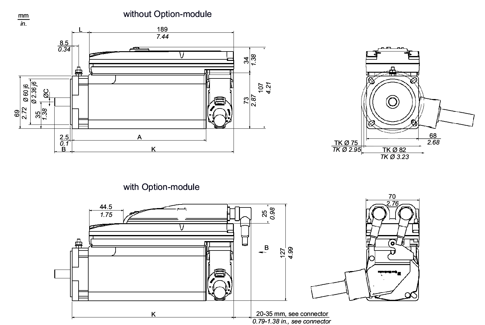
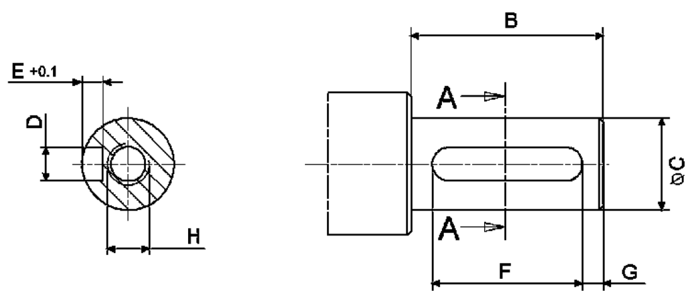

# Mechanical and Electrical Data for the ILM070 Servo Motor

## Technical Data for ILM070

| Designation | Parameter | Abbreviation [unit] | ILM0701P | ILM0702P | ILM0703P |
| --- | --- | --- | --- | --- | --- |
| General data | Standstill torque | M0 [Nm] | 1.1 | 1.7 | 2.2 |
| Peak torque | Mmax [Nm] | 3.5 | 7.6 | 8.7 |
| Rated motor speed | nN [RPM] | 6000 | 6000 | 6000 |
| Rated torque | MN [Nm] | 0.5 | 1.15 | 1.15 |
| Rated power | PN [kW] | 0.31 | 0.72 | 0.72 |
| Electrical data | Number of pole pairs | p | 3 | 3 | 3 |
| Motor winding switch | – | Y | Y | Y |
| Torque constant (120 °C) | kT [Nm/Arms] | 0.71 | 0.68 | 0.73 |
| Winding resistance Ph-Ph (20 °C) | RU-V, 20 [Ω] | 10.40 | 4.20 | 2.70 |
| Winding resistance Ph-0 (120 °C) | R120 [Ω] | 7.23 | 2.92 | 1.88 |
| Winding inductance Ph-Ph | LU-V [mH] | 38.8 | 19.0 | 13.0 |
| Winding inductance Ph-0 | L [mH] | 19.4 | 9.5 | 6.5 |
| Voltage constant Ph-Ph (1) | kE [Vrms] | 46 | 48 | 49 |
| Standstill current | I0 [Arms] | 1.55 | 2.5 | 2.7 |
| Rated current | IN [Arms] | 0.60 | 1.5 | 1.5 |
| Peak current 23 s (ISC) | Imax [Arms] | 5.7 | 11.8 | 12.0 |
| Protective class | Class | - | 1 (IEC/EN 61800-5-1) | | |
| Mechanical data (with brake) | Moment of inertia of the rotor | JM [kgcm2] | 0.25 (0.35) | 0.41 (0.51) | 0.58 (0.88) |
| Thermal data | Thermal time constant | Tth [min] | 35 | 38 | 51 |
| Response threshold temperature sensor | TTK [°C] | 100 | 100 | 100 |
| Brake data | Holding brake | – | optional | optional | optional |
| Weight (with brake) | – | m [kg] | 2.7 (3.0) | 3.4 (3.7) | 4.2 (4.7) |
| **(1)** : RMS value at 1000 rpm and 20°C ( 68°F) | | | | | |

## Dimensions - ILM070

NOTE: The ILM series 070 uses different shaft diameters. The shaft diameter for the ILM0703P is 14 mm/0.55 in.

| Dimensions | ILM0701P [mm]/[in] | ILM0702P [mm]/[in] | ILM0703P [mm]/[in] |
| --- | --- | --- | --- |
| A (with brake) | 175 (182) / 6.89 (7.17) | 189 (215) / 7.44 (8.46) | 222 (256) / 8.74 (10.08) |
| B | 23 / 0.91 | 23 / 0.91 | 30 / 1.18 |
| C | 11 k6 / 0.43 k6 | 11 k6 / 0.43 k6 | 14 k6 / 0.55 k6 |
| K (with brake) | 212 (219) / 8.35 (8.62) | 226 (252) / 8.90 (9.92) | 259 (293) / 10.20 (11.54) |
| L (with brake) | 25 (31) / 0.98 (1.22) | 38 (64) / 1.50 (2.52) | 71 (105) / 2.80 (4.13) |

## Dimensions - Feather Key

| Dimensions | ILM0701P / ILM0702P  [mm] / [in] | ILM0703P  [mm] / [in] |
| --- | --- | --- |
| B | 23 / 0.91 | 30 / 1.18 |
| C | 11 k6 / 0.43 k6 | 14 k6 / 0.55 k6 |
| D | 4 N9 / 0.16 N9 | 5 N9 / 0.20 N9 |
| E | 2.5 / 0.10 | 3 / 0.12 |
| F | 18 / 0.71 | 20 / 0.78 |
| G | 2.5 / 0.10 | 5 / 0.20 |
| H | DIN 332-D M4 | DIN 332-D M5 |
| Feather key (N9) | DIN 6885-A4x4x18 | DIN 6885-A5x5x20 |

EIO0000001351.08

© 2022

Schneider Electric.

All rights reserved.