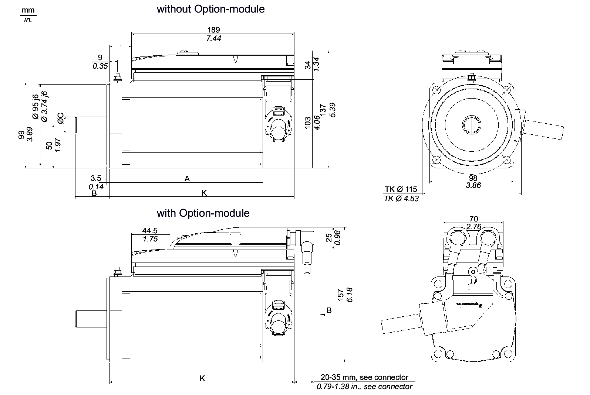

# Mechanical and Electrical Data for the ILM100 Servo Motor

## Technical Data for ILM100

| Category | Parameter | Abbreviation [unit] | ILM1001P | ILM1002P | ILM1003P |
| --- | --- | --- | --- | --- | --- |
| General data | Standstill torque | M0 [Nm] | 2.5 | 4.4 | 5.8 |
| Peak torque | Mmax [Nm] | 9.6 | 18.3 | 28.3 |
| Rated motor speed | nN [RPM] | 3000 | 3000 | 3000 |
| Rated torque | MN [Nm] | 1.9 | 2.9 | 3.5 |
| Rated power | PN [kW] | 0.6 | 0.91 | 1.10 |
| Electrical data | Number of pole pairs | p | 4 | 4 | 4 |
| Motor winding switch |  | Y | Y | Y |
| Torque constant (120 °C) | kT [Nm/Arms] | 1.39 | 1.52 | 1.61 |
| Winding resistance Ph-Ph (20 °C) | RU-V, 20 [Ω] | 9.80 | 4.12 | 2.60 |
| Winding resistance Ph-0 (120 °C) | R120 [Ω] | 6.82 | 2.86 | 1.81 |
| Winding inductance Ph-Ph | LU-V [mH] | 45.70 | 21.80 | 15.60 |
| Winding inductance Ph-0 | L [mH] | 22.85 | 10.90 | 7.80 |
| Voltage constant Ph-Ph(1) | kE [Vrms] | 90 | 100 | 103 |
| Standstill current | I0 [Arms] | 1.80 | 2.90 | 3.60 |
| Rated current | IN [Arms] | 1.40 | 2.00 | 2.40 |
| Peak current 23 s (ISC) | Imax [Arms] | 7.40 | 13.10 | 21.20 |
| Protective class | Class | - | 1 (IEC/EN 61800-5-1) | | |
| Mechanical data (with brake) | Moment of inertia of the rotor | JM [kgcm2] | 1.40  (2.10) | 2.31  (3.01) | 3.22  (3.92) |
| Thermal data | Thermal time constant | Tth [min] | 44 | 48 | 56 |
| Response threshold temperature sensor | TTK [°C] | 100 | 100 | 100 |
| Brake data | Holding brake | – | optional | optional | optional |
| Weight (with brake) | – | m [kg] | 4.9 (5.7) | 6.4 (7.2) | 8.1 (8.9) |
| **(1)** : RMS value at 1000 rpm and 20°C ( 68°F) | | | | | |

## Dimensions - ILM100

| Dimensions | ILM1001P [mm]/[in] | ILM1002P [mm]/[in] | ILM1003P [mm]/[in] |
| --- | --- | --- | --- |
| A (with brake) | 178 (207) / 7.01 (8.15) | 212 (243) / 8.35 (9.57) | 248 (279) / 9.76 (10.98) |
| B | 40 / 1.57 | 40 / 1.57 | 40 / 1.57 |
| C | 19 k6 / 0.75 k6 | 19 k6 / 0.75 k6 | 19 k6 / 0.75 k6 |
| K (with brake) | 215 (243) / 8.46 (9.57) | 249 (280) / 9.80 (11.02) | 285 (315) / 11.22 (12.40) |
| L (with brake) | 27 (55) / 1.06 (2.17) | 61 (92) / 2.40 (3.62) | 97 (127) / 3.82 (5) |

## Dimensions - Feather Key

| Dimensions | ILM1001P / ILM1002P / ILM1003P  [mm] / [in] |
| --- | --- |
| B | 40 /1.57 |
| C | 19 k6 / 0.75 k6 |
| D | 6 N9 / 0.24 N9 |
| E | 3.5 / 0.14 |
| F | 30.01.2018 |
| G | 5 / 0.20 |
| H | DIN 332-D M6 |
| Feather key (N9) | DIN 6885-A6x6x30 |

EIO0000001351.08

© 2022

Schneider Electric.

All rights reserved.