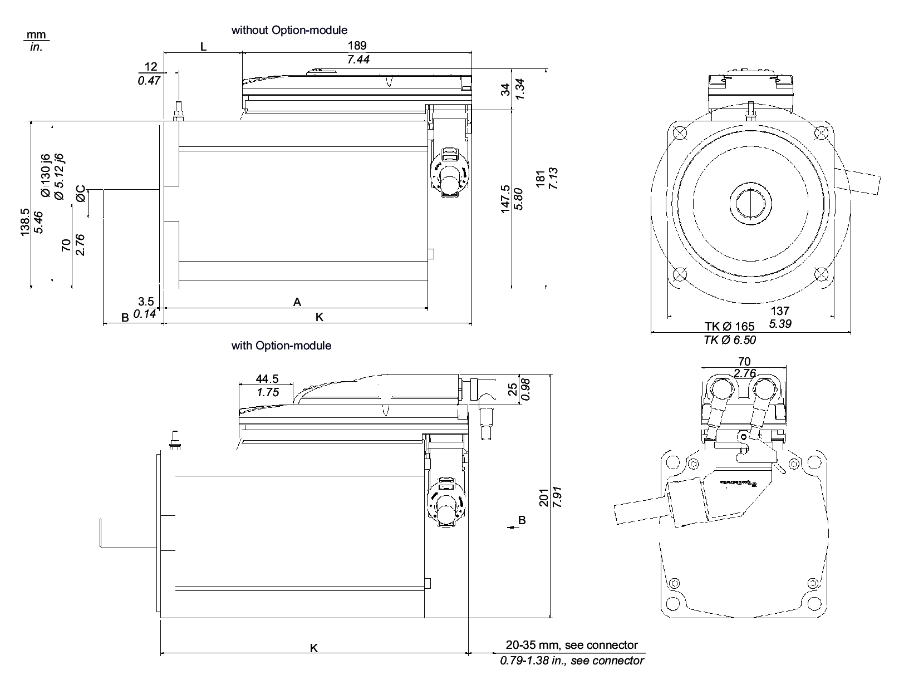

# Mechanical and Electrical Data for the ILM140 Servo Motor

## Technical Data for the ILM140

| Designation | Parameter | Abbreviation [unit] | ILM1401P | ILM1401M | ILM1402P |
| --- | --- | --- | --- | --- | --- |
| General data | Standstill torque | M0 [Nm] | 7.5 | 8.5 | 12.5 |
| Peak torque | Mmax [Nm] | 27.0 | 27.0 | 55.0 |
| Rated motor speed | nN [RPM] | 3000 | 1500 | 2000 |
| Rated torque | MN [Nm] | 4.6 | 8.3 | 9.1 |
| Rated power | PN [kW] | 1.45 | 1.30 | 1.91 |
| Electrical data | Number of pole pairs | p | 5 | 5 | 5 |
| Motor winding switch | – | Y | Y | Y |
| Torque constant (120 °C) | kT [Nm/Arms] | 1.60 | 2.65 | 2.60 |
| Winding resistance Ph-Ph (20 °C) | RU-V, 20 [Ω] | 1.81 | 4.58 | 1.90 |
| Winding resistance Ph-0 (120 °C) | R120 [Ω] | 1.26 | 3.18 | 1.32 |
| Winding inductance Ph-Ph | LU-V [mH] | 19.10 | 50.0 | 22.0 |
| Winding inductance Ph-0 | L [mH] | 9.55 | 25.0 | 11.0 |
| Voltage constant Ph-Ph(1) | kE [Vrms] | 108 | 175 | 173 |
| Standstill current | I0 [Arms] | 4.70 | 3.20 | 4.8 |
| Rated current | IN [Arms] | 2.90 | 3.15 | 3.7 |
| Peak current 23 s (ISC) | Imax [Arms] | 18.8 | 14.6 | 24.0 |
| Protective class | Class | – | 1 (IEC/EN 61800-5-1) | | |
| Mechanical data (with brake) | Moment of inertia of the rotor | JM [kgcm2] | 7.41 | 7.41 | 12.68 |
| Thermal data | Thermal time constant | Tth [min] | 64 | 64 | 74 |
| Response threshold temperature sensor | TTK [°C] | 100 | 100 | 100 |
| Brake data | Holding brake | – | optional | optional | optional |
| Weight (with brake) | – | m [kg] | 12.5 (13.8) | 12.5 (13.8) | 17.2 (18.5) |
| **(1)** : RMS value at 1000 rpm and 20°C ( 68°F) | | | | | |

## Dimensions - ILM140

| Dimensions | ILM1401P [mm]/[in] | ILM1401M [mm]/[in] | ILM1402P [mm/[in] |
| --- | --- | --- | --- |
| A (with brake) | 218 (256) / 8.58 (10.08) | 218 (256) / 8.58 (10.08) | 273 (311) / 10.75 (12.24) |
| B | 50 /1.97 | 50 /1.97 | 50 /1.97 |
| C | 24 k6 / 0.94 k6 | 24 k6 / 0.94 k6 | 24 k6 / 0.94 k6 |
| K (with brake) | 254 (292) / 10 (11.50) | 254 (292) / 10 (11.50) | 309 (347) / 12.17 (13.66) |
| L (with brake) | 67 (105) / 2.64 (4.13) | 67 (105) / 2.64 (4.13) | 122 (160) / 4.80 (6.30) |

## Dimensions - Feather Key

| Dimensions | ILM1401P / ILM1401M / ILM1402P  [mm] / [in] |
| --- | --- |
| B | 50 / 1.97 |
| C | 24 k6 / 0.94 k6 |
| D | 8 N9 / 0.31 N9 |
| E | 4.5 / 0.18 |
| F | 40 / 1.57 |
| G | 5 / 0.20 |
| H | DIN 332-D M8 |
| Feather key (N9) | DIN 6885-A8x7x40 |

EIO0000001351.08

© 2022

Schneider Electric.

All rights reserved.