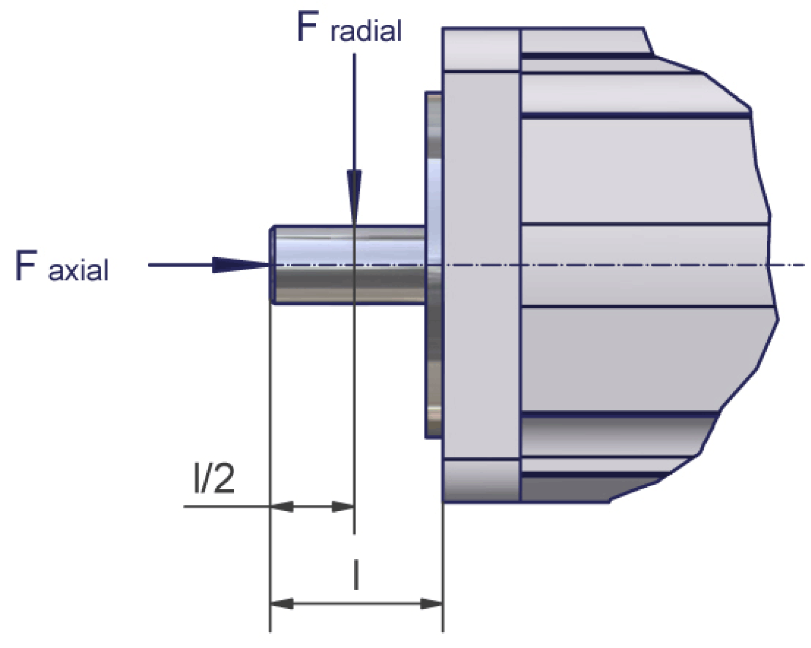

# Motor Shaft and Bearings

## Design of the Shaft End

|  |  |
| --- | --- |
| Smooth shaft end (standard) | With a non-positive connection, torque transmission must be achieved only by surface pressure to help ensure power transmission without backlash. |
| Shaft end with round-ended feather key according to DIN 6885 | Shaft connections with feather keys are positive. The feather key seating can wear under continuous strain with changing torques and frequent changes of direction, causing backlash as the increased wear causes play between the key and its seating. As a result, rotational quality is reduced due to backlash. Further increasing wear can lead to the feather key breaking and damage to the shaft. |

| NOTICE | |
| --- | --- |
|  | ADVERSE ROTATIONAL QUALITY  Regularly inspect feather key shaft ends for wear and possible damage in applications that have frequent changes in torque and direction.  Failure to follow these instructions can result in equipment damage. |

## Bearing

The back side bearing is designed as a fixed bearing and the bearing on shaft output side as a floating bearing.

## Permissible Shaft Load

The life of drives might be limited by the bearing life. You cannot replace the bearing, as the measuring systems integrated in the drive must then be reinitialized.

The graphic shows the definition of shaft load:

The table shows the permissible radial force Fradial [N]:

| Motor | 1000 RPM | 2000 RPM | 3000 RPM | 4000 RPM | 5000 RPM | 6000 RPM |
| --- | --- | --- | --- | --- | --- | --- |
| ILM0701P | 660 | 520 | 460 | 410 | 380 | 360 |
| ILM0702P | 710 | 560 | 490 | 450 | 410 | 390 |
| ILM0703P | 730 | 580 | 510 | 460 | 430 | 400 |
| ILM1001P | 900 | 720 | 630 | – | – | – |
| ILM1002P | 990 | 790 | 690 | – | – | – |
| ILM1003P | 1050 | 830 | 730 | – | – | – |
| ILM1401M | 2210 | 1760 | - | – | – | – |
| ILM1401P | 2210 | 1760 | 1530 | – | – | – |
| ILM1402P | 2430 | 1930 | - | - | - | - |

Basis for calculation:

The permissible axial force Faxial [N] is calculated according to:

Faxial = 0.2 x Fradial

* Nominal bearing life L10h = 20,000 h for a shaft without feather key nut (for operating hours at a 10% detected failure probability)
* Ambient temperature = 40 °C / 104 °F (approximately 100 °C / 212 °F storage temperature)
* Peak torque = 10% duty cycle
* Nominal torque = 100% duty cycle

EIO0000001351.08

© 2022

Schneider Electric.

All rights reserved.