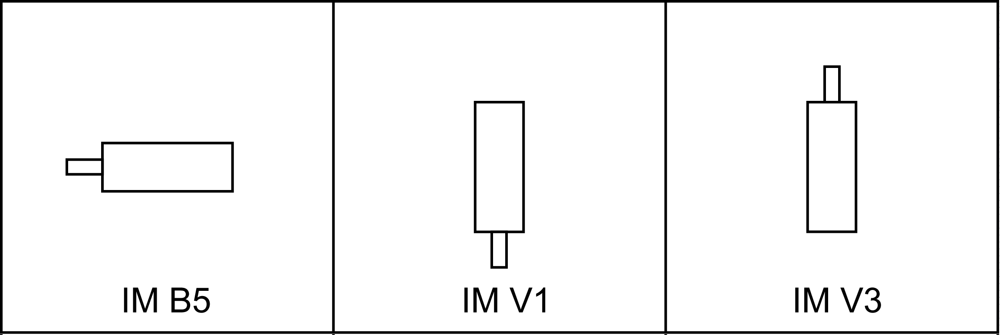

# Mounting Arrangement and Degree of Protection

## Overview

The drive degree of protection depends on the reference of the drive. In some cases, the degree of protection requires particular mounting arrangements and addition options. The mounting flange for all drive types is designed in such a way that the installation type is possible according to the types of construction IM B5, IM V1, and IM V3 (mounting flange with through hole).

The following mounting positions are defined and permissible as per IEC 60034-7:

| NOTICE | |
| --- | --- |
|  | MOUNTING POSITION AND PENETRATING LIQUIDS  Prevent liquids from remaining on the motor shaft over an extended period of time when mounting the motor in the mounting position IM V3.  Failure to follow these instructions can result in equipment damage. |

NOTE: It also cannot be ruled out that liquids penetrate the motor housing along the motor shaft even if a shaft sealing ring has been installed.

The table shows the degree of protection of the Lexium 62 ILM servo motor:

| Motor part | Mounting position (conforming to DIN 42 950) | Degree of protection (according to IEC/EN 60529) WITHOUT shaft sealing ring | Degree of protection (according to IEC/EN 60529) WITH shaft sealing ring |
| --- | --- | --- | --- |
| Shaft | IM V3 | IP 50 | IP 65 |
| IM B5, IM V1 | IP 54 |
| Surface / connections | IM B5, IM V1, IM V3 | IP 65 | IP 65 |

EIO0000001351.08

© 2022

Schneider Electric.

All rights reserved.