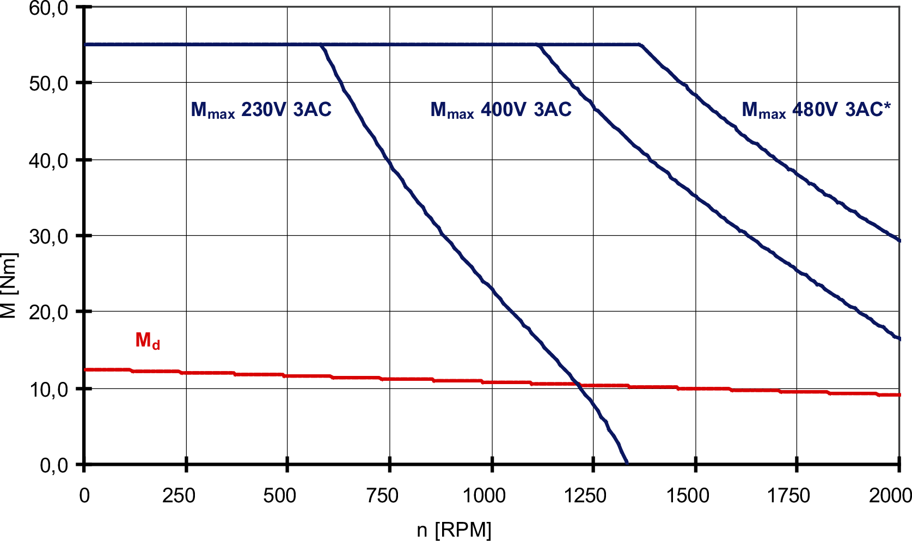
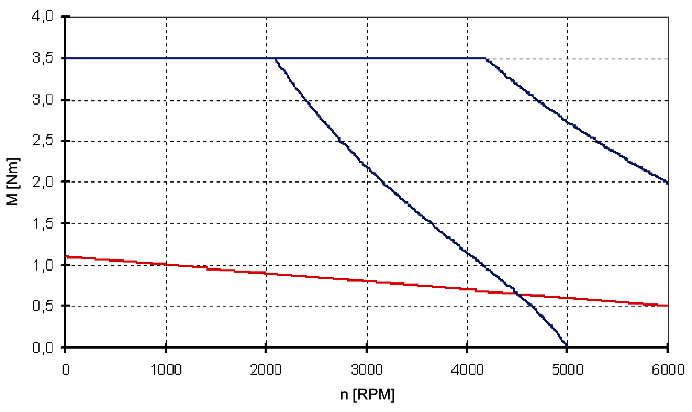
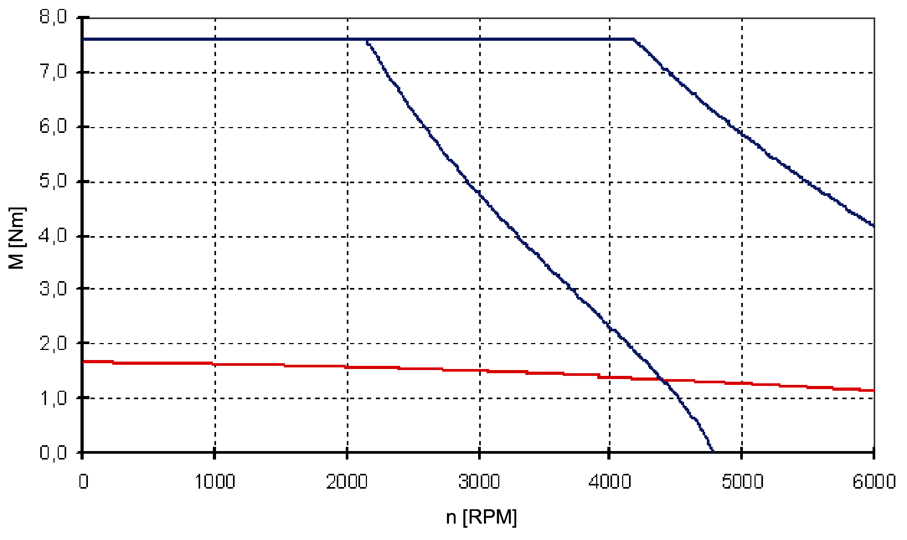
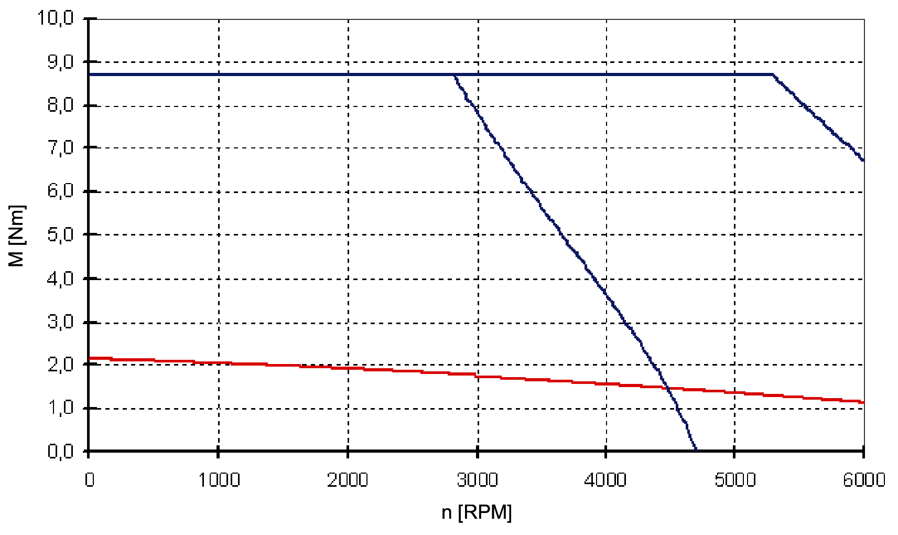
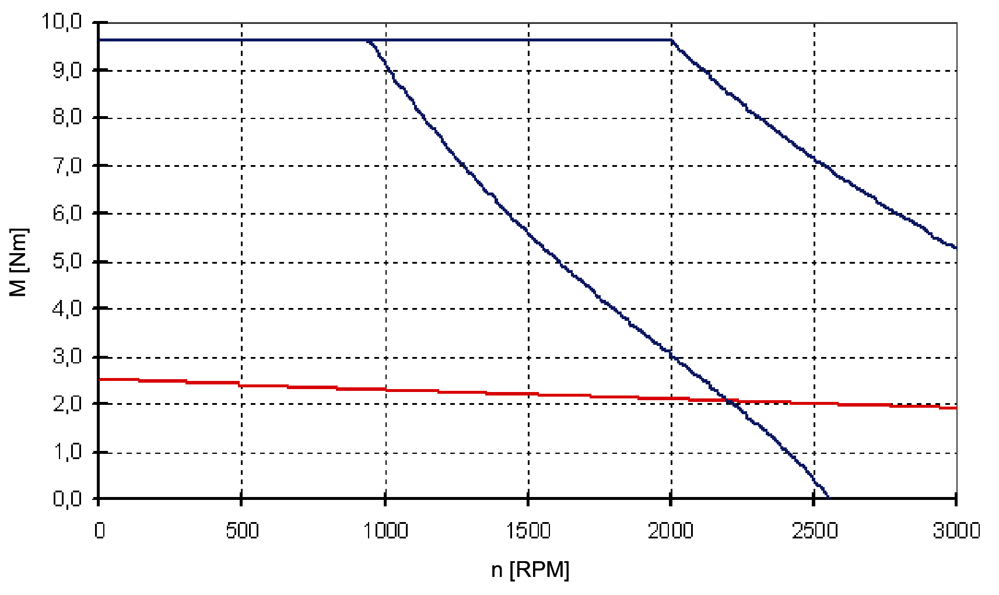
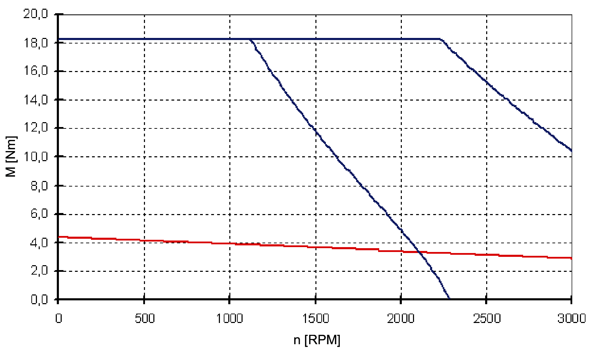
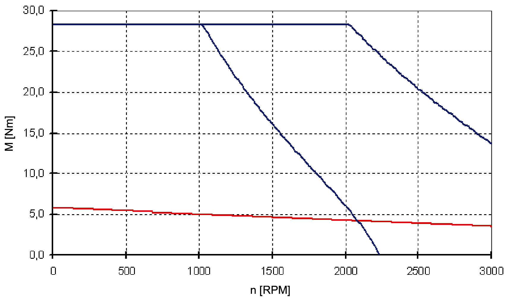
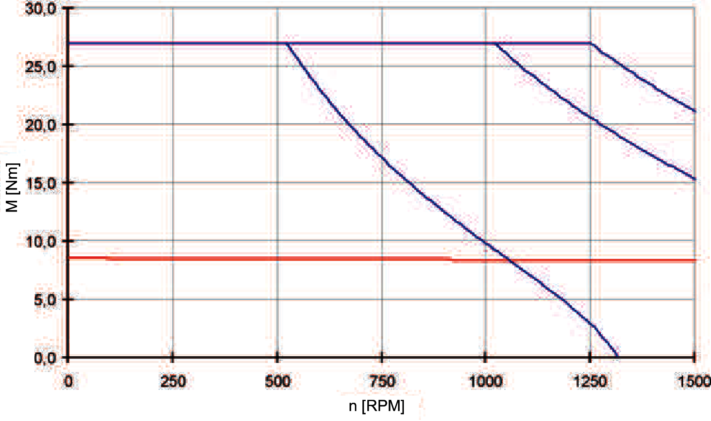
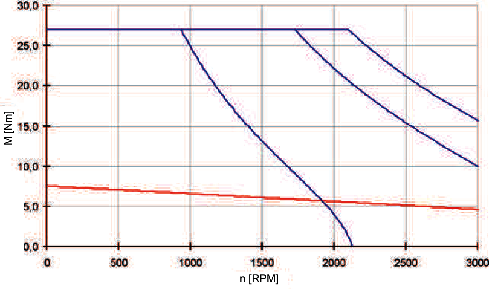
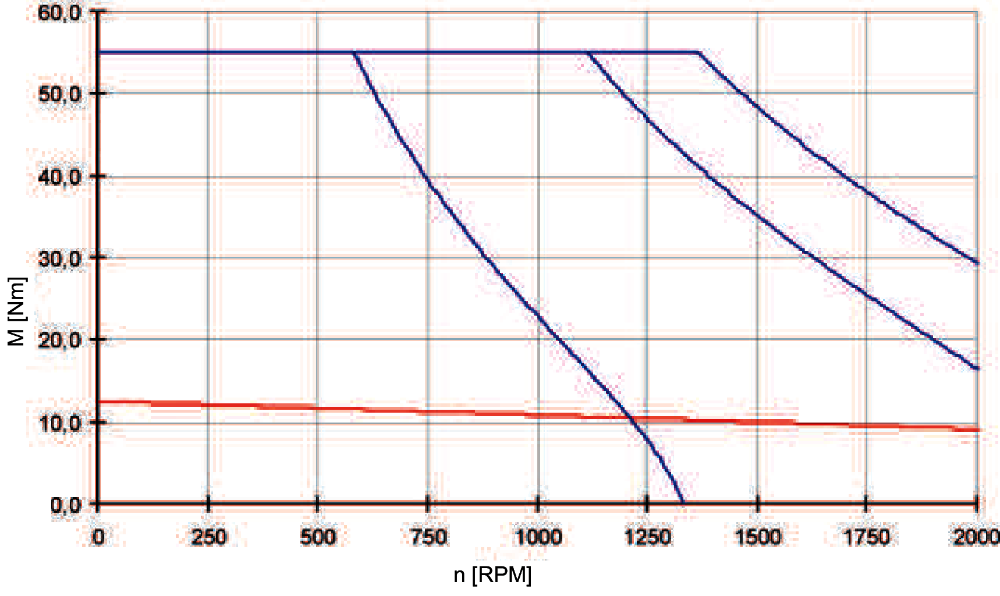

# Torque / Speed Characteristic Curves

## Overview

The torque-speed characteristic curve represents the following characteristics:

* The permissible permanent torque (operating type S 1)
* The peak torque with mains voltage = 3 x 230 Vac
* The peak torque with mains voltage = 3 x 400 Vac
* The peak torque with mains voltage = 3 x 480 Vac (for ILM140•• only)

Example of a torque-speed characteristic curve (ILM140•• only):

The characteristic curves refer to an ambient temperature of 40 °C / 104 °F and a maximum winding temperature of 120 °C / 248 °F.

Torque-speed characteristic curve ILM0701P:

Torque-speed characteristic curve ILM0702P:

Torque-speed characteristic curve ILM0703P:

Torque-speed characteristic curve ILM1001P:

Torque-speed characteristic curve ILM1002P:

Torque-speed characteristic curve ILM1003P:

Torque-speed characteristic curve ILM1401M:

Torque-speed characteristic curve ILM1401P:

Torque-speed characteristic curve ILM1402P:

EIO0000001351.08

© 2022

Schneider Electric.

All rights reserved.