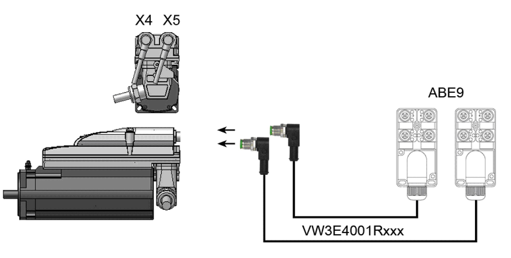

# Lexium 62 ILM Digital I/O Module - Description

## Overview

Connecting the ABE9 splitter box to the Lexium 62 ILM Digital I/O Module:

Features:

* 8 bidirectional floating inputs/outputs (configurable in the controller configuration).
* Connection via two M12 connectors (8-pin), each with 4 inputs/outputs.
* Floating internal power supply of outputs up to 0.1 A total current for 8 inputs/outputs.
* Maximum 2 A total output current via 8 outputs when using external supply voltage.
* 0.5 A output current maximum per output when using external supply.
* Short-circuit detection and open-circuit detection on outputs.
* Two inputs with special functions (touch probe, counter).

EIO0000001351.08

© 2022

Schneider Electric.

All rights reserved.