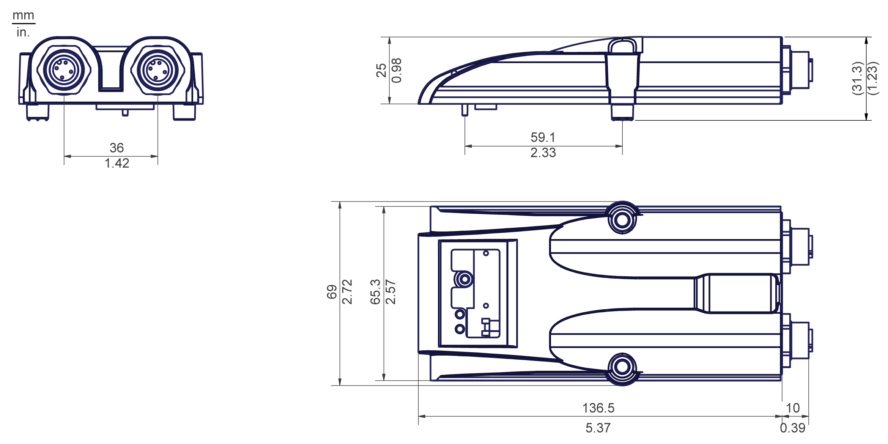
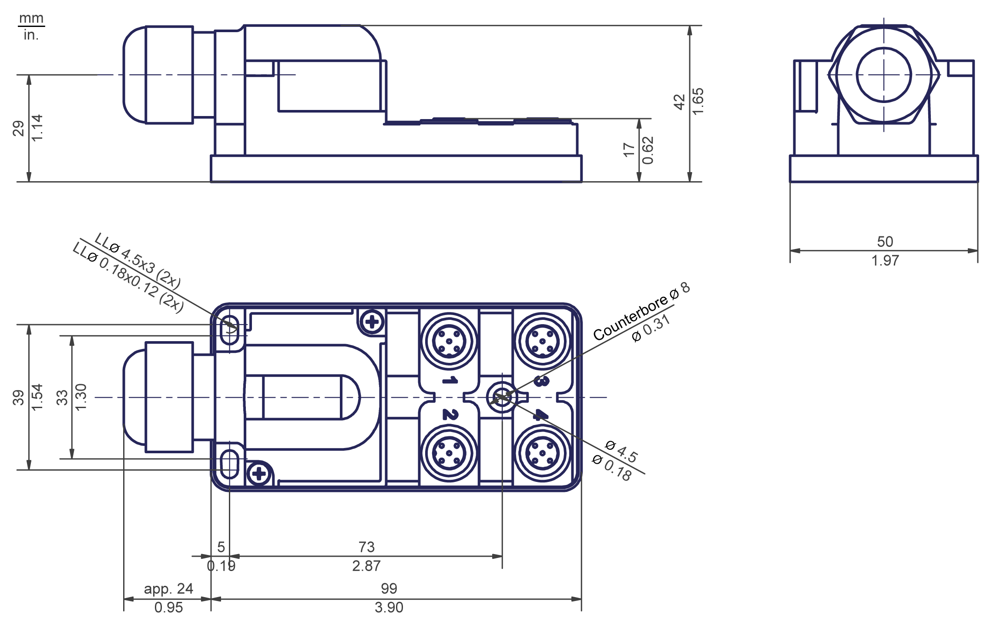

# Lexium 62 ILM Digital I/O Module - Technical Data

## Parameter Table

| Parameter | Value |
| --- | --- |
| Internal/External control voltage UL  Internal control current | DC 24 V (-15% / +20%)   * When using internal I/O supply: maximum 300 mA * When using external I/O supply: maximum 80 mA |
| External current | Maximum 2 A |
| Overvoltage category | III |
| Weight | 0.22 kg (0.49 lb) |
| Degree of radio interference | C3 (IEC/EN 61800-3) |
| **Inputs / Outputs** | |
| Inputs/Outputs | 8 configurable as inputs or outputs:   * Inputs IEC61131-2 Type1 * Outputs IEC61131-2 |
| Galvanic isolation | 500 V DC isolated against PE |
| **Ports configurable as digital inputs** | |
| Voltage in UIN L/0 range | -3...5 Vdc |
| Voltage in UIN H/1 range | 15...30 Vdc |
| Input current | IIN = 2 mA at UIN = 15 Vdc |
| Protected against reverse polarity | Yes |
| Input filter | 1 ms or 5 ms, configurable |
| **Ports configurable as digital outputs** | |
| Output voltage | (+UL-3 V) < UOUT < +UL |
| Rated current per output | Ie = 500 mA |
| Overall module current across all 8 in-/outputs | When using internal I/O supply: 0.1 A |
| When using external I/O supply: 2.0 A |
| Maximum inrush current | Iemax > 2 A for 1 s |
| Touch current with zero signal | < 0.4 mA |
| Transmission time | 100 μs |
| Short-circuit protections | Yes |
| Supply output (L / 0) | 24 Vdc (-15...+20%) / 2 A |
| **Ambient conditions** | |
| Degree of protection | IP 65 (with connected cables or caps) |
| Operational temperature | +5...+40 °C (+41...+104 °F) |
| Storage temperature | -25...+55 °C (-13...+131 °F) |
| Transport temperature | -25...+70 °C (-13...+158 °F) |
| Temperature Fluctuation | tmax = 30 K/h |
| Operational humidity | 5 %...85 % rel. |
| Storage humidity | 5 %...95 % rel. |
| Transport humidity | 5 %...95 % rel. |

## Dimensions

Dimensions Lexium 62 ILM digital I/O module:

Dimensions of the ABE9 splitter box:

EIO0000001351.08

© 2022

Schneider Electric.

All rights reserved.