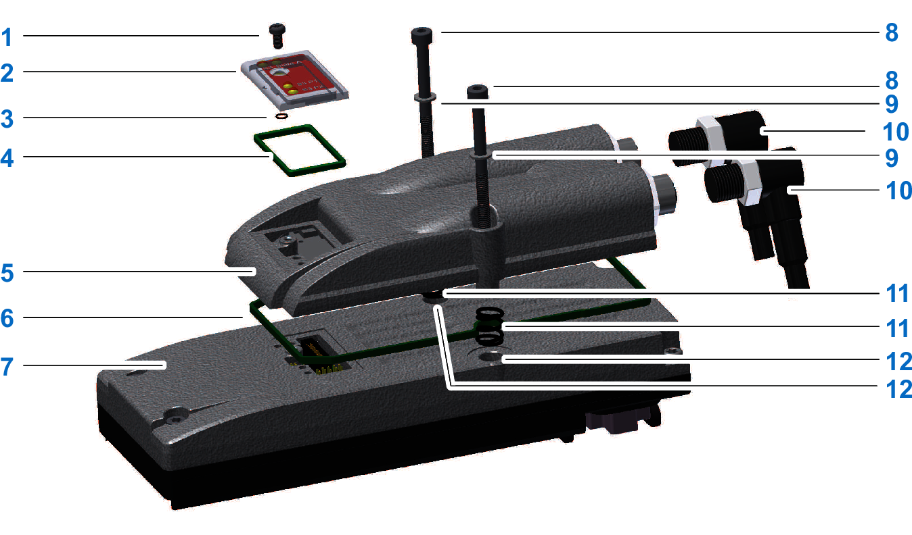

# Lexium 62 ILM Digital I/O Module - Installation

## Overview

**1** Torx M3x6 screw

**2** Protective cover

**3** Insulating washer, 2.5 x 0.6 mm (0.1 x 0.02 in.)

**4** Protective cover gasket

**5** Lexium 62 ILM digital I/O module

**6** Sealing ring for the Lexium 62 ILM digital I/O module

**7** Lexium 62 ILM Integrated Servo Drive

**8** Hexagon socket screw M4x50

**9** Serrated lock washers M4

**10** M12 connectors (X4, X5)

**11** Pressure springs with inner diameter 5 mm (0.20 in) / outer diameter 8 mm (0.31 in) / height 8 mm (0.31 in)

**12** Mounting holes of the Lexium 62 ILM

Before beginning the replacement of specific components, read thoroughly the section [*Replacing Components and Cables*](D-SE-0049351.html#D-SE-0049351) for important safety information and general instructions.

## Required Tool

The following tools are required for installation:

* Hexagon socket screwdriver 3.0
* Torx TX10 screwdriver

Check delivery for completeness:

* Lexium 62 ILM digital I/O module with sealing ring
* Two hexagonal screws M4x50
* Two serrated lock washers M4
* Two pressure springs

## ESD Protection

Observe the following instructions to help prevent damages due to electrostatic discharge.

| NOTICE | |
| --- | --- |
|  | ELECTROSTATIC DISCHARGE  * Do not touch any of the electrical connections or components. * Touch circuit boards only on the edges. * Take the necessary protective measures against electrostatic discharges.  Failure to follow these instructions can result in equipment damage. |

## Prepare Installation

| Step | Action |
| --- | --- |
| 1 | Set main switch to OFF position, or otherwise remove all power to the system. |
| 2 | Prevent main switch from being switched back on. |
| 3 | Loosen the screw (1) with the screwdriver (Torx). |
| 4 | Remove screw (1) with insulating washer (3) and protective cap (2) and protective cap gasket (4) from Lexium 62 ILM. |
| 5 | Loosen the screws in the mounting holes (11) (M4x28) with the screwdriver (hexagon socket). |
| 6 | Remove the screws and serrated lock washers. |
| 7 | Insert the sealing ring (6) into the groove of the Lexium 62 ILM digital I/O module. |

| NOTICE | |
| --- | --- |
|  | INSUFFICIENT SHIELDING/GROUNDING/Tightness  * Serrated lock washers (9) must be removed when removing screws from position (12).  * Align DIO8 with three fixing pins.  * The sealing ring of DIO8 must be completely inserted into the groove of the DIO8.  * Insert springs if installing on ILM070/100/140.  Failure to follow these instructions can result in equipment damage. |

## Assembly

| Step | Action |
| --- | --- |
| 1 | Insert each pressure spring (11) in vertical position into the respective mounting hole (12) of the Lexium 62 ILM. |
| 2 | Place the Lexium 62 ILM Digital I/O Module on the Lexium 62 ILM. |
| 3 | Insert screws (8) (M4x50) with serrated lock washers (9) through the mounting holes of the Lexium 62 ILM Digital I/O Module, then through the aperture of the pressure springs (11), and finally into the mounting holes (12) of the Lexium 62 ILM. |
| 4 | Tighten the screws (8) temporary with 2 Nm (17.70 lbf in). |
| 5 | Tighten the screws (8) with 3 Nm (26.55 lbf in) definitively. |
| 6 | Fit protective cap (2) together with protective cover seal (4) onto the Lexium 62 ILM digital I/O module. |
| 7 | Screw the protective cap on (to 1 Nm) with the screw (1) and the insulating washer (3) by using a Torx screwdriver. |

| NOTICE | |
| --- | --- |
|  | INSUFFICIENT SHIELDING/GROUNDING/Tightness  * Serrated lock washers (9) must be removed when removing screws from position (12).  * Align DIO8 with three fixing pins.  * The sealing ring of DIO8 must be completely inserted into the groove of the DIO8.  * Insert springs if installing on ILM070/100/140.  Failure to follow these instructions can result in equipment damage. |

EIO0000001351.08

© 2022

Schneider Electric.

All rights reserved.