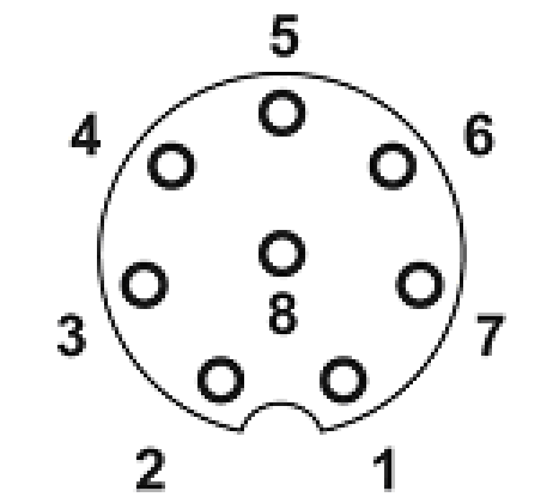
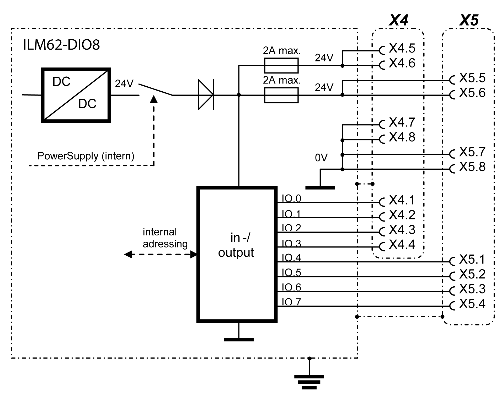
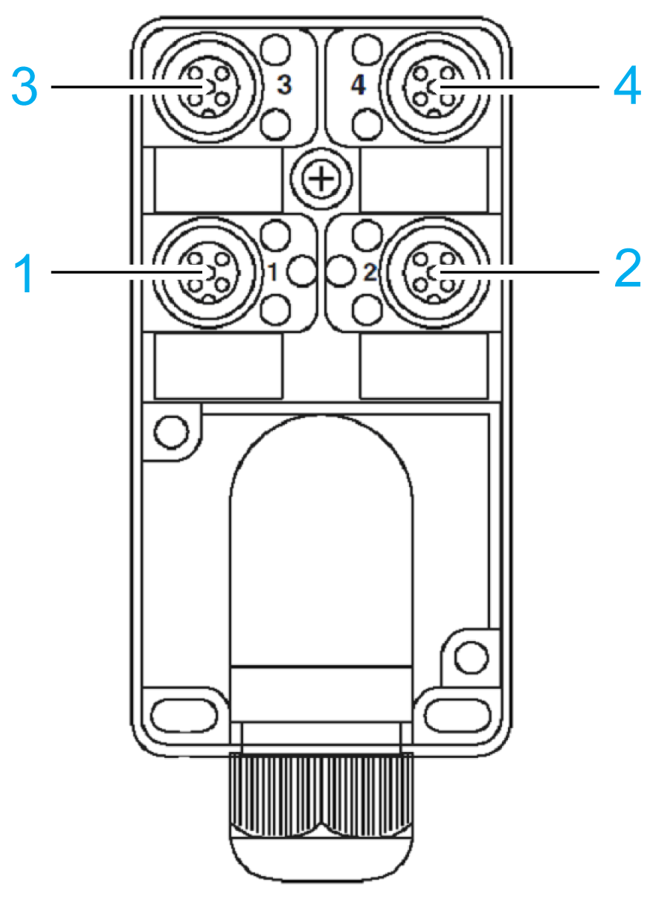
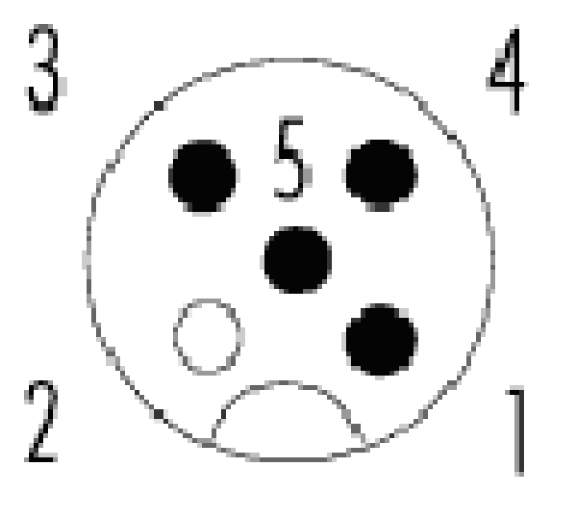
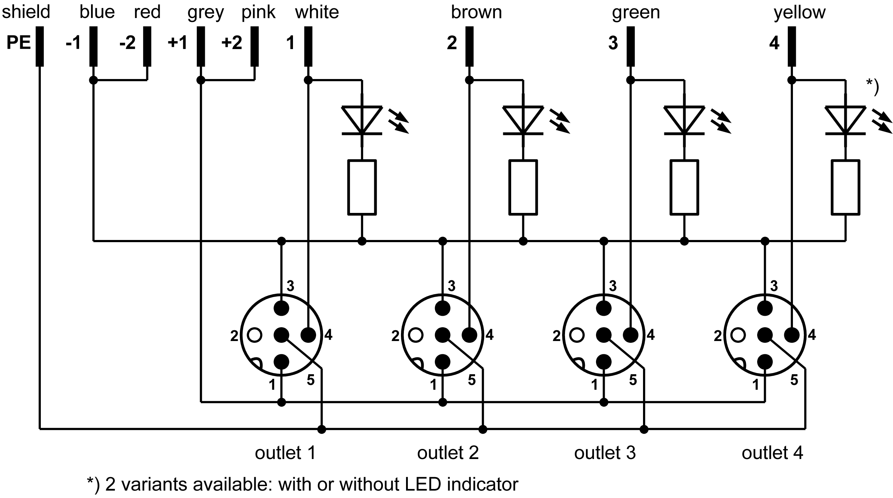

# Lexium 62 ILM Digital I/O Module - Electrical Connections

## Electrical Connections - Lexium 62 ILM Digital I/O Module

NOTE: Maximum cable length is 30 m (98.4 ft)

Electrical connection Lexium 62 ILM Digital I/O Module outlet X4 - inputs/outputs:

| Pin | Designation | Meaning |
| --- | --- | --- |
| 1 | IO.0 | Input/output 0 |
| 2 | IO.1 | Input/output 1 |
| 3 | IO.2 | Input/output 2 |
| 4 | IO.3 | Input/output 3 |
| 5 | 24 V | Control voltage |
| 6 | 24 V | Control voltage |
| 7 | 0 V | Control voltage |
| 8 | 0 V | Control voltage |
| Shield | PE | Shield |

Electrical connection Lexium 62 ILM Digital I/O Module outlet X5 - inputs/outputs:

| Pin | Designation | Meaning |
| --- | --- | --- |
| 1 | IO.4 | Input/output 4 |
| 2 | IO.5 | Input/output 5 |
| 3 | IO.6 | Input/output 6 |
| 4 | IO.7 | Input/output 7 |
| 5 | 24 V | Control voltage |
| 6 | 24 V | Control voltage |
| 7 | 0 V | Control voltage |
| 8 | 0 V | Control voltage |
| Shield | PE | Shield |

## Block Diagram Lexium 62 ILM Digital I/O Module

## ABE9 - Splitter Box

Connection wiring diagram ABE9 splitter box:

**1** Outlet 1

**2** Outlet 2

**3** Outlet 3

**4** Outlet 4

Electrical connections for ABE9 splitter box outlet 1...4 - inputs/outputs

| Pin | Designation | Meaning |
| --- | --- | --- |
| 1 | 24 V | Control voltage |
| 2 | free | Reserved |
| 3 | 0 V | Control voltage |
| 4 | IO.x | Input/output x (X4: 0 ... 3 or X5: 4 ... 7) |
| 5 | PE | Shield |

The control voltage when using external I/O supply can be supplied either via the X4, X5 outlets or via the ABE9 splitter box.

| NOTICE | |
| --- | --- |
|  | NO POTENTIAL ISOLATION OF THE INPUTS/OUTPUTS  Install a 2 A, slow blow fuse when using an external power supply.  Failure to follow these instructions can result in equipment damage. |

Block diagram ABE9 splitter box:

EIO0000001351.08

© 2022

Schneider Electric.

All rights reserved.