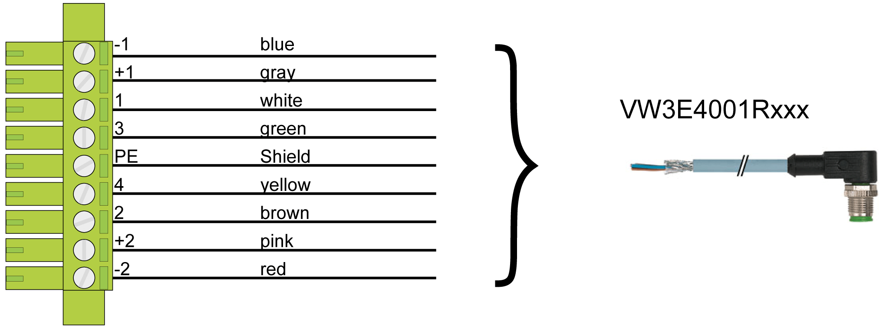
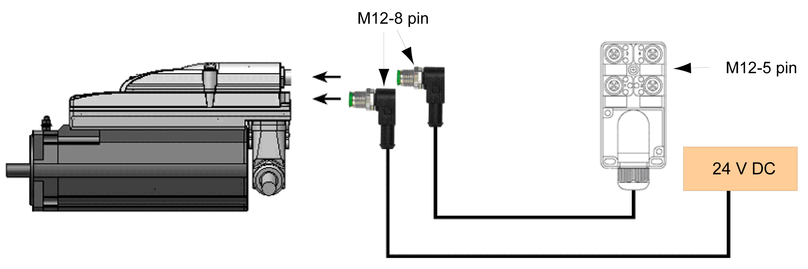
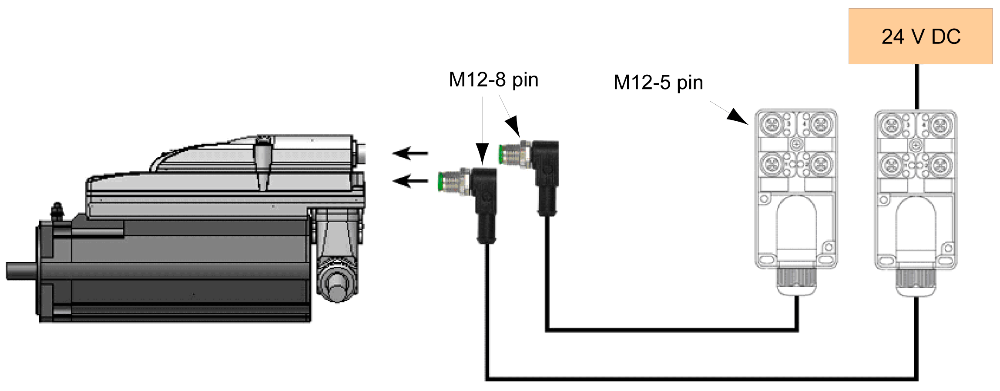

# Lexium 62 ILM Digital I/O Module - Wiring

## Overview

Cable configuration VW3E4001Rxxx for connection of ABE9 splitter box:

Configuration Examples

1-4 inputs/ outputs with external supply:

2-8 inputs/ outputs with external supply:

EIO0000001351.08

© 2022

Schneider Electric.

All rights reserved.