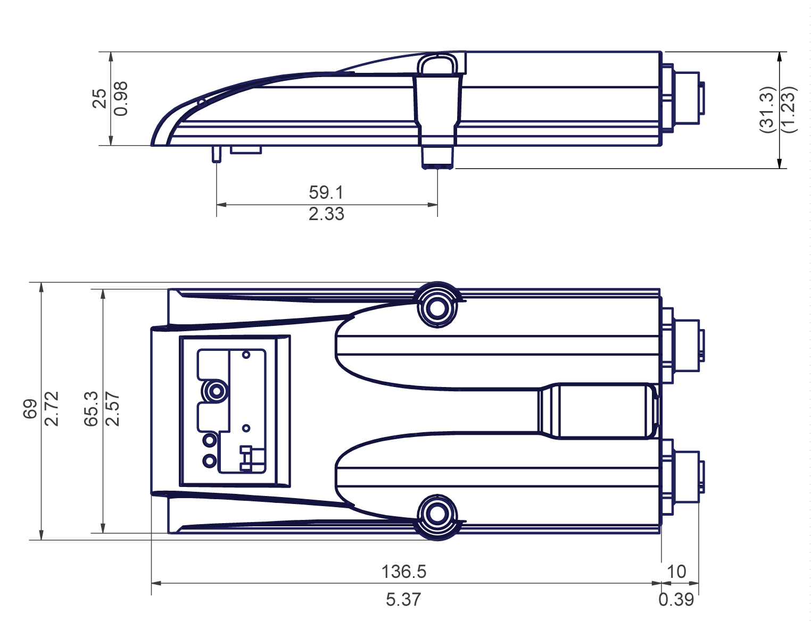

# Lexium 62 ILM Safety Module - Technical Data

## Overview

| Parameter | Value |
| --- | --- |
| **Supply** | |
| Control voltage / control current | DC 24 V (-15% / +20%)  With internal E/A supply: maximum 400 mA |
| **Weight** | 0.22 kg (0.49 lb) |
| **Ambient conditions** | |
| Overvoltage category | III |
| Radio interference level | Class A EN55011 / IEC/EN 61800-3 |
| **Operation** | |
| Degree of protection | IP 65 |
| Ambient temperature | +5 °C to + 40 °C/ +41 + 104 °F |
| Condensation | No |
| Icing | No |
| Other liquid | No |
| **Transport** | |
| Ambient temperature | -25 + 70 °C / -13 + 158 °F, temperature variation tmax = 30 K/h |
| Condensation | No |
| Icing | No |
| Other liquid | No |
| **Long-term storage in transport packaging** | |
| Ambient temperature | -25 +55 °C/ -13 +131 °F, temperature variation tmax = 30 K/h |
| Condensation | No |
| Icing | No |
| Other liquid | No |

## Dimensions

Lexium 62 ILM Safety Module dimensions:

EIO0000001351.08

© 2022

Schneider Electric.

All rights reserved.